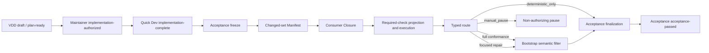
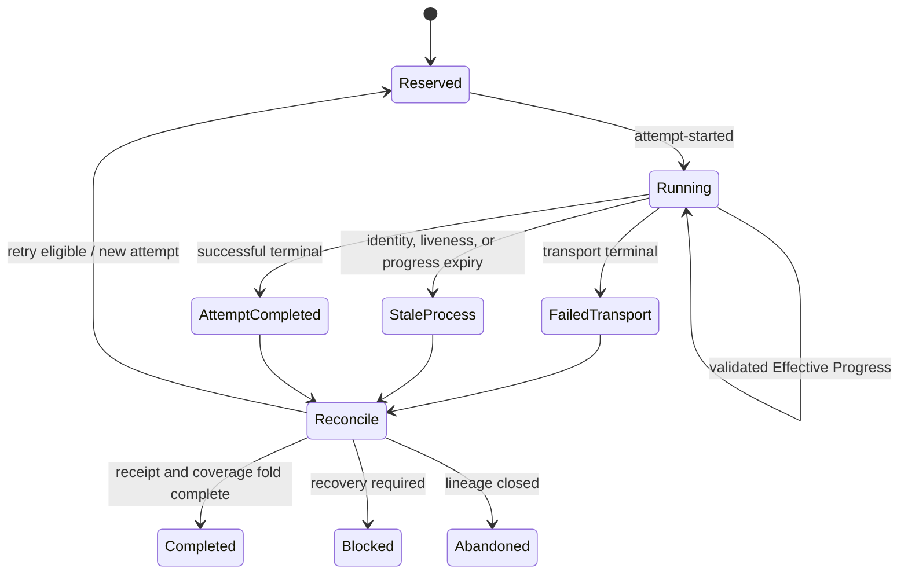

# Architecture Spine - Acceptance Review and Bootstrap Efficiency

## Design Paradigm

Primary paradigm: **Evidence-Gated Pipes-and-Filters**, represented as an Artifact DAG. Each filter consumes validated immutable typed artifacts and publishes independently verifiable successor artifacts. Evidence flow does not transfer lifecycle ownership.

Bootstrap execution uses an **Event-Sourced Execution State Machine** only for attempt reservation, process observation, liveness, Effective Progress, terminal classification, lease reconciliation, retry, and recovery. Event sourcing does not define manifest, closure, route, receipt, or segment truth; canonical content identity does.



## Invariants & Rules

### AD-1 - Decentralized lifecycle authority [ADOPTED]

- **Binds:** CAP-1, CAP-3, CAP-4, CAP-9; all lifecycle publishers.
- **Prevents:** Evidence producers acquiring another stage's lifecycle authority.
- **Rule:** VDD alone owns `draft` and `plan-ready`; the maintainer alone owns `implementation-authorized`; Quick Dev / `quick-dev-tdd-adapter` alone owns `implementation-complete`; Acceptance alone owns `acceptance-passed`. Bootstrap and deterministic checks always return evidence with `authorizes=[]` and publish no lifecycle state.

### AD-2 - Immutable owner-local Artifact DAG [ADOPTED]

- **Binds:** CAP-1, CAP-2, CAP-3, CAP-6, CAP-9; every manifest, closure, route, descriptor, receipt, and selection artifact.
- **Prevents:** Shared mutable workflow state, silent history rewrite, and central evidence authority.
- **Rule:** Published artifacts and content-addressed selection records are immutable and owner-local. Repair, rerun, or reprojection creates a successor bound to predecessor, input, and policy identities; deterministic reproduction may yield the same content identity but cannot overwrite published bytes. An owner-only, schema-valid `current` pointer is atomically replaceable and references exactly one immutable selection identity; replacement changes selection, never artifact truth, and prior selection records remain immutable. No central mutable evidence registry is permitted.

### AD-3 - Acceptance-owned closure and post-closure evidence [ADOPTED]

- **Binds:** CAP-2, CAP-3, CAP-4, CAP-8, CAP-9; Acceptance and Bootstrap review-input builders.
- **Prevents:** Diff-only review, incomplete consumer discovery, and a closure/evidence dependency cycle.
- **Rule:** Acceptance first publishes a reproducible Changed-set Manifest covering modified, added, deleted, renamed, and applicable untracked implementation files, with each item's baseline/current relationship. It computes Consumer Closure to a fixed point over `changed_artifact`, `implementation_contract`, `requirement_acceptance_binding`, `executable_entrypoint`, `validator_or_consumer`, `repository_authority`, `authorization_prerequisite`, and `external_selection`. Every edge binds source identity, target identity, type, discovery basis, and validation result. Included items carry inclusion reason; excluded items carry recomputable disposition, source identity, and decision authority. The completeness receipt binds roots, edge policy, fixed-point result, included/excluded sets, and closure identity. `deterministic_evidence` is generated only after closure identity freezes; it may attach to a Bootstrap review-input DAG but never participates in the originating closure fixed point.

### AD-4 - Repository-neutral Shared Canonical Evidence Primitive [ADOPTED]

- **Binds:** CAP-1, CAP-2, CAP-3, CAP-5, CAP-6, CAP-9; bmad-spec, VDD, exact-cover, Quick Dev, Acceptance, Bootstrap, and future evidence producers.
- **Prevents:** Consumer-specific canonical JSON, hashing, or path normalization producing incompatible identities.
- **Rule:** The sole shared implementation lives at `scripts/toolchain/canonical_evidence/` and exposes `parse_json_strict(raw)`, `canonical_bytes(value)`, `domain_hash(domain, projection)`, `normalize_repository_path(root, path)`, `validate_content_identity(domain, projection, expected)`, and golden-vector/mutation runners. Dependencies point from Skills to this pure deterministic library only. It owns mechanics, not artifact schema, semantic projection, domain meaning, lifecycle, publication, authorization, registry state, or runtime state. `normalize_repository_path` returns one non-empty repository-relative POSIX path: it normalizes separators and lexical dot segments, rejects root escape and invalid absolute/drive/UNC forms, preserves Unicode scalars and case without normalization or casefolding, and performs no filesystem existence, resolve, symlink, reparse, or junction check. Runtime containment, case-collision, and filesystem safety remain owner checks; shared vectors cover Windows and POSIX input forms.

### AD-5 - Versioned complete identity contract [ADOPTED]

- **Binds:** CAP-1, CAP-2, CAP-3, CAP-5, CAP-6, CAP-9; every current canonical identity field.
- **Prevents:** Digest-only equality, domain confusion, algorithm ambiguity, and incompatible serializers.
- **Rule:** Current content digest is `sha256(canonical_bytes({"domain": owner_domain, "payload": semantic_projection}))`. Artifact `schema_version` plus stable `identity_purpose` statically selects exactly one canonical primitive version, identity domain, and semantic projection contract; callers cannot choose them. A complete identity reference contains `schema_version`, `identity_purpose`, `canonical_evidence_version`, `identity_domain`, and `content_identity`, and all equality, binding, and reuse compare the complete reference. Domains match `^[a-z0-9]+(?:[._-][a-z0-9]+)*\.v[1-9][0-9]*$`. Primitive metadata remains outside the brownfield-compatible digest envelope; an incompatible algorithm requires an explicit owner schema/version upgrade.

`repository-canonical-json.v1` accepts only null, boolean, Unicode-scalar string, signed int64, array, and string-keyed object. Strict raw UTF-8 parsing rejects BOM, duplicate keys, lone surrogates, floats, fractions, exponents, non-finite values, `-0`, leading zeros, overflow, and coercion. Canonical bytes use scalar-order keys, compact separators, UTF-8 without BOM or trailing newline, and no Unicode normalization. String escaping is unique: quote becomes `\"`, backslash becomes `\\`, U+0008/U+0009/U+000A/U+000C/U+000D use `\b`/`\t`/`\n`/`\f`/`\r`, other U+0000..U+001F use lowercase four-digit `\u00xx`, slash is unescaped, and every other scalar emits direct UTF-8. Optional `\uXXXX` for ordinary scalars and surrogate-pair output are forbidden.

### AD-6 - Verify-only legacy compatibility and ordered migration [ADOPTED]

- **Binds:** CAP-1, CAP-6, CAP-9, CAP-10; all brownfield canonical identity producers and validators.
- **Prevents:** Historical evidence invalidation, legacy fallback acceptance, and a cutover validation gap.
- **Rule:** `legacy-canonical-sha256.v1` is the sole legacy profile and is verify-only: it cannot mint, write, authorize, or act as fallback after current verification failure. Before any mandatory consumer cutover, the shared current primitive, legacy replay, and current/legacy cross-rejection vectors must exist. Existing domain-separated adopters first pass shadow byte/hash equivalence; domainless producers then receive owner schema/domain versions; mandatory consumers cut over and pass current, legacy, wrong-domain, unknown-version, mutation, and historical replay vectors before private implementations are removed. Current canonical JSON never coerces float: every float-bearing Bootstrap history/calibration identity owner must version its schema and define an integer, scaled-integer, or canonical decimal-string projection before cutover, while historical float-bearing identities remain legacy verify-only. Quick Dev production code must remove imports from `execution-plans/2026-07-15-repository-maintenance-tdd-adapter/tools`; shared canonical/path mechanics move to `canonical_evidence`, and Quick Dev-specific semantics move to Quick Dev-owned modules. Historical bytes remain immutable, and no new private canonical implementation or durable production dependency on an execution-plan directory may remain after mandatory convergence.

### AD-7 - Full-source-bound inclusive Range Projection [ADOPTED]

- **Binds:** CAP-5, CAP-6, CAP-10; model-visible authority projection.
- **Prevents:** Reviewer-selected sampling, tool-specific slicing, normalization drift, and out-of-bound coverage claims.
- **Rule:** The shared file/model tooling owner publishes the selected immutable model-visible budget policy and owner-scoped current selection. Authority within that policy's budget is delivered as the complete unchanged source; every `Partial` result continues from the exact reported offset until `Complete`, and truncated input or a summary cannot launch review. Only over-budget authority may use a controller-owned Range Projection. The delivery decision and descriptor bind the selected budget-policy identity. The projection uses raw-file content identity and zero-based, start-inclusive, end-inclusive byte coordinates and binds repository-relative source path, full-source hash, both endpoints, exact extracted-bytes hash, encoding, projection version, inclusion reason, and the applicable changed-set/requirement/acceptance context identity. Extraction occurs from unchanged raw bytes, performs no newline or Unicode normalization or replacement decoding, and must decode on complete character boundaries. It cannot omit applicable constraints, counterexamples, or exceptions. Source mutation stales the descriptor. Reviewers cannot choose or expand ranges. Threshold values remain policy data, not spine constants.

### AD-8 - Stable Segment Descriptor separated from attempts [ADOPTED]

- **Binds:** CAP-4, CAP-5, CAP-6, CAP-7; Bootstrap assignment, request, receipt, fold, retry, and cache consumers.
- **Prevents:** Retry changing semantic segment identity, attempt metadata contaminating cache identity, and child scope expansion.
- **Rule:** Domain `jimuyun.bootstrap.segment-descriptor.v1` identifies the stable canonical projection binding review run, candidate/baseline, Changed-set Manifest, Consumer Closure, route/profile, reviewer role, assigned artifact/path/range identities, requirement/acceptance bindings, required-check evidence, ordinal/total, output contract, and applicable predecessor/repair input. Attempt identity is excluded. Every attempt runs in an absolute immutable segment-only snapshot exposing only assigned artifacts/ranges and minimum validation attestations; live repository and full Artifact View traversal are denied. Attempt Request/Event separately binds a unique attempt identity to the descriptor, parent-issued access proof, execution route, and process identity. Executable, model, reasoning, and environment identity inherit from that access proof; operator replacement, manual repair, and silent fallback fail before semantic work. Transport retry uses the same descriptor, access-proof identity, and runtime-policy identity with a new attempt; context-budget repartition produces new descriptors. Assignment, request semantic payload, child receipt, parent validator, coverage fold, and cache/retry use the same descriptor projection contract.

### AD-9 - Real required-check execution and exact reuse [ADOPTED]

- **Binds:** CAP-3, CAP-4, CAP-8, CAP-9, CAP-10; implementation contracts and command registries.
- **Prevents:** Handwritten false-GREEN receipts and stale command evidence reuse.
- **Rule:** Each required check executes the fixed real runner selected by the current implementation contract and command registry. Its receipt binds command ID, executable identity, argv, cwd, allowlisted environment projection, dependency/tool versions, acceptance IDs, input identities, observed exit/result, output identities, and execution-policy version. A generic receipt validator cannot substitute for execution. Reuse requires exact equality of the complete binding and independently validated output; all required-check receipts carry `authorizes=[]`. Deterministic failure launches zero semantic reviewers.

### AD-10 - Execution-local event state and conjunctive lease [ADOPTED]

- **Binds:** CAP-7, CAP-8, CAP-10; Bootstrap runtime controller and policy owner.
- **Prevents:** Heartbeat-as-progress, PID reuse, independent lease truth, and unbounded no-progress execution.
- **Rule:** The Bootstrap control-plane policy owner publishes immutable runtime-policy records and an owner-only atomic current pointer under `.agents/skills/run-phase-bootstrap-review/policies/bootstrap-runtime/`; the owner-local schema lives under `.agents/skills/run-phase-bootstrap-review/schemas/`. No other stage can replace the selection. The policy carries independently tunable liveness, Effective Progress, no-progress, launch/terminal grace, lease, retry, backoff, status-throttle, and output fields. Every launch, attempt, retry, recovery result, and imported Bootstrap receipt binds the resolved runtime-policy identity. Existing hard-coded runtime constants lose authority only after schema, mutation, and behavioral-equivalence tests pass; no dual policy authority is allowed. Process Events are append-only execution-fact authority. `attempt-started` initializes the liveness and Effective Progress/no-progress windows from the bound policy; reservation uses launch grace and cannot establish an occupied lease before current process identity is observed. A lease is a rebuildable view where `lease_occupied = process_identity_matches AND liveness_not_expired AND effective_progress_window_not_expired AND no_terminal_event`; process identity binds at least PID plus process creation identity. Heartbeat refreshes liveness only. An Effective Progress Event binds the current candidate, closure, Segment Descriptor, and attempt, and may represent only a terminal transition, validated evidence/receipt increment, or policy-registered state transition; only such an event refreshes the no-progress window. Any false lease conjunct enters terminal/stale reconciliation before retry reservation. Recovery uses only Process Events, immutable descriptors, current process identity, and the attempt-bound policy. User-visible status is emitted only for a phase transition, new identity-bound evidence, retry, typed warning, exception, or terminal; it is deduplicated by event identity and policy-throttled. Heartbeat, polling, stdout, and repeated status are never user-visible progress.



### AD-11 - Two-level terminal and recovery taxonomy [ADOPTED]

- **Binds:** CAP-7, CAP-9, CAP-10; Bootstrap attempts, segments, runs, and historical regressions.
- **Prevents:** A retryable attempt failure terminalizing a run and historical failures being rewritten as success.
- **Rule:** Attempt Terminal Classification is `completed`, `failed-transport`, `stale-process`, or `abandoned`; every attempt and its events/receipt are immutable. Segment/Run Outcome is `completed`, `blocked-recovery-required`, or `abandoned`. Attempt terminal evidence passes through process/lease reconciliation, retry-policy evaluation, and receipt/coverage fold before a segment/run outcome. Only a `completed` attempt with a current independently validated receipt may enter semantic finding, coverage, gate, verifier, or completion folds. `failed-transport`, `stale-process`, and `abandoned` payloads are transport/recovery evidence only, carry `authorizes=[]`, and cannot establish a finding, verdict, role completion, segment completion, or run completion. Retry ceilings produce `blocked-recovery-required`; context-budget failure repartitions into new descriptors rather than retrying unchanged input. Historical `vcec-r1n` is run outcome `abandoned`, classification `historical-runtime-failure`, `reusable=false`, and `authorizes=[]`, while preserving its real internal attempt classifications.

### AD-12 - Typed route preserves Complete Review semantics [ADOPTED]

- **Binds:** CAP-3, CAP-4, CAP-8, CAP-9; Acceptance route policy and Bootstrap review control plane.
- **Prevents:** Cost-driven authority weakening, single-reviewer substitution, and Bootstrap finalization authority.
- **Rule:** The Acceptance owner publishes immutable route/cost policy artifacts and its owner-scoped current selection; this policy cannot grant maintainer authorization or alter Bootstrap runtime policy. Acceptance selects only `deterministic_only`, `focused_repair_verification`, `full_implementation_conformance`, or `manual_pause` from the selected authority/risk-policy allowed set. Route and launch-plan projection are deterministic functions of the frozen baseline/current, Changed-set Manifest, Consumer Closure, required-check results, implementation contract, and resolved route/cost-policy identity. Mandatory triggers cannot be cost-downgraded. Full conformance retains isolated Blind Hunter, Edge Case Hunter, and Acceptance Auditor roles over the same frozen identities; an independent verifier runs only for gate-accepted P0/P1 under existing risk/model policy. Focused repair requires formal predecessor findings and cannot replace first Complete Review or discover new blockers. Bootstrap returns identity-bound non-authorizing evidence; Acceptance alone validates import and finalizes.

### AD-13 - Cost observability and semantic parity gate rollout [ADOPTED]

- **Binds:** CAP-8, CAP-10; M0-M2 rollout and regression owners.
- **Prevents:** Optimizing bytes or time by omitting authority, weakening findings, or accepting transport artifacts as semantics.
- **Rule:** Before semantic launch, Acceptance publishes an immutable typed Review Cost Decision with disposition `continue`, `rebuild-closure`, `repartition`, or `manual-pause`, binding closure bytes, segment count, required roles/attempts, retry exposure, whole-plan comparison, launch-plan identity, and policy identity. Rebuild or repartition publishes successor artifacts and requires a new cost decision. Observed attempts cannot exceed `required_roles * segment_count + policy_authorized_retries + required_verifier_attempts`; excess is a typed non-authorizing policy failure. Delivery is ordered M0 recovery/isolation, then M1 Acceptance strategy, then M2 scale/finalization. M1 cannot launch before M0 invariants pass, and the whole-directory default remains active until M2's 8-13 regression, frozen semantic corpus, metrics, and counter-metrics pass. Rollout records actual closure, segment, attempt, retry, token, and wall-time data, but no provisional target authorizes weakening. The semantic corpus preserves mandatory route, blocker class, ambiguity/manual-pause, omission detection, Range Projection counterexamples, zero-review deterministic-only behavior, and false-authorization rejection. Canonical identity tests supplement but never replace semantic detection parity.

### AD-14 - Acceptance admission, staleness, and final import [ADOPTED]

- **Binds:** CAP-1, CAP-9; Acceptance admission, evidence invalidation, Bootstrap import, and finalization.
- **Prevents:** Moving baselines, stale handoffs, partial evidence import, and prose-derived acceptance.
- **Rule:** Acceptance starts only from a schema-valid identity-bound `implementation-complete` handoff whose candidate matches current repository evidence; missing, stale, or mismatched handoff fails closed. Baseline is a resolved immutable commit identity, never unresolved `HEAD`. Candidate mutation stales Changed-set Manifest and every dependent closure, check, route, segment, review, and import artifact; closure, required-check projection, route policy, or authority identity mutation stales all dependent role outputs. Final import exact-matches the current candidate, closure, required checks, gate, required verifier, and receipt identities. Assistant prose, transport status, historical passed flags, upstream booleans, and manually copied receipts establish neither completion nor `acceptance-passed`.

## Consistency Conventions

| Concern | Convention |
| --- | --- |
| Artifact naming | Owner-defined versioned schema names and stable `identity_purpose`; domains end in `.vN`. |
| Identity validation | Validate schema/purpose dispatch, carried primitive/domain metadata, semantic projection, canonical replay, then complete identity equality. |
| Mutation | Fail closed on unknown version/domain, identity mismatch, stale predecessor, scope expansion, or unverifiable authority. |
| State | Artifact content identity is truth; Bootstrap events are execution history; leases and current selections are derived views. |
| Errors | Deterministic, semantic, transport, recovery, and lifecycle outcomes remain typed and non-interchangeable. |
| Authority | Evidence and receipts default to `authorizes=[]`; only the lifecycle owner may publish its state. |
| Status | Only typed event transitions and new identity-bound evidence are user-visible; heartbeat, polling, stdout, and repeated text are not progress. |
| Operations | Repository-local processes and immutable evidence only; no new service, central registry, provider, listener, or Phase/user-sandbox runtime dependency. |

## Structural Seed

```text
scripts/toolchain/canonical_evidence/
  implementation modules      # stable public primitive API; internal split remains code-owned
  vectors/                    # shared golden vectors and mutation corpus

.agents/skills/run-refactor-implementation-acceptance/
  scripts/                    # Acceptance-owned freeze, closure, checks, route, import, finalization

.agents/skills/run-phase-bootstrap-review/
  scripts/                    # Bootstrap-owned semantic execution, events, leases, retry, recovery
  policies/bootstrap-runtime/ # immutable runtime-policy records and owner-scoped current pointer
  schemas/                    # owner-local runtime-policy and evidence schemas
```

The seed fixes ownership and dependency direction, not final filenames or internal module decomposition. Artifact-specific schemas, domains, projections, and semantic fixtures remain with their owners.

## Capability -> Architecture Map

| Capability | Lives in | Governed by |
| --- | --- | --- |
| CAP-1 | VDD, maintainer, Quick Dev handoff; Acceptance freeze | AD-1, AD-2, AD-5, AD-14 |
| CAP-2 | Acceptance Changed-set Manifest and Consumer Closure | AD-2, AD-3, AD-5 |
| CAP-3 | Acceptance required checks and typed route | AD-1, AD-3, AD-9, AD-12 |
| CAP-4 | Bootstrap Complete Review and verifier | AD-8, AD-9, AD-12 |
| CAP-5 | File tooling and controller Range Projection | AD-4, AD-7 |
| CAP-6 | Bootstrap segment builder, snapshot, request, receipt, fold | AD-5, AD-7, AD-8 |
| CAP-7 | Bootstrap runtime events, watchdog, lease, retry | AD-8, AD-10, AD-11 |
| CAP-8 | Acceptance cost decision and route control | AD-3, AD-10, AD-12, AD-13 |
| CAP-9 | Bootstrap evidence import and Acceptance finalization | AD-1, AD-2, AD-5, AD-9, AD-12, AD-14 |
| CAP-10 | Cross-consumer vectors, 8-13 regression, semantic corpus | AD-4, AD-6, AD-7, AD-11, AD-13 |

## Deferred

- Formal end-to-end wall-time SLO waits for stable M2 telemetry; timing evidence remains mandatory.
- Formal Consumer Closure reduction threshold waits for workload-bucket baseline and completeness-corpus results.
- Concrete timeout, heartbeat, no-progress, grace, lease, retry, backoff, and output values remain versioned runtime-policy data.
- Non-Python bindings, performance-specialized implementations, and `repository-canonical-json.v2` wait for a real consumer requirement.
- Repository-wide follow-up migration of knowledge, workflow routing, Git snapshot, and SC LLM review identities follows mandatory Acceptance/Bootstrap canonical convergence.
- Phase service, Hosted user sandbox, deployment/provider topology, model pricing/provider selection, and global token quota remain outside this toolchain-control-plane feature.
