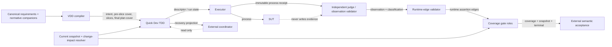
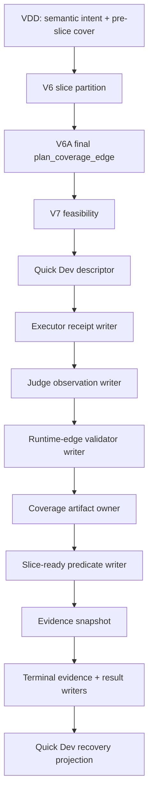

# Architecture Spine — VDD and Quick Dev Chapter 4/5/6 Capability Upgrade

## Design Paradigm

采用六边形证据流水线。编译器、生命周期执行器、被测系统和判定器通过不可变 artifact 合同连接；依赖方向始终从语义意图流向执行证据，再流向覆盖判定。每类权威 artifact 只有一个写入者，历史版本 append-only。



## Invariants & Rules

### AD-1 — Trust boundaries and dependency direction

- **Binds:** CAP-1..CAP-10
- **Prevents:** VDD executing its own intent, Quick Dev self-judging, SUT self-reporting pass, or coordinator rewriting evidence.
- **Rule:** VDD, Quick Dev, executor/judge, SUT, coverage gate and external coordinator are separate trust zones. Inbound artifacts are validated by consumers but never rewritten across ownership boundaries; dependencies point toward immutable contracts.

### AD-2 — VDD semantic ownership and staged cover

- **Binds:** CAP-1, CAP-2, CAP-3; VDD V0–V6A
- **Prevents:** future runtime facts being guessed or fabricated during planning, and V5/V6 circularity.
- **Rule:** VDD alone writes source index, obligations, Acceptance, failure intents, pre-slice cover, slice contracts and final plan coverage. V5 emits only requirement↔obligation↔Acceptance↔source↔RED-intent edges. V6 partitions slices. V6A, after partition, binds each edge to slice, lane, terminal predicate and the exact ordered `stage_scope=["red","green","refactor","terminal"]`. V7 alone evaluates feasibility.

### AD-3 — Quick Dev descriptor and lifecycle ownership

- **Binds:** CAP-4, CAP-5, CAP-6, CAP-8
- **Prevents:** VDD-generated commands, mutable descriptors, lifecycle transitions inferred from file presence, and unrelated writes being accepted.
- **Rule:** Quick Dev materializes shell-free descriptors from VDD intent, owns Q0–Q8 run state and recommendation/recovery artifacts, and appends immutable versions. Q2–Q6 may create execution evidence only through the executor/judge path; Quick Dev never writes receipt outcome, coverage or implementation-complete. The existing `stage_command.py` is a non-authoritative dispatcher: process-bearing stages must delegate through the declared descriptor/executor seam; any direct diagnostic/test-selector path is explicitly non-authoritative and cannot produce completion evidence.

### AD-4 — Process and semantic truth have separate writers

- **Binds:** CAP-5, CAP-7, CAP-9
- **Prevents:** hard-coded failures, producer self-reported pass, zero-case success, and copied expected values.
- **Rule:** The executor is the sole writer of the immutable process receipt after performing the real argv/cwd process with `shell=false`. The independent judge/observation validator is the sole writer of observations and failure classification, deriving `evidence_state`, `verification_outcome`, `failure_family` and `failure_id` from the receipt, assertions and identity-bound inputs; `failure_id` is deterministic over taxonomy version, family, descriptor/target/fixture/oracle/case identities and normalized receipt fingerprint. The judge does not execute the SUT in the same authority. The runtime-edge validator is the sole writer of runtime assertion edges. SUT output is evidence input only.

Q3/Q5/Q6 ownership is therefore dispatch-only for Quick Dev: Q3 invokes the executor and then the judge; Q5/Q6 invoke the same descriptor through the executor and consume judge output. Neither stage may persist a receipt, observation, classification or runtime edge.

### AD-5 — Layered result legality

- **Binds:** CAP-4, CAP-5, CAP-7, CAP-8
- **Prevents:** treating planning status as execution result or using failure IDs as lifecycle states.
- **Rule:** `evidence_state` is one of `planned-only|observed-run|recovered-run|invalid-run`; `verification_outcome` is one of `pass|fail|blocked|incomplete|not-applicable`. Legal combinations are:
  - `planned-only` → `not-applicable|incomplete|blocked` only;
  - `observed-run` → `pass|fail|blocked|incomplete`;
  - `recovered-run` → `pass|fail|blocked|incomplete` and must reference complete prior evidence;
  - `invalid-run` → `fail|blocked|incomplete` only.
  `pass` and `not-applicable` carry no failure family or failure ID. A process-derived `fail` or `blocked` result carries exactly one deterministic `failure_family` and `failure_id`; timeout and pre-execution integrity failures use their explicit non-process failure classification. `expected-red` is always `fail`; `failure_family` and `failure_id` classify a result and never authorize a transition.

### AD-6 — Single-writer artifact graph

- **Binds:** CAP-1, CAP-3, CAP-4, CAP-7, CAP-8
- **Prevents:** split-brain current views, overwritten history, and coordinator-created evidence.
- **Rule:** VDD writes semantic artifacts and plan cover; Quick Dev writes descriptors, run state, reuse/invalidation and recovery projection; the executor writes process receipts; the independent judge writes observations/classifications; the runtime-edge validator writes runtime assertion edges; the coverage artifact owner writes acceptance coverage; the slice-ready predicate writer writes slice-ready results; the terminal evidence producer writes terminal evidence; and the terminal result predicate writes the implementation-complete result. These roles may be exposed through one coverage-gate facade, but each artifact type has exactly one writer and read-only validators. All writes are atomic create-if-absent and reference immutable predecessors.



### AD-7 — Exact-cover and completion authority

- **Binds:** CAP-3, CAP-7, CAP-9
- **Prevents:** incomplete Acceptance coverage, exclusive-partition assumptions, and status-string promotion.
- **Rule:** Coverage-gate roles are the sole evaluators/writers for acceptance coverage, slice-ready, evidence snapshot and implementation-complete. VDD-authored `terminal_predicate` is an immutable, content-addressed predicate specification; the terminal descriptor binds the current plan hash, V6 partition manifest hash, every slice-ready reference, active Acceptance universe and predicate hash, and Q8 verifies evaluator identity immediately before publication. Final plan coverage and runtime assertion coverage are sound-and-complete many-to-many covers: every active Acceptance must have an admissible path and every asserted path must resolve to the active universe; overlap is permitted. `terminal_input.runtime_closure_tuples` is a typed closed set, not a list of opaque assertion references: each V6A-declared `(slice, Acceptance, stage)` tuple appears exactly once with runtime-edge ref/hash, selector identity and current-snapshot hash, and no extra tuple is admissible. Q7/Q8 reject missing, duplicate, cross-run, cross-slice, stale or non-canonical tuples. Q8 re-reads the V6 partition manifest, requires every emitted slice to have RED/GREEN/REFACTOR and slice-ready closure plus terminal evidence in one current snapshot, then recomputes cover before terminal validation and performs a final current-byte revalidation.

### AD-8 — Runtime edge and selector identity

- **Binds:** CAP-5, CAP-6, CAP-7
- **Prevents:** RED/GREEN drift and evidence edges that depend on future or self-hashed files.
- **Rule:** Descriptor compilation is a deterministic projection from V6A `selector_intents`, target/fixture refs, assertion IDs, cwd and ordered stage scope; any mismatch routes `repair-vdd`. `runtime_assertion_edge` is created only after execution and must include receipt_ref/receipt_sha256, observation_ref/observation_sha256, descriptor_sha256, target_sha256, fixture_sha256, current plan/slice/candidate/run identities, Acceptance/assertion/case-source, selector, `verification_outcome`, `failure_family`/`failure_id` when required, producer and validator identities. RED, GREEN and REFACTOR reuse the same selector identity, target, fixture, assertion set and cwd; only stage/run/successor identity may change. Runtime edge hashes point to immutable external results and never self-reference.

### AD-9 — TDD gates and write-set isolation

- **Binds:** CAP-5, CAP-6, CAP-7
- **Prevents:** GREEN without a real RED, test-contract tampering, and unrelated production changes.
- **Rule:** Q3 accepts RED only with real process attempts, non-zero test/case counts, non-zero exit and exact expected failure identity. Q4 successor diff may touch only declared production paths; selector, fixture, contract and evidence paths are immutable. Q5 GREEN and Q6 REFACTOR require the same selector and all bound assertions true. Any changed test/contract/fixture invalidates the lineage back to RED.

### AD-10 — NN+1 promotion and frozen judge

- **Binds:** CAP-9, CAP-10
- **Prevents:** a candidate validating itself, mutable predecessor judges, and false-green promotion.
- **Rule:** When the self-hosted/toolchain profile is selected, promotion is blocked until a detached evidence bundle proves independent origin, read-only judge/oracle/fixture bytes, identities and hashes. Ordinary development does not require external review, candidate binding or maintainer authorization. Freeze predecessor judge bytes, detached positive/negative/mutation fixtures, oracle identities and expected failure IDs before implementation; the candidate remains SUT and coverage gate writes the NN+1 promotion record only after one closed evidence snapshot passes.

```mermaid
sequenceDiagram
  participant F as Frozen predecessor judge + fixtures
  participant C as NN+1 candidate SUT
  participant G as Coverage gate
  F->>C: execute RED / negative / mutation cases
  C-->>F: process behavior only
  F->>G: append receipt and observation
  G->>G: validate lineage, exact cover and terminal
  alt all mandatory evidence passes
    G->>G: append NN+1 promotion record
  else any identity or false-green failure
    G-->>C: remain blocked; keep candidate as SUT
  end
```

### AD-11 — Reuse, invalidation and recovery

- **Binds:** CAP-4, CAP-7, CAP-8
- **Prevents:** stale green reuse, historical glob/mtime selection, and recovery fabricating evidence.
- **Rule:** A repository-owned, versioned `change-impact-matrix` and resolver is the sole authority for reuse/invalidation; its canonical root set includes candidate tree, plan, contract, descriptor, fixture, validator/judge, source and explicit plan-state transition bytes. Architecture registries, memlogs, spine hashes, review/binding/authorization records and ordinary governance documentation are excluded unless a named product or execution dependency explicitly adopts their semantics. Recommendation and recovery consumers call this resolver rather than recomputing reachability. Requirement/Acceptance/plan changes force coverage recomputation; selector/fixture/target/case-source changes invalidate RED→GREEN→REFACTOR→terminal; owner/compiler/validator/judge changes invalidate the affected evidence; ordinary non-semantic documentation may reuse identity-valid observations. A `recovered-run` must reference a complete prior receipt, observation and runtime-edge set for the same slice plus their hashes; it cannot promote a receipt-only or planned artifact. Recovery references explicit run-local predecessors and copies identities without reclassifying results; no glob, mtime or latest-success scan is allowed.

### AD-12 — Profiles and stop-loss preserve the truth floor

- **Binds:** CAP-5, CAP-9, CAP-10
- **Prevents:** fast profiles bypassing dynamic execution or repeated deterministic failures looping indefinitely.
- **Rule:** Profiles change scope and cost only; every profile retains real execution, non-zero test/case counts, selector binding, exact cover and deterministic validation. A repeated unchanged fingerprint routes directly to `repair-vdd` or `stop`; rerun is allowed only after input change produces a new fingerprint. Harness, repo-noise, timeout, zero-case and unexpected-green results never satisfy expected-red or completion.

### AD-13 — Brownfield execution envelope is explicit

- **Binds:** CAP-4, CAP-5, CAP-8, CAP-10
- **Prevents:** different launchers, cwd roots, path normalization, timeout and persistence behavior across independently built adapters.
- **Rule:** The initial brownfield host is Windows with repository-contained temporary run roots and the currently verified `py -3`/pytest environment as a baseline, not a universal version gate. Before V0/Q1, the adapter resolves and records the launcher, interpreter and test-runner versions, repository-root cwd and path-containment result; compatibility is decided by observed contract behavior. Every owner subprocess uses that same resolved cwd and shell-free argv. Evidence writes are atomic create-if-absent under `logs/tdd-adapter/`; concurrent-run locking, resource quotas, retention and cross-platform normalization remain explicit Deferred decisions.

### AD-14 — Canonical compatibility and enforcement seam

- **Binds:** CAP-4, CAP-5, CAP-7, CAP-8, CAP-9
- **Prevents:** legacy artifacts silently becoming current authority, stage shortcuts bypassing identity checks, and two implementations choosing different lineage or failure semantics.
- **Rule:** The repository-owned current-snapshot/change-impact resolver is the sole consumer-facing resolver for candidate bytes, dependency closure and invalidation. When recovering from memlog, the latest non-superseded ownership decision wins; earlier combined-writer entries are historical and cannot be selected as current authority. Legacy `artifact_owners.py`/`semantic_oracle.py` outputs (`observed`, aggregate `executions`, combined receipt/observation) are read-only compatibility inputs and must be projected or rejected before entering the canonical graph. Q3/Q5/Q6 process-bearing actions dispatch the frozen descriptor through the executor seam; direct pytest or owner shortcuts are diagnostic-only. The runtime-edge validator mechanically enforces the complete receipt/observation/hash/failure identity shape before coverage accepts an edge. Any compatibility projection is versioned, content-addressed and cannot write current evidence.

### AD-15 — Brownfield conformance diagnostic and migration gate

- **Binds:** CAP-4, CAP-5, CAP-6, CAP-7, CAP-8, CAP-9
- **Prevents:** declaring the architecture implemented while legacy plan-local tools still bypass its authority seams.
- **Rule:** A fresh brownfield conformance run diagnoses and gates implementation/migration readiness against all of the following: (a) executor-only receipt writes and judge-only observation/classification writes; (b) canonical projection of legacy `observed`/`executions` fields into the four-state and separated-counter schema; (c) runtime-edge validator rejection of any edge missing receipt/observation/descriptor/target/fixture hashes, verification outcome, or required failure identity; (d) Q3/Q5/Q6 process stages consume the frozen descriptor through one executor seam, with direct pytest/owner paths marked diagnostic-only; (e) terminal preparation never pre-writes a pass and Q8 validates every slice and Acceptance edge; (f) all declared paths are normalized repository-relative paths with symlink/junction containment checks; (g) current-snapshot/change-impact resolver is versioned, content-addressed, and invoked by Q0, Q4, Q7, Q8 and recovery. The gate emits a non-authoritative conformance report; it cannot manufacture receipts, observations, coverage or completion. A blocked report identifies implementation work still required but does not invalidate this architecture or prevent ordinary TDD truth-floor execution.

#### Brownfield conformance matrix

| Gate | Mechanical input | Sole writer / evaluator | Required rejection condition |
| --- | --- | --- | --- |
| Q3 RED | frozen descriptor + process result | executor writes receipt; judge writes observation | missing receipt hash, `process_attempts/test_executions/cases`, exact selector or deterministic failure family/ID |
| Q5 GREEN / Q6 REFACTOR | same descriptor selector identity + successor diff | Quick Dev dispatches; executor and judge write evidence | direct pytest/owner shortcut, changed selector/target/fixture/assertions/cwd, or write outside closed allow-list |
| Runtime edge | receipt hash, observation hash, descriptor/target/fixture hashes, plan/slice/candidate/run IDs, Acceptance/assertion/case-source, selector, outcome, family/ID, producer/validator | runtime-edge validator | any missing field, stale hash, family/ID mismatch, self-reference or edge not attributable to current observation |
| Current snapshot | candidate tree, plan/contract/descriptor/fixture/source/validator-judge roots and explicit plan-state transition | versioned change-impact resolver | unlisted root, unrelated write, glob/mtime/latest-success selection, or stale resolver hash |
| Q8 terminal | predicate hash + evaluator identity, plan hash, V6 partition hash, every slice-ready ref, active Acceptance manifest, runtime edge refs and current snapshot | terminal evidence producer then terminal result predicate | any partitioned slice or active Acceptance lacks RED/GREEN/REFACTOR/runtime closure; terminal selector/result not bound to all hashes |
| Paths and new files | repository-relative normalized paths, declared write set, `planned_new_files` | successor diff validator | absolute path, symlink/junction escape, undeclared file, or evidence/contract mutation |

The matrix is an implementation/migration diagnostic gate, not a claim that legacy modules already satisfy it. A fresh conformance report must identify each row as `pass` or `blocked`; `blocked` keeps the affected implementation path in repair, but does not block Architecture handoff or the development truth floor.

### AD-16 — Decision supersession and current authority

- **Binds:** all architecture decisions and memlog recovery
- **Prevents:** a resume operation selecting an obsolete combined-writer or legacy ownership decision.
- **Rule:** Every architecture decision has a stable `AD-*` identity. When a decision is amended, the new memlog entry names `supersedes: AD-*`; only the latest non-superseded decision for a topic is current. Historical entries remain immutable evidence and are never candidates for authority resolution. The current resolver records the selected decision IDs in its snapshot.

### AD-17 — Versioned snapshot and path resolver contract

- **Binds:** CAP-4, CAP-6, CAP-7, CAP-8
- **Prevents:** divergent Git-delta interpretation, evidence-only churn invalidating candidates, and path escape through symlink/junction or undeclared files.
- **Rule:** The current-snapshot resolver is a versioned repository-owned component with a content-addressed `current-snapshot-manifest.v1`. The manifest is a closed typed set of roots, each carrying `root_kind`, normalized repository-relative POSIX path, `content_sha256`, source commit and inclusion reason. Its include set is exactly candidate tree, plan, contract, descriptor, fixture, source, validator/judge and explicit plan-state transition bytes; architecture registries, memlogs, spine hashes, review records, bindings, authorizations and ordinary governance documentation are excluded unless a named dependency edge explicitly adopts their semantics. It resolves normalized repository-relative POSIX paths, rejects absolute paths and symlink/junction escapes, and computes a typed exact Git-delta set of additions/deletions/renames against the frozen candidate. Any path outside the declared root set or plan-state-only transition is invalid; unknown roots, ambiguous normalization, glob/mtime/latest-success selection and unrelated writes are never ignored. The resolver is invoked read-only at Q0, Q4, Q7, Q8, terminal publication and recovery.

### AD-18 — Detached judge/fixture evidence envelope

- **Binds:** CAP-9, CAP-10
- **Prevents:** candidate-authored fixtures or judges masquerading as independent promotion evidence.
- **Rule:** A self-hosted/toolchain promotion bundle must contain source commit/tree identity, immutable detached judge/oracle/fixture paths, hashes for each, read-only-open verification, judge identity/version and promotion-time revalidation result. The bundle must be outside the candidate tree and unable to import candidate evidence writers. Missing envelope fields, mutable bytes or failed revalidation block promotion.

### AD-19 — Typed runtime closure and cardinality

- **Binds:** CAP-7, CAP-9
- **Prevents:** string-only terminal references, duplicate edge admission, and cross-slice lineage substitution.
- **Rule:** `runtime_closure_tuples` is a closed typed array whose object keys are exactly `tuple_key`, `slice_id`, `acceptance_id`, `stage`, `runtime_edge_ref`, `runtime_edge_sha256`, `selector_identity` and `current_snapshot_sha256`. `tuple_key` is the canonical concatenation `slice_id|acceptance_id|stage`, making tuple-key uniqueness machine-checkable. The active V6A tuple universe is the only admissible key set: exactly one tuple for every `(slice_id, acceptance_id, stage)` with `stage ∈ {red, green, refactor, terminal}`; no missing, duplicate, extra, cross-run, cross-slice, stale or self-referential tuple may pass Q7/Q8.

### AD-20 — Typed snapshot roots and Git delta

- **Binds:** CAP-6, CAP-7, CAP-8
- **Prevents:** unlisted roots, ambiguous path normalization, and unrelated writes being hidden from candidate closure.
- **Rule:** `current-snapshot-manifest.v1` is a closed typed root set. Each root records `root_kind`, normalized repository-relative POSIX path, `content_sha256`, source commit and inclusion reason. The resolver emits typed additions/deletions/renames over that set and rejects every path outside it, every symlink/junction escape and every post-candidate change except the explicitly permitted plan-state transition.

### AD-21 — Stable decision identity registry (recovery-only)

- **Binds:** AD-16 and memlog recovery
- **Prevents:** supersession ambiguity when historical memlog entries predate explicit decision labels.
- **Rule:** The append-only memlog is paired with the repository-owned `architecture-decision-registry.v1.json` artifact for recovery and audit only. The registry is immutable and content-addressed; its bindings may identify canonical selection and spine bytes, and it maps each historical decision ordinal to one stable `AD-*` identity, topic and supersession status. An amendment must name `supersedes: AD-*`; recovery selects only the latest non-superseded identity per topic. The registry, memlog and spine hashes are not runtime snapshot roots and their byte changes do not invalidate TDD evidence unless a named product or execution contract explicitly adopts them.

## Consistency Conventions

| Concern | Convention |
| --- | --- |
| Naming | Stable `CAP-*`, `AD-*`, `V*`/`Q*`, `S<ordinal>`, `A-*`, `FI-*`, `RUN-*`, `sha256:<64 hex>` identities. |
| Data & formats | UTF-8 JSON, shell-free argv arrays, repository-relative POSIX paths, explicit typed schema with unknown fields rejected. Legacy `evidence_state=observed` or aggregate `executions` fields are accepted only through a read-only compatibility projection and never written by current owners. |
| State & mutation | Append-only artifacts, atomic create-if-absent, deterministic validator-derived predicates, explicit predecessor refs, no mutable current inference. |
| Failure layers | `verification_outcome` describes result, `failure_family` groups cause, `failure_id` identifies the deterministic instance; never collapse these layers. |

## Stack

| Name | Version |
| --- | --- |
| Python toolchain | Runtime-resolved `py -3` launcher/interpreter (current host baseline recorded at preflight) |
| Test runner | Runtime-resolved pytest/test-runner version (recorded at preflight; exact version not a universal gate) |
| Identity format | repository canonical JSON/hash helpers |

## Structural Seed

```text
_bmad-output/specs/.../                 # canonical VDD package
_bmad-output/planning-artifacts/        # architecture and execution plans
.agents/skills/vdd-execution-plan/      # VDD compiler skill-owned stages
  .agents/skills/quick-dev-tdd-adapter/   # Quick Dev adapter-owned stages
execution-plans/<plan>/tools/           # plan-local authoritative tools
_bmad-output/planning-artifacts/architecture/<run>/architecture-decision-registry.v1.json
logs/tdd-adapter/                       # append-only run and acceptance evidence
```

## Capability → Architecture Map

| Capability | Lives in | Governed by |
| --- | --- | --- |
| CAP-1..CAP-3 | VDD source/obligation/Acceptance compiler and V5/V6/V6A/V7 stages | AD-2, AD-7 |
| CAP-4 | Quick Dev Q0/Q1 run recommendation and state layer | AD-3, AD-11 |
| CAP-5..CAP-6 | Q2–Q6 descriptor, executor and write-set gates | AD-3, AD-4, AD-8, AD-9 |
| CAP-7 | Q7/Q8 coverage gate and terminal validator | AD-5, AD-7, AD-8, AD-19, AD-20 |
| CAP-8 | invalidation, replay and recovery resolver | AD-11, AD-17, AD-20, AD-21 |
| CAP-9 | frozen judge, detached fixtures and mutation lanes | AD-10, AD-12, AD-19 |
| CAP-10 | profile selector and deterministic replay policy | AD-12 |

## Deferred

| Decision | Deferred because | Re-decide when |
| --- | --- | --- |
| obligation↔Acceptance normalization | SPEC leaves exact normalization to implementation freeze | Before VDD compiler schema is implemented |
| slice split/merge thresholds | Architecture fixes dimensions and incompatibility rules, not numeric thresholds | Before first partitioner implementation |
| deterministic semantic validator boundary | Model may warn, but exact deterministic predicate surface is not fixed | Before semantic validator implementation |
| v1 compatibility adapter projection | Historical field mapping is intentionally read-only and version-specific | Before migrating a v1 plan |
| 60-minute task measurement | Product must define task size, environment and timing | Before blind-task benchmark |
| profile scope differences | Truth floor is fixed; optional scope/cost matrix remains open | Before profile schema is published |
| detached fixture/judge independence procedure | Detailed maintainer ceremony is outside this spine; AD-10 minimum content-addressed/read-only gate is binding now | Before acceptance of self-hosted/toolchain profile |
| comparator types and stdout/stderr normalization | SPEC leaves exact comparator and cross-platform normalization open | Before the first cross-platform case-matrix fixture |
| judge lifecycle, retention and revocation | Operational lifecycle is not needed for the initial single-judge path | Before more than one predecessor judge or revocation workflow |
| runnable rollback probe interface | Recovery oracle contract is not defined in SPEC | Before a recovery-class oracle enters semantic verification |
| unexpected-green proof | Regression/current-behavior proof shape remains open | Before RED materializer handles unexpected green |
| stop-loss numeric threshold | AD-12 fixes behavior but not profile-specific numeric policy | Before profile retry policy is introduced |
| semantic-change partial reuse | Coverage recomputation is binding; finer reuse matrix remains open | Before semantic changes reuse any prior stage evidence |
| concurrency and resource quotas | Initial execution is single-run oriented; parallel limits are not selected | Before concurrent-run support |
| evidence retention and cleanup | Append-only ownership is fixed; retention/cleanup policy is operational | Before long-lived evidence store or automated cleanup |
| cross-platform execution normalization | Initial baseline is Windows; other hosts are not in v1 scope | Before a non-Windows executor is enabled |
