# Architecture Spine — Phase B/C Identity Isolation and Workspace Recovery

## Design Paradigm

**Layered control-plane with durable intent/outcome and staged fail-safe publication.** The Phase service is the policy and orchestration layer; SQLite is durable control-plane metadata; local Workspace storage and Runner are restricted execution layers; evidence/readback is a derived, account-scoped projection. Mutations cross boundaries as authenticated intents, durable state transitions, and verified outcomes. Workspace content is published only after staging validation.

## Inherited Invariants

| Inherited | From | Binds here |
| --- | --- | --- |
| ADR-0033 [ADOPTED] | SQLite Metadata And Local Disk | Current single-node metadata and Workspace backend; additive migrations and no live DB edits. |
| ADR-0034 [ADOPTED] | Account-Scoped Token Auth | Existing hashed account/admin token behavior and account-scoped readback remain compatible while OIDC direction is prepared. |
| ADR-0035 [ADOPTED] | Controlled Runner And Workspace Execution | Server-controlled Workspace roots, allowlisted commands, queued heavy work, and per-Project serialization. |
| ADR-0036 [ADOPTED] | Prototype Route Recovery Authority | Hosted route recovery order and machine-closed acceptance remain the only route/readback authority. |
| ADR-0037 [ADOPTED] | Shared LLM And Codex Execution Entrypoints | Agent/LLM work remains behind shared entrypoints and cannot become identity or recovery authority. |
| ADR-0038 [ADOPTED] | Evidence Sidecars And Account-Scoped Readback | Evidence is generated, redacted, account-scoped, hash-aware, and never replaced by assistant prose. |
| ADR-0039 [ADOPTED] | Phase Runtime, Caddy, And Recovery Order | Runtime health and recovery remain local-first and use canonical scripts/proxy boundaries. |
| ADR-0061 [ADOPTED] | Phase B/C Identity Isolation And Workspace Recovery Spine | AD-1..AD-13 are the accepted narrow architecture contract for this capability slice. |

## Invariants & Rules

### AD-1 — Server-owned identity and tenant ownership

- **Binds:** CAP-1, CAP-2; PIWR-001..014, PIWR-A01..A04, PIWR-A15, PIWR-A17
- **Prevents:** Browser/account-ID spoofing, parallel meanings of Account, orphan adoption, and cross-tenant enumeration.
- **Rule:** `Principal`, `Account/Tenant`, `Member`, `Role`, and `Credential/Session` are distinct domain records. The server resolves `RequestContext { principalId, accountId, roleSet, credentialId, correlationId }` from verified credentials and server relations. Every Project, Run, Artifact, Package, Asset, Chat, Workflow, LLM usage, Workspace, Snapshot, Restore Attempt, and Preview carries server-owned Account/Project ownership. Client account fields are target selectors only. Unknown or conflicting ownership fails closed.

### AD-2 — One verified context at every execution boundary

- **Binds:** CAP-1, CAP-2, CAP-5; PIWR-002, 005..011, 025, 033, 035
- **Prevents:** HTTP authorization being bypassed by background queues, Runner environment variables, or restore callbacks.
- **Rule:** HTTP handlers create the authenticated `RequestContext`; background jobs persist and revalidate its immutable identity binding before execution; Runner launch receives a server-created `RunContext` containing only account/project/workspace/run IDs, allowed root, policy hash, and lease/fencing version. No layer accepts caller-provided account scope as authority, and no context is widened after dispatch.

### AD-3 — Credential revocation and disablement boundary

- **Binds:** CAP-1; PIWR-004..008, PIWR-A02
- **Prevents:** Revoked tokens or disabled accounts continuing through caches, queued work, preview tickets, or restore paths.
- **Rule:** Control-plane authorization checks credential/account status synchronously. The deployment profile permits a maximum five-second cache lifetime and requires status revalidation before every new Run, Restore, Preview, and private read. Disablement drains only the current atomic operation; after its boundary no new write lease or publication is granted, and queued work is cancelled. Every transition is audited without token material.

### AD-4 — Layered OS execution isolation

- **Binds:** CAP-3; PIWR-015..020, PIWR-A05..A07, PIWR-A13
- **Prevents:** Runner access to platform binaries/DB/proxy, another Account's Workspace, secrets, or stale execution after lease loss.
- **Rule:** Platform processes own platform assets. Each Project's heavy-write/restore Runner uses a distinct low-privilege Windows identity, Job Object containment, deny-by-default NTFS ACLs, and an explicit authorized Workspace/staging root set containing only that Project's roots. The identity cannot enumerate the Account root or access sibling Project roots, even within the same Account. Secret injection is scoped to the Run and never inherited from the platform process. ACL/owner/reparse-point checks occur before launch and before publication; drift blocks the Runner. A stale lease/fencing version cannot publish.

### AD-5 — Logical Workspace identity over placement

- **Binds:** CAP-4, CAP-6; PIWR-021, 037..039, PIWR-A09, PIWR-A12, PIWR-A16
- **Prevents:** Absolute paths, node IDs, PIDs, ports, or Runner IDs becoming ownership or recovery identity.
- **Rule:** Workspace identity is `(workspaceId, accountId, projectId)`. Physical root, `nodeId`, `runnerId`, `sandboxId`, `attemptId`, port, process ID, lease version, and path are placement/runtime metadata. A move or restore changes placement only; it cannot create a new owner or revive old environment capabilities.

### AD-6 — Explicit immutable Snapshot Manifest is the content contract

- **Binds:** CAP-4, CAP-7; PIWR-023..024, PIWR-A08..A10, PIWR-A18
- **Prevents:** Ad hoc directory copies, hidden secrets, path-dependent restores, content identity drift, and policy changes rewriting history.
- **Rule:** A Snapshot is created only by an explicit user or protected admin request; no file watcher, Run completion hook, migration, or periodic job may create one. Its Manifest includes schema/compatibility versions; stable Snapshot/Workspace/Account/Project IDs; creator/action/time provenance; normalized content entries with size/hash; explicit exclusions; immutable admin extension-blacklist policy version; ownership/ACL policy reference; recovery prerequisites/rebuild instructions; retention state; and optional non-authoritative runtime refs. Each create publishes a new immutable Snapshot; history is never updated or overwritten. Snapshot content includes persistent project/GDD/module/source/test/approved artifact files and excludes cache/build/temp/process/ticket/secret/absolute-path/unsafe-link content plus active blacklisted extensions. The operations profile fixture is ≤100 MiB and ≤10,000 files; empty fixtures are invalid evidence.

### AD-7 — Restore is an append-only Attempt with staged publication

- **Binds:** CAP-4, CAP-5; PIWR-025..032, PIWR-A09..A14
- **Prevents:** Partial overwrite, duplicate publication, lost recovery intent, and manual log-dependent recovery.
- **Rule:** Restore begins only from an explicit user or protected admin request and creates an immutable `RestoreAttempt` with requester, source Snapshot, target Workspace, idempotency key, stage, bounded status/failure family, timestamps, correlation, and evidence refs. No ordinary file change or background lifecycle event may invoke it. The flow is: authorize and ownership-check; validate manifest/schema/hash/quota/path; write isolated staging; recompute content identity; apply owner/ACL; revalidate route/readback prerequisites; atomically publish; append cleanup evidence. Failure rolls back or quarantines staging and never exposes it as ready. Same idempotency key maps to one publication.

### AD-8 — Durable cross-boundary intent/outcome reconciliation

- **Binds:** CAP-5, CAP-7; PIWR-025, 028..032, NFR-001..003, PIWR-A10..A14, A18
- **Prevents:** SQLite saying “published” while the filesystem is absent/corrupt, or filesystem content being silently adopted into metadata.
- **Rule:** Every DB/filesystem operation records a durable intent and an outcome/compensation state. SQLite transaction commits ownership and Attempt intent before external mutation; filesystem staging and verification produce a content-bound outcome; final metadata publication and cleanup are committed only after verification. Startup reconciliation classifies incomplete intents as continue, rollback, quarantine, or repair. It never silently chooses one side or mutates the live DB to hide inconsistency.

### AD-9 — Route, preview, and secrets are rebuilt after restore

- **Binds:** CAP-4, CAP-5; PIWR-027..030, PIWR-A08, A09, A12
- **Prevents:** Restored stale route state, preview tickets, ports, PIDs, leases, or credentials becoming valid in a new environment.
- **Rule:** After content publication, Phase re-resolves the existing eight-source hosted route recovery order and validates current contract/readback. Old preview tickets, ports, PIDs, Runner credentials, leases, and secrets are invalid; current-node capabilities are newly issued. Browser readback exposes only sanitized logical IDs/relative paths/tickets with expiry/revocation and current Account scope.

### AD-10 — Single-node lease seed with scale-out gate

- **Binds:** CAP-3, CAP-6; PIWR-018, 037..040, PIWR-A13, A16
- **Prevents:** An in-process Boolean lock becoming an irreversible distributed contract, or premature scale-out weakening ownership.
- **Rule:** Current single-node heavy-write exclusivity persists a monotonically increasing lease/fencing version in SQLite and binds it to Run/Restore publication. A new worker/attempt must supersede the version; old holders fail publication. Scale-out, remote restore, or object-backed storage requires an Accepted ADR plus evidence of multi-host writes, sustained SQLite contention, or remote-recovery need; migration preserves manifest, ownership, audit, and fail-safe publication semantics.

### AD-11 — Migration and legacy adoption fail closed

- **Binds:** CAP-1, CAP-2, CAP-4, CAP-6; PIWR-009, 012, 021, 034, PIWR-A04, A09, A16
- **Prevents:** Legacy Workspace or orphan rows being assigned to a caller, destructive migration, or topology fields changing authority.
- **Rule:** SQLite migrations are additive and preserve valid records. Project deletion writes a server-owned soft-delete marker; ordinary lists and new operations exclude it, logical user quota is released, and retained bytes are reclaimed only by protected cleanup. Existing Workspace adoption requires an explicit server-owned mapping to `(workspaceId, accountId, projectId)`, verified root containment, manifest/ACL scan, and append-only lineage; ambiguous/orphan ownership is quarantined for operator repair. Nullable topology fields cannot authorize adoption. No destructive rewrite or live DB mutation occurs without an Accepted ADR and recovery plan.

### AD-12 — Evidence and readback are projections, not authority

- **Binds:** CAP-7; PIWR-013..014, 029, 033..036, PIWR-A08, A15, A17, A18
- **Prevents:** Browser state, sidecar declarations, raw logs, or assistant/model text becoming completion or security truth.
- **Rule:** Authoritative state is server metadata, verified Workspace/Snapshot content, Attempt outcomes, and validator-backed evidence. Sidecars/readback are account-scoped projections that carry source hashes, bounded status, correlation, and sanitized paths. Secrets/raw prompts/tokens/raw host paths are redacted or excluded. Acceptance is machine-closed and only current evidence can publish status.

### AD-13 — Isolation upgrade evidence gate

- **Binds:** CAP-3, CAP-6; PIWR-020, 038..040
- **Prevents:** Product claims of strong sandboxing before the current boundary is proven, or adoption of containers/microVMs without migration semantics.
- **Rule:** The current claim is cross-Account OS isolation with per-Project Runner identity. Upgrade to per-execution identity, container, microVM, or remote Runner requires: accepted ADR; threat-model delta; real unauthorized-access negative tests; lease/fencing proof; Snapshot/Restore round-trip and rollback proof; redaction/readback proof; and compatibility evidence on the current fixture. Until all pass, the stronger tier is not selectable or advertised.

## Dependency Direction

```mermaid
flowchart TD
  Browser[Browser / React] -->|intent + display only| Phase[Phase Service]
  Phase --> Auth[Identity + Ownership]
  Phase --> Meta[(SQLite Control Metadata)]
  Phase --> Queue[Durable Run/Restore Queue]
  Queue --> Runner[Restricted Project Runner]
  Runner --> Stage[Workspace Staging]
  Stage --> Manifest[Snapshot Manifest Validator]
  Manifest --> Publish[Atomic/Failsafe Publish]
  Publish --> Route[Hosted Route Recovery + Readback]
  Route --> Evidence[Redacted Account-Scoped Evidence]
  Evidence --> Browser
  Agent[Codex / Agent Runtime] --> Runner
  Agent -. never owns .-> Auth
  Agent -. never owns .-> Manifest
```



## Consistency Conventions

| Concern | Convention |
| --- | --- |
| IDs and ownership | Stable opaque IDs; `accountId`, `projectId`, `workspaceId`, `runId`, `attemptId`; placement fields never infer ownership. |
| Time | UTC persisted fields (`createdUtc`, `startedUtc`, `finishedUtc`, `timestampUtc`). |
| API errors | Existing status compatibility; new responses use bounded lower-snake-case codes and redacted `code/message/details/requestId`. |
| State | Bounded enums; append-only Attempt/audit/evidence history; no Boolean-only lifecycle authority. |
| Storage | SQLite snake_case schema, additive migrations, local disk first; paths normalized relative to server-owned roots. |
| Authorization | Revalidate identity, ownership, credential status, lease/fencing and policy at each boundary; deny by default. |
| Evidence | Hash-bound, source-linked, account-scoped, sanitized; failure history is preserved and new evidence is additive. |
| Secrets | Never persist plaintext tokens, token hashes, provider keys, raw environments, raw prompts, or unreduced secrets. |

## Stack (brownfield seed)

| Name | Version / status |
| --- | --- |
| C# / .NET | .NET 8 (`net8.0`) |
| ASP.NET Core | 8 (existing PhaseA.Platform) |
| Godot | 4.5 .NET/mono (existing hosted runtime) |
| Metadata | SQLite, ADR-0033 accepted |
| Workspace backend | Windows local disk, ADR-0033 accepted |
| Reverse proxy | Caddy (existing runtime profile) |
| Supporting tools | Python 3, PowerShell, xUnit/GdUnit4 existing test lanes |

## Structural Seed

```text
PhaseA.Platform/
  Auth + Account scope       # Principal/Account/Member/Role/Credential context
  Runs + Queue               # durable Run/Restore intents, lease/fencing
  Workspaces + Storage       # logical Workspace, root policy, Snapshot/Restore
  Readback + Audit           # redacted account-scoped projections
  Data/                      # additive SQLite schema/migrations
runtime/phase-a/             # platform-owned startup, Caddy, watchdog, recovery
logs/phase-a-innernet/       # runtime/evidence output; never user authority
```

Deployment profile:

```text
single Windows host
  Phase ASP.NET Core process (platform identity)
  SQLite metadata + local disk workspaces/artifacts
  Caddy HTTPS boundary
  per-Project low-privilege Runner + Job Object + NTFS ACL
  staging roots and evidence under server-owned containment roots
```

## Capability → Architecture Map

| Capability | Lives in | Governed by |
| --- | --- | --- |
| CAP-1 Identity lifecycle | Auth/context and Account scope | AD-1, AD-2, AD-3 |
| CAP-2 Tenant/resource isolation | HTTP, background, metadata, readback | AD-1, AD-2, AD-12 |
| CAP-3 Runner isolation | Runner factory, root policy, ACL/Job Object checks | AD-4, AD-10, AD-13 |
| CAP-4 Snapshot/Restore | Storage, Manifest, staging/publish services | AD-5, AD-6, AD-7, AD-9 |
| CAP-5 Recovery | Attempt state, intent/outcome reconciliation | AD-7, AD-8, AD-10 |
| CAP-6 Evolution | SQLite migrations, placement/fencing, storage boundary | AD-5, AD-10, AD-11 |
| CAP-7 Evidence | Validators, audit, sidecars, sanitized readback | AD-8, AD-9, AD-12, AD-13 |

## Deferred

- OQ-1 and OQ-2 are decided for this deployment profile as five-second maximum control-plane cache and drain-current-atomic-operation-then-cancel; a different product SLA requires an ADR/profile revision.
- OQ-3 is decided for the current baseline as per-Project Runner identity for heavy write/restore; per-execution identities remain an upgrade option under AD-13.
- OQ-4 is fixed in principle for the initial single-node profile: retention, a user-level actual-space quota covering live Workspace plus Snapshots, encryption-at-rest key reference with plaintext keys excluded, fixture ≤100 MiB/10,000 files, P95 RTO 30 minutes, and initial admin extension-blacklist defaults. No per-Project disk partition is reserved; quota values and physical cleanup lag are deployment-profile parameters that Operations may version after evidence and ADR review.
- OIDC provider, session/token exchange, exact Windows token/Job Object/ACL implementation, manifest serialization, storage API, and migration table layout remain implementation-owned seeds constrained by the ADs.
- React UI, Program.cs restructuring, multi-node fleet, object storage, App Server, Agent Session, Tasks/Taskmaster, and Agent Asset governance are outside this slice and require separate inputs.
