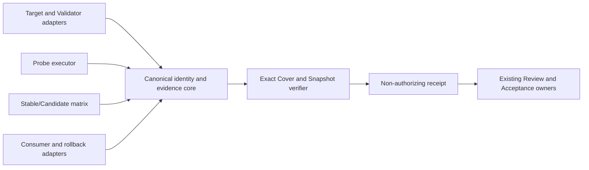

---
name: TC-D1 Trustworthy Skill Replay and Evaluation Repair
type: architecture-spine
purpose: build-substrate
altitude: feature
paradigm: hexagonal evidence pipeline with content-addressed identity and non-authorizing receipts
scope: target and validator trust, probes, historical replay, stable/candidate matrix, consumers, rollback, exact cover, snapshot freshness, lifecycle handoff
status: final
created: 2026-09-12
updated: 2026-09-12
binds: [CAP-1, CAP-2, CAP-3, CAP-4, CAP-5, CAP-6, CAP-7, CAP-8]
sources:
  - ../../../../specs/spec-tc-d1-trustworthy-skill-replay-and-evaluation-repair/SPEC.md
companions:
  - ../../../../specs/spec-tc-d1-trustworthy-skill-replay-and-evaluation-repair/domain-contract.md
  - ../../../../specs/spec-tc-d1-trustworthy-skill-replay-and-evaluation-repair/requirements-and-acceptance.md
  - ../../../../specs/spec-tc-d1-trustworthy-skill-replay-and-evaluation-repair/authority-and-open-questions.md
  - ../../../../specs/spec-tc-d1-trustworthy-skill-replay-and-evaluation-repair/atomic-obligations.md
  - ../../../../specs/spec-tc-d1-trustworthy-skill-replay-and-evaluation-repair/.memlog.md
---

# Architecture Spine - TC-D1 Trustworthy Skill Replay and Evaluation Repair

## Design Paradigm

Use a hexagonal evidence pipeline. Adapters ingest repository targets, validator capabilities, Probes, Stable/Candidate packages, Consumers, and route transitions; an inward canonical identity/evidence core computes bounded results; an outward non-authorizing handoff exposes receipts to review and Acceptance. No adapter owns another lifecycle's state.



## Architecture Decisions

### AD-1 - Canonical identity core is the sole evidence boundary

- **Binds:** CAP-1, CAP-2, CAP-3, CAP-4, CAP-6, CAP-7
- **Prevents:** caller-supplied target/validator identities, copied outcomes, drifted hashes, and inconsistent verdicts.
- **Rule:** Recompute repository-relative target, validator, dependency, Probe, package, case, Consumer, route, snapshot, and evidence identities from current bytes and canonical serialization. A supplied identity is comparison input only. Unknown, stale, ambiguous, escaping, or mismatched identity fails closed.

### AD-2 - Semantic dependency closure is exhaustive and architecture-owned

- **Binds:** CAP-2, CAP-7
- **Prevents:** implementations shrinking trust to reachable files or omitting policy/environment inputs.
- **Rule:** The closure includes executable, data, policy, configuration, and environment representations that can affect target selection, verdict, diagnostic category, or evidence validity. Probe reachability cannot define or narrow it. Architecture fixes the closure semantics; discovery algorithm and concrete registry remain Deferred.

### AD-3 - Validator and Probe evidence are independent executions

- **Binds:** CAP-2, CAP-3
- **Prevents:** self-approval, always-success validators, and infrastructure failures masquerading as negative validation.
- **Rule:** Positive detached Probes must pass; negative detached Probes must fail for their declared defect and expected diagnostic category. Import errors, missing dependencies, timeout, non-start, and other infrastructure failures are execution failures. Each Probe binds input, actual target, command, result, and output. Validator content, dependency closure, compatibility, and descriptive version are independently bound; version text alone is never trust.

### AD-4 - Stable/Candidate matrix uses source-qualified immutable subjects

- **Binds:** CAP-3, CAP-4
- **Prevents:** temporary packages being promoted as Stable or labels replacing behavioral comparison.
- **Rule:** Stable requires verifiable provenance and immutable identity for existing supported behavior. Candidate contains the real change under evaluation. Both execute for every distinct Matrix Case; hashes alone do not prove meaningful difference. Stable eligibility creates no quality baseline or Acceptance authority.

### AD-5 - Matrix, Consumer, and rollback transitions are real calls

- **Binds:** CAP-4, CAP-5
- **Prevents:** skipped cases, unreachable Consumers, configuration-only rollback, and candidate rejection being misreported as restoration.
- **Rule:** Every Matrix Case runs both subjects with distinct fixtures/state and attributable evidence. The frozen Consumer Manifest is checked against the repository call surface and includes VDD, Acceptance, and workflow-model-routing observations. Enable calls Candidate; disable and rollback call Prior Route and reproduce Prior Route identity, verdict, and diagnostic category for each applicable fixture; re-enable calls current approved Candidate. Any applicability exception is approved and bound before execution.

### AD-6 - Exact Cover is a bidirectional evidence graph

- **Binds:** CAP-6
- **Prevents:** aggregate-only assertions, orphan requirements, and false coverage from test counts.
- **Rule:** Every Atomic Obligation maps to its assertion, selector, command, witness, and runtime evidence; every evidence node maps back to exact source. Many-to-many reuse is valid only where each obligation is independently observed. Commands and receipts are implementation bindings, not architecture authority.

### AD-7 - Snapshot and historical evidence are immutable inputs

- **Binds:** CAP-3, CAP-7
- **Prevents:** historical rewrite, stale replay, and portable claims from machine-bound facts.
- **Rule:** Freeze historical membership, paths, and bytes for 08-01 and pre-repair 08-05; repair evidence is append-only. Current Snapshot binds Git baseline, Skill-input v2, code, fixtures, contracts, Consumers, tests, targets, validators, dependencies, sources, and evidence. Bound changes invalidate results; reconstruction first restores identities, then creates fresh process evidence.

### AD-8 - Lifecycle authority remains external and explicit

- **Binds:** CAP-8
- **Prevents:** replay or architecture artifacts publishing completion or inventing approvals.
- **Rule:** Replay, seed, matrix, review, and Quick Dev outputs carry `authorizes: []`. This feature grants no product-scope, Trust Approval, Consumer-exception, Acceptance, release, or archive authority. Existing owner contracts govern transitions; C3 questions remain open and must be confirmed before first reliance or downstream freeze.

### AD-9 - Protected paths and roadmap boundaries are hard stops

- **Binds:** CAP-8
- **Prevents:** installed Skill mutation, Phase/user-sandbox writes, replacement requirement trees, Skill-input redesign, and roadmap creep.
- **Rule:** Reject writes to `_bmad/**`, `.agents/skills/bmad-*/**`, `.agents/skills/gds-*/**`, Phase/runtime/Hosted workspace/account/sandbox paths, and any new TC-D1 requirement tree. Do not redesign Skill-input v2, implement TC-E0/D2-D6, promote seeds, or add autonomous modification, Miner/Curator, ranking, or RL. Production changes require prior real defect-revealing tests.

## Inherited Invariants

- Canonical package and selection contract remains `canonical-spec-package.v1` with typed role graph and content-addressed selection.
- ADR-0041 ownership separation, ADR-0053 lifecycle separation, ADR-0058 bounded replay/non-authorizing evidence, and ADR-0060 Skill-input v2 binding are read-only inherited constraints.
- Installed BMAD/GDS files remain forbidden changes; C1/C2 conditions are not relaxed.

## Structural Seed

```text
adapters/
  target-validator/
  probes/
  matrix/
  consumers-rollback/
core/
  canonical-identity/
  evidence-and-verdict/
  dependency-closure/
  exact-cover/
  snapshot/
handoff/
  non-authorizing-receipts/
```

## Deferred

- Concrete validator adapter API, dependency discovery algorithm, schema field names, command registry, fixture layout, hash projection, and Windows launcher details.
- Stable commit/package selection and source registry representation.
- Consumer registry persistence and route-switch implementation.
- Exact timeout/output budgets, normalization exclusions, and retry policy.
- Concrete Trust Approval, product-scope, and Consumer-exception authorities; C3 remains open.
- Runtime implementation, production tests, Quick Dev, VDD, Acceptance, and live backend execution.

## Spec Reconciliation

- SP-H1 atomic obligation register is consumed as the acceptance universe; this spine adds no replacement obligation.
- SP-H2 closure categories and Probe reachability rule are ratified by AD-2.
- SP-M1 route semantics are ratified by AD-5.
- SP-M2 detached Probe oracle is ratified by AD-3.
- SP-M3 source-qualified Stable eligibility is ratified by AD-4.
- The PRD and Spec remain the requirement authorities; this spine fixes only cross-unit invariants and defers implementation choices.
