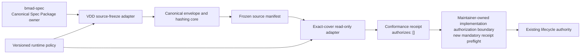

# Architecture Spine - VDD Conformance Exact-Cover

## Design Paradigm

Use a hexagonal producer-consumer pipeline with canonical content-addressed envelopes. `bmad-spec` owns the Canonical Spec Package contract and its external selection registry. VDD is the only source-freeze producer and owns create/repair through `draft` and `plan-ready`; the maintainer authorization adapter alone owns receipt preflight and publication of `implementation-authorized`. Exact-cover is a read-only deterministic consumer that independently reconstructs canonical identities before it evaluates coverage. Shared canonicalization and schema libraries sit inward of both adapters; neither adapter owns or may fork those rules.



Dependency direction is inward toward the canonical contract core. The core may not import VDD lifecycle, model execution, review, acceptance, or release modules. Exact-cover may emit diagnostics and non-authorizing receipts only; it may not call lifecycle transitions directly.

## Invariants & Rules

### AD-1 - Canonical package conformance replaces producer attestation [ADOPTED]

- **Binds:** CAP-1, CAP-2, VCEC-A01
- **Prevents:** A valid package being rejected because its producer identity is not mechanically attestable, or an invalid package passing through a provenance string.
- **Rule:** The input gate validates `canonical-spec-package.v1` conformance, not who produced the bytes. The sole physical package descriptor is YAML frontmatter in exactly one root `SPEC.md`; a package-manifest sidecar or a nested competing `SPEC.md` is invalid. `bmad-spec refresh` must add `package_schema: canonical-spec-package.v1` and encode `sources` and `companions` as ordered typed entries `{path, role}`. Each `path` is a normalized repository-relative POSIX path resolved from the repository root under AD-4 containment. A `normative_companion` must remain under the package root; an `adopted_companion` or `provenance` entry may live elsewhere inside the repository and is included only by explicit descriptor entry. Package frontmatter roles are closed to `normative_companion`, `adopted_companion`, and `provenance`; `SPEC.md` is implicitly the sole `canonical` entry and cannot appear in either list. `repository_authority` and `unresolved_input` are forbidden in package frontmatter and are introduced only by the VDD source-freeze manifest. Each path is unique, and relationships are encoded only by schema-owned role/relationship fields. Unknown schema versions, roles, or relationship fields, duplicates, missing referenced files, or unlisted normative companions fail closed. Every listed normative/adopted companion, including this adopted architecture spine after refresh, and every provenance source is included in the source-entry universe; provenance is hashed but contributes no package-owned obligation. No unlisted file gains normative authority merely by residing in the directory. `bmad-spec` owns the descriptor schema, but producer name or self-declared provenance is not a pass/fail predicate. In addition, `bmad-spec` publishes a content-addressed `canonical-spec-package-selection.v1` record outside the package, containing the package ID, expected descriptor hash, and complete expected role graph. A maintainer-scoped current pointer selects that record by its canonical hash; callers cannot substitute either artifact. VDD resolves the pointer and record from the repository registry and verifies both independently. This is a completeness commitment and caller-independent selection root, not producer attestation. VDD deterministically constructs the package manifest during source freeze. A later trusted producer attestation may be recorded as evidence but cannot replace conformance validation.

### AD-2 - One narrow canonical JSON contract binds every identity [ADOPTED]

- **Binds:** CAP-1, CAP-2, CAP-4, CAP-5, CAP-6
- **Prevents:** VDD and exact-cover computing different hashes for semantically identical data.
- **Rule:** Every hashed JSON payload uses `repository-canonical-json.v1`. It emits UTF-8 without BOM or trailing newline, with `ensure_ascii=false`, compact `,` and `:` separators, arrays in input order, and object keys sorted lexicographically by Unicode scalar value sequence, matching Python string ordering rather than UTF-8-byte or UTF-16-code-unit ordering. Strings retain their scalar sequence without Unicode normalization; quote, reverse solidus, and U+0000 through U+001F use the lowercase short JSON escape where one exists (`\b`, `\t`, `\n`, `\f`, `\r`) or lowercase `\u00xx`, while other valid scalars are emitted as UTF-8. Parsers reject duplicate keys, non-string keys, invalid UTF-8, and lone surrogate code points. Values are limited to `null`, boolean, string, integer, array, and object; integers use the shortest base-10 grammar `0|-?[1-9][0-9]*`, with no implementation-specific magnitude limit, and floats, NaN, and Infinity are rejected. Hash text is `sha256:` plus 64 lowercase hexadecimal characters. Implementations may wrap the repository's existing canonical JSON helper only if these narrower rules are enforced. Normative cross-adapter vectors distinguish scalar, UTF-8-byte, and UTF-16 ordering and fix exact serialized bytes.

### AD-3 - Hashes use explicit domains and artifact-specific projections [ADOPTED]

- **Binds:** CAP-1, CAP-4, CAP-5, CAP-6
- **Prevents:** Cross-kind hash substitution, recursive self-hashing, and silent divergence caused by generic field removal.
- **Rule:** Except for the ratified `vcec-shard-v1` identity below, each hash input is the canonical JSON encoding of `{"domain":"jimuyun.vdd-exact-cover.<hash-kind>.v1","payload":<typed-payload>}`. A schema-owned projection lists the exact fields included for that artifact. The projection for a self-hashed artifact excludes only that artifact's declared self-hash or fingerprint field; no generic recursive stripping is allowed. Domain name, payload schema version, projection, and golden vectors change together under an explicit successor version. The sole exception is shard identity: lowercase SHA-256 over the exact UTF-8 bytes `vcec-shard-v1\n<manifest_path>\n<source_sha256_hex>\n<start_byte>\n<end_byte>\n`, with unprefixed 64-lowercase-hex source and result hashes and unsigned base-10 offsets without leading zeros. Shard identity has its own type and cannot be supplied where an AD-3 envelope hash is required.

### AD-4 - Directory manifests have one path and ordering algorithm [ADOPTED]

- **Binds:** CAP-1, CAP-4, CAP-5, CAP-6
- **Prevents:** Platform-specific enumeration, case, traversal, or link behavior changing package identity.
- **Rule:** A directory manifest contains files only. Each entry is `{path, kind:"file", size_bytes, sha256}` where `path` is a contained, repository-relative POSIX path and `sha256` uses the AD-2 text form. Producers reject empty, absolute, drive-qualified, URI, `.`/`..` traversing, backslash-containing, symlink/reparse-resolved, or case-colliding paths. Entries sort by unsigned UTF-8 bytes of `path`. `size_bytes` is the exact file byte count and each file hash covers raw bytes. The directory-manifest hash covers its schema version, normalized root role, and complete ordered entry array through the AD-3 envelope.

### AD-5 - Manifest identities are independently reconstructable [ADOPTED]

- **Binds:** CAP-1, CAP-2, CAP-4, CAP-5
- **Prevents:** Caller-supplied hashes or discovery order becoming authority.
- **Rule:** `source_manifest.canonical_hash` is computed from a projection containing manifest schema version, run and target identity, normalized package root, the AD-4 source entry array, typed authority roles, relationships, unresolved declarations, and literal `authorizes: []`; it excludes only `canonical_hash`. `requirements_manifest_hash` is the AD-4 canonical directory-manifest hash of the target plan's requirements directory, never a hash of raw enumeration order or caller prose. VDD and exact-cover parse current bytes and recompute both identities independently; a supplied identity is comparison input only.

### AD-6 - Aggregate and shard reuse fingerprints bind exact payloads [ADOPTED]

- **Binds:** CAP-2, CAP-3, CAP-4, CAP-6
- **Prevents:** Stale extraction reuse after a relevant contract change, or needless shard invalidation after an unrelated package change.
- **Rule:** `run_aggregate_fingerprint.v1` uses the exact payload `{source_manifest_hash, requirements_manifest_hash, validator_identity, prompt_identity, policy_identity, authoritative_companions}`. `shard_reuse_fingerprint.v1` uses `{shard_identity, source_segments, roles, relationships, requirements_manifest_hash, validator_identity, prompt_identity, policy_identity}` and deliberately omits the whole source-manifest hash as an equality condition. Every `*_hash` is an AD-3 hash string; `shard_identity` is the typed AD-3 exception. Each nested identity is `{id, schema_version, canonical_hash}` with non-empty strings. `authoritative_companions` entries are `{path, role, sha256}` sorted by UTF-8 path bytes then role. `source_segments` entries are `{path, role, source_sha256, start_byte, end_byte, start_line, end_line}` sorted by path/start_byte/end_byte/role; byte ranges are zero-based half-open, line ranges are one-based half-open, and empty/overlapping segments are invalid. `roles` is a sorted unique string array. `relationships` entries are `{from_path, relationship, to_path}` sorted by from/relationship/to using UTF-8 bytes. No field is nullable or optional in v1; absence blocks computation or reuse. Each fingerprint excludes only its own output field under AD-3. Golden vectors own complete envelope bytes and expected digests. Aggregate output is always recomputed from the current complete active universe; quarantined shards remain included and block `conformant`.

### AD-7 - Operational thresholds belong to a versioned runtime policy [ADOPTED]

- **Binds:** CAP-3, CAP-4, CAP-6, CAP-7
- **Prevents:** Spec-authoring defaults becoming irreversible architecture or operators changing behavior without invalidating evidence.
- **Rule:** Retry families, shard soft/hard ceilings, hotspot/quarantine rules, and presentation caps live in an allowlisted, schema-valid runtime-policy registry owned by the repository toolchain maintainer. Every retry family has a finite positive maximum attempt count and stable exhaustion outcome. Every size/count threshold is a positive integer with an explicit unit and boundary predicate. Before extraction, VDD resolves one approved profile from the registry and freezes its stable policy ID, canonical AD-2 hash, and registry revision into the run/source-freeze inputs. Exact-cover independently resolves and re-hashes that same registered profile; caller-only, unknown, unapproved, mismatched, or mutable inline profiles fail closed. The profile hash is included by AD-6 and receipts report the selected identity. Numeric values remain policy, not architecture. A maintainer-approved successor invalidates affected fingerprints and evidence but needs a new architecture decision only when ownership, safety posture, or governing predicates change.

### AD-8 - Exact UTF-8 bytes are the output gate; tokens are telemetry [ADOPTED]

- **Binds:** CAP-4, CAP-6, CAP-7
- **Prevents:** Different tokenizers producing different deterministic validation outcomes.
- **Rule:** The only model-visible hard gate is 12,000 UTF-8 bytes measured over the exact serialized wire artifact, including its schema-required trailing newline. `estimated_tokens_v1 = ceil(exact_serialized_utf8_bytes / 4)` and is emitted with `measurement_mode: estimated` and `measurement_method: utf8-bytes-ceil-div-4-v1`. It is derived telemetry, not a second acceptance predicate. A producer that cannot fit the schema-valid bounded artifact fails explicitly; it never silently truncates and reports success.

### AD-9 - Exact-cover cannot acquire lifecycle authority [ADOPTED]

- **Binds:** CAP-3, CAP-4, CAP-5, CAP-7
- **Prevents:** A conformance result mutating a plan, launching review, or being promoted into implementation or release authorization.
- **Rule:** Exact-cover reads the frozen package, requirements, policy, schemas, and current evidence; it writes only run-scoped diagnostics, checkpoints, and receipts with `authorizes: []`. VDD owns source-freeze production, create/repair, `draft`, and `plan-ready`; the existing maintainer-owned `plan-ready -> implementation-authorized` boundary gains a mandatory current-receipt preflight for canonical-flow plans. That preflight independently binds the current source manifest, requirements manifest, validator identity, and registered policy, and rejects missing, stale, mismatched, non-conformant, prose, or boolean substitutes. Plan-readiness never implies phase authorization, implementation acceptance, or release. Recovery consumes only the AD-11 checkpoint selected by authorized branch, validated hash lineage, and greatest sequence, together with its scoped live blocker, and preserves target requirements bytes; assistant prose, model history, raw logs, cached extraction, timestamps, and convenience pointers are not recovery authority.

### AD-10 - Semantic ambiguity has one non-authorizing escalation and re-entry path [ADOPTED]

- **Binds:** CAP-3, CAP-4, CAP-7
- **Prevents:** Deterministic defects being laundered through LLM review, post-implementation assurance being confused with upstream clarification, or review prose mutating requirements directly.
- **Rule:** `bootstrap-upstream-plan` is eligible only after all deterministic schema, path, identity, set, mapping, disposition, and output checks are current and non-failing, and a typed diagnostic proves a source-bound requirement-semantic ambiguity that deterministic rules cannot resolve. Launch requires explicit authorization by the existing Bootstrap owner and a distinct pre-implementation review identity; exact-cover cannot auto-launch it, and post-implementation semantic assurance uses a separate lifecycle. Accepted review output remains non-authorizing until the exact-cover non-mutating handoff adapter packages it as `vdd-repair-input.v1` bound to review run, source manifest, prior requirements manifest, validator, policy, ambiguity IDs, and allowed repair scope. VDD may validate and consume that artifact only during explicit repair; it does not produce its own repair input. Explicit VDD repair alone may create a new requirements identity. That identity invalidates prior extraction, aggregate, receipt, and authorization evidence; exact-cover must rerun to a current result before re-entry. Rejected, incomplete, stale, or mismatched handoffs remain blocked and preserve prior bytes and evidence.

### AD-11 - Recovery follows one append-only checkpoint state machine [ADOPTED]

- **Binds:** CAP-4, CAP-6, VCEC-035
- **Prevents:** Clock skew, concurrent attempts, or abandoned forks causing different consumers to resume different state.
- **Rule:** `recovery-checkpoint.v1` is create-new, append-only, and a tagged union on stage-tagged input availability. Every checkpoint binds `{run_id, branch_id, sequence, stage, state, validator_identity, policy_identity, artifact_refs, attempt_binding, shard_states, live_blocker, next_legal_actions}` plus its artifact hash. `validator_identity` and `policy_identity` use the AD-6 nested identity form, are mandatory from `package_candidate`, and remain immutable for the run; an unavailable validator or approved policy prevents creation of a recoverable run rather than creating a partially bound checkpoint. `artifact_refs` is the complete current set of checkpoint-consumed or checkpoint-produced artifacts, each `{role,path,sha256,schema_version}`, sorted by UTF-8 bytes of role then path; paths obey AD-4 containment, roles are schema-closed, and raw bytes are re-hashed on every resume. Missing, extra, tampered, duplicate, or drifted refs fail closed, and neither directory enumeration nor a mutable convenience pointer may supply an omitted artifact. Its `input_bindings` form a monotonic union: `package_candidate` binds candidate descriptor/selection evidence; `source_frozen` adds `source_manifest_hash`; `requirements_frozen` adds `requirements_manifest_hash`; `aggregate_available` adds the full AD-6 `run_aggregate_fingerprint`. Each variant lists every not-yet-available later identity in a closed typed `unavailable` array of `{identity, reason}`; null, empty, placeholder, fabricated hashes, stage regression, or loss/change of an earlier binding is invalid. `attempt_binding` is exactly one of `{status:"unavailable",reason}` or `{status:"available",attempt_identity}` and becomes available monotonically once an attempt starts. `shard_states: []` is the sole pre-partition form; after partition it is the complete shard-identity-sorted set, and later checkpoints may change states but may not add, remove, or reorder shard identities for the same aggregate fingerprint. `live_blocker` is exactly `{status:"none"}` or `{status:"present",blocker}`; terminal `blocked` requires `present`, while every other state permits `none` and may carry `present` only for the selected lineage's current unresolved blocker. `fingerprint_status` is derived from stage and, before aggregate availability, no checkpoint can authorize reuse or `conformant`. The `available` variant requires the complete AD-6 value and an empty unavailable set. `sequence` starts at 0 per branch and increases by exactly one; same-branch sequence 0 has no `predecessor_hash`, while every later same-branch checkpoint names the prior checkpoint hash. A fork-root sequence 0 instead uses an independent `fork_from` object containing parent branch, parent checkpoint hash, and authorization reference; it still omits same-branch `predecessor_hash`. No predecessor may have two same-branch successors unless an explicit authorized fork creates a new `branch_id`. Legal nonterminal states are `running`, `checkpointed`, and `semantic_handoff_required`; terminal states are `blocked`, `conformant`, and `aborted`. `conformant` requires `aggregate_available`. Legal transitions are `running -> checkpointed|semantic_handoff_required|blocked|conformant|aborted`, `checkpointed -> running|blocked|aborted`, and `semantic_handoff_required -> blocked|aborted`; repair starts a new run/requirements identity rather than transitioning the old run. Publication is atomic create-new followed by atomic update of a non-authoritative convenience pointer only after full validation. Resume selects the explicitly authorized branch, validates its complete hash lineage, artifact refs, and bound identities, then chooses its greatest sequence; validator or policy drift starts a new run or fails closed. Without an authorized branch choice, divergent valid forks block. A live blocker is authoritative only when it belongs to that selected checkpoint or a higher sequence on the same lineage and explicitly supersedes the prior blocker. Wall-clock time, filesystem order, convenience pointers, and assistant summaries never select recovery state.

## Consistency Conventions

| Concern | Convention |
| --- | --- |
| Schema and domain names | Lowercase stable IDs with an explicit `.v1` suffix; successors never mutate old semantics. |
| Hash values | `sha256:<64 lowercase hex>` over an AD-3 envelope; raw file hashes cover raw bytes. Typed `vcec-shard-v1` identity is the sole unprefixed non-JSON exception. |
| Paths | Repository-relative POSIX paths only; compare collision keys case-insensitively while retaining original case in the manifest. |
| Errors | Stable machine code, family, severity, artifact identity, current/expected hash, and deterministic next action; prose is supplementary. |
| Evidence | Append-only/run-scoped, current candidate/source/validator/policy bound, and `authorizes: []` unless an existing external owner explicitly consumes it. |
| Recovery | Resume from the greatest validated sequence on the explicitly authorized branch and hash lineage; invalidate stale checkpoints on any bound identity change. |

## Structural Seed

```text
shared canonical-contract core
  schemas/                 # canonical package, manifests, envelopes, policy, receipts
  canonical_json/          # narrow parser, serializer, domain hashing, golden vectors
  path_manifest/           # containment, link/collision checks, deterministic ordering
VDD adapter
  source_freeze/           # package validation and manifest production
exact-cover adapter
  extraction/              # deterministic partition and bounded semantic extraction
  coverage/                # sound-and-complete cover and disposition checks
  recovery/                # checkpoints, typed diagnostics, explicit repair handoff
maintainer authorization adapter
  authorization_preflight/ # current receipt prerequisite and implementation publication
tests
  contract_vectors/        # producer/consumer cross-implementation identity vectors
  negative_fixtures/       # duplicate keys, paths, stale hashes, mutations, authority leaks
```

Golden vectors must cover exact string escapes, lone-surrogate rejection, unbounded integer grammar, preserved array order, and object-key cases that produce different scalar-value, UTF-8-byte, and UTF-16-unit orders. They must also cover duplicate-key and float rejection, self-hash projection, UTF-8 path ordering, traversal/link/case collision rejection, the exact `vcec-shard-v1` byte payload and type separation, paired producer/consumer manifest and fingerprint recomputation, and pre-aggregate recovery rejection for validator drift, policy successors, missing/tampered artifact refs, and convenience-pointer disagreement.

## Capability -> Architecture Map

| Capability / Area | Lives in | Governed by |
| --- | --- | --- |
| CAP-1 package authority freeze | Canonical package contract and VDD source-freeze adapter | AD-1 through AD-5 |
| CAP-2 exact sound-and-complete cover | Exact-cover coverage adapter | AD-2, AD-5, AD-6 |
| CAP-3 ambiguity isolation | Exact-cover diagnostics, authorized upstream review, and VDD repair/re-entry | AD-7, AD-9, AD-10 |
| CAP-4 diagnostics and recovery | Exact-cover recovery adapter and run-scoped evidence | AD-3, AD-6, AD-8 through AD-11 |
| CAP-5 authorization prerequisite | Maintainer-owned implementation authorization boundary with mandatory current-receipt preflight | AD-5, AD-6, AD-9 |
| CAP-6 scalable extraction and reuse | Extraction adapter and versioned runtime policy | AD-6 through AD-8, AD-11 |
| CAP-7 deterministic validation | Shared schemas, golden vectors, negative and composition fixtures | AD-1 through AD-11 |

## SPEC Reconciliation

This spine supersedes the following package statements until `bmad-spec refresh` incorporates it:

| SPEC item | Disposition | Architecture result |
| --- | --- | --- |
| Retry maxima `3 / 3 / 2 / 3` | DEFER | Keep only as candidate runtime-policy defaults; architecture requires finite positive family-specific maxima and hash binding. |
| Shard `32 KiB / 400 lines`, hard `48 KiB / 600 lines` | DEFER | Partition algorithm and identity are invariant; numeric ceilings belong to the runtime policy. |
| Finding/presentation caps | DEFER | Versioned presentation policy owns the values and invalidates bound evidence when changed. |
| 12,000 UTF-8 bytes | RATIFY | Sole exact model-visible hard gate, measured over the complete serialized artifact. |
| 3,000 estimated tokens | AMEND | Deterministic `ceil(bytes/4)` telemetry only, never an independent gate. |
| Reject non-bmad-spec package | AMEND | Reject non-conformant `canonical-spec-package.v1`; do not require producer attestation. |
| Hash/fingerprint references | AMEND | AD-2 through AD-6 provide the missing serialization, projection, directory, domain, and payload contracts. |
| `vcec-shard-v1` identity | RATIFY | Preserve its exact newline-delimited byte payload and unprefixed representation as the sole typed non-JSON hash exception. |
| Package descriptor | AMEND | Root `SPEC.md` frontmatter is the sole descriptor; refresh adds schema/version and typed entries and adopts this spine. |
| Recovery checkpoint prose | AMEND | AD-11 defines lineage, ordering, forks, legal states, atomic publication, and deterministic selection. |

## Deferred

- Exact retry, shard, hotspot, quarantine, and presentation values are deferred to implementation of the maintainer-owned versioned runtime-policy registry. Ratification requires representative fixtures and bounded-run evidence; changing them does not alter architecture while AD-7 remains satisfied.
- Concrete schema registry filenames and source module names are deferred to the implementation plan. Their ownership and dependency direction are fixed here; aliases or duplicate authorities are not allowed.
- Trusted producer attestation is deferred because package conformance is mechanically sufficient for this feature. Adding attestation later must remain supplementary unless a separate trust-boundary decision changes the acceptance model.
- Deployment topology is inherited from the repository toolchain control plane. This feature adds offline repository artifacts and validators only; it introduces no service listener, database, external provider, credential authority, or user-sandbox mutation path.
- Performance tuning beyond bounded retries, deterministic partitioning, and exact output limits is deferred until measured dogfood evidence exists. Correctness, freshness, and authority isolation cannot be traded for throughput.
