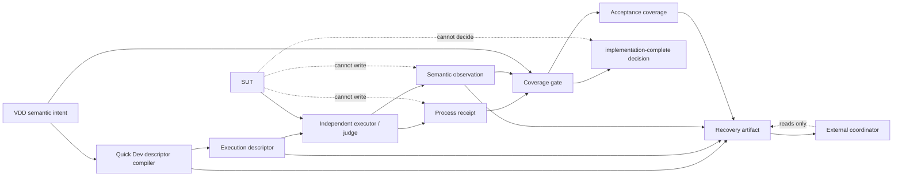

# Architecture Spine - VDD Quick Dev Semantic Oracle Recovery

## Design Paradigm

Use a hexagonal evidence pipeline. VDD produces semantic intent; Quick Dev compiles execution descriptors and publishes recovery projections; an independent executor/judge produces receipts and observations; the coverage gate alone evaluates completion. The SUT and external coordinator are adapters outside this authority core. Dependencies move toward immutable artifact contracts, never from a consumer back into an upstream writer.



## Invariants & Rules

### AD-1 - Separate trust zones by artifact authority [ADOPTED]

- **Binds:** CAP-1..CAP-7; FR-1..FR-17; NFR-1..NFR-11
- **Prevents:** VDD executing its own intent, Quick Dev self-judging, SUT-provided pass status, coordinator-side completion, or a coverage consumer rewriting upstream evidence.
- **Rule:** VDD, Quick Dev, independent executor/judge, SUT, coverage gate, and external coordinator are separate trust zones. Each boundary exchanges versioned artifacts only. An adapter may validate inbound artifacts but may not write another zone's authoritative artifact.

### AD-2 - VDD owns semantic intent, not execution evidence [ADOPTED]

- **Binds:** CAP-1, CAP-2; FR-1, FR-2, FR-10; NFR-5..NFR-9
- **Prevents:** Commands, receipts, hashes, or implementation-specific execution choices entering VDD and pre-judging Quick Dev.
- **Rule:** VDD is the sole writer of `semantic-verification.v1`. Each oracle declares `case_source_refs` and `case_producer_ref` as abstract references, alongside selector, subject, required case roles, failure intent and lane/preflight fields. VDD must not emit executable, argv, cwd, command, receipt, hash, run ID, or observed result.

### AD-3 - Quick Dev owns descriptor compilation and recovery publication [ADOPTED]

- **Binds:** CAP-2, CAP-3, CAP-6, CAP-7; FR-3, FR-12, FR-14, FR-15, FR-17
- **Prevents:** Caller-controlled target/cwd, VDD-generated commands, implicit loop decisions, or a coordinator reconstructing mutable evidence.
- **Rule:** Quick Dev is the sole writer of execution descriptors, recommendation-only artifacts, reuse/invalidated-observation records, and recovery artifacts. A descriptor is immutable after candidate freeze and binds `shell=false`, executable, argv, cwd, target identity, fixture identity, and RED oracle/test identity. The recovery artifact is a projection of referenced identities and current live blockers; it has no completion authority.

### AD-4 - The independent executor/judge owns process truth [ADOPTED]

- **Binds:** CAP-3, CAP-5; FR-4, FR-5, FR-8, FR-9; NFR-1..NFR-4, NFR-7..NFR-8
- **Prevents:** SUT self-report, copied expected observations, unexecuted fixtures, zero-test success, or a candidate judge promoting itself.
- **Rule:** Only the independent executor/judge writes process receipts and semantic observations. It executes the descriptor against the SUT and derives exit code, stdout/stderr hash, target/fixture identity, executed count, actual matrix results, `evidence_state`, `verification_outcome`, `failure_family`, and `failure_id`. SUT output is input evidence only; it never writes a receipt, observation, coverage or judge verdict.

### AD-5 - Coverage gate owns exact-cover and completion [ADOPTED]

- **Binds:** CAP-1, CAP-4, CAP-6; FR-2, FR-6, FR-7, FR-11, FR-13, FR-14; NFR-2, NFR-6..NFR-11
- **Prevents:** Incomplete active Acceptance IDs, exclusive-partition assumptions, stale observation promotion, or `implementation-complete` inferred from a report.
- **Rule:** Coverage gate is the sole writer of `acceptance-coverage.v1` and the sole evaluator of `implementation-complete`. The active Acceptance ID universe is the immutable `active_acceptance_manifest` identity frozen by VDD; coverage stores and verifies that identity. It validates sound-and-complete many-to-many cover: every ID in that universe has at least one admissible oracle/observation path, and every asserted path resolves to an ID in that same universe; overlap is permitted. It accepts only current, identity-matched observations with receipts, non-zero execution, required independence, and no invalidation.

### AD-6 - Result layers have independent legal domains [ADOPTED]

- **Binds:** CAP-3, CAP-4, CAP-6; FR-4, FR-7, FR-11, FR-13, FR-17; NFR-7, NFR-9..NFR-11
- **Prevents:** Treating planned evidence as a result, converting timeout into pass/fail, or using a failure ID as a lifecycle state.
- **Rule:** `evidence_state` is exactly `planned-only|observed-run|recovered-run|invalid-run`. `verification_outcome` is exactly `pass|fail|blocked|incomplete|not-applicable`. Legal pairs are closed: `planned-only` only permits `not-applicable|incomplete|blocked`; `observed-run` permits `pass|fail|blocked|incomplete`; `recovered-run` permits `pass|fail|blocked|incomplete`; `invalid-run` only permits `fail|blocked|incomplete`; every other pair is invalid. `pass` and `not-applicable` carry neither failure family nor failure ID. `fail|blocked|incomplete` carry a failure family whenever classification is known; a failure ID is present only with that family and is its deterministic member. `expected-red` is a failure family with `verification_outcome=fail`, never pass. A recovered run only references an existing complete receipt plus observation and must not synthesize matrix results, hashes, or process facts; any current descriptor/target/fixture/oracle/live-blocker identity mismatch changes it to `invalid-run`. No state/outcome pair authorizes completion without AD-5.

### AD-7 - Artifact graph is append-only and single-writer

- **Binds:** CAP-1, CAP-3, CAP-4, CAP-6; FR-3, FR-4, FR-6, FR-7, FR-12, FR-17; NFR-1..NFR-3
- **Prevents:** Two writers for descriptor/receipt/observation/coverage/recovery, mutable receipt replacement, or coordinator-created evidence.
- **Rule:** Artifact ownership is fixed: VDD writes semantic intent and active-acceptance manifest; Quick Dev writes descriptor, recommendation, reuse state and recovery artifact; executor/judge writes receipt and observation; coverage gate writes coverage/completion. Each zone has write permission only to its owned artifact root and read permission only to identity-addressed inbound roots; SUT has no artifact-root write permission and coordinator has read-only recovery permission. All writers append a new versioned artifact by atomic create-if-absent and reference immutable predecessors by identity; none overwrites historical artifacts. A current resolver selects the newest schema-valid artifact in an owner-specific append-only index whose entry binds artifact identity, predecessor identity, writer zone and timestamp; equal sequence or concurrent publication conflicts fail closed rather than choosing by filesystem order.

### AD-8 - N→N+1 promotion uses frozen predecessor judging [ADOPTED]

- **Binds:** CAP-5; FR-8, FR-9, FR-15; NFR-1, NFR-3, NFR-8, NFR-10
- **Prevents:** Candidate Quick Dev validating itself, changing its judge or fixtures after RED, or treating historical 08-05 evidence as mutable input.
- **Rule:** A self-hosted candidate is always SUT. Before change, freeze predecessor judge bytes, black-box regression fixture bytes, expected failure IDs and identity hashes. The frozen predecessor or separately provisioned external judge executes the candidate. Promotion is a new append-only record only after all mandatory false-green regressions and corrected fixtures pass. Frozen judge artifacts are read-only.

```mermaid
sequenceDiagram
  participant P as N predecessor judge
  participant F as Frozen fixtures + oracle
  participant C as N+1 candidate Quick Dev (SUT)
  participant G as Coverage gate
  P->>F: bind judge and fixture hashes
  P->>C: execute frozen RED/negative/mutation suite
  C-->>P: process behavior only
  P->>G: append receipt + observation
  G-->>P: validate coverage and independence
  alt all mandatory cases pass
    G-->>C: eligible for N+1 promotion record
  else any false-green or identity failure
    G-->>C: blocked; candidate remains SUT
  end
```

### AD-9 - Reuse follows change-impact invalidation [ADOPTED]

- **Binds:** CAP-4, CAP-6, CAP-7; FR-12, FR-14, FR-15, FR-17; NFR-1, NFR-2, NFR-9..NFR-11
- **Prevents:** Reusing green evidence after target/fixture drift, avoiding coverage recomputation after semantic changes, or using reuse to lower the authenticity floor.
- **Rule:** Quick Dev writes per-oracle reuse decisions. Code/test/schema/validator changes invalidate affected oracle evidence; requirements/acceptance/plan semantic changes retain only identity-valid test observations but require coverage recomputation against the new active-acceptance manifest; fixture/target/command changes invalidate related RED, GREEN and REFACTOR evidence; ordinary non-semantic documentation changes may reuse valid observations. Every invalidation names its cause and required next action. Validator, executor and schema owners must each provide positive, negative and mutation fixtures before their artifact type can enter a coverage decision.

### AD-10 - Recovery is published, not coordinated here [ADOPTED]

- **Binds:** CAP-6; FR-11, FR-12, FR-13, FR-17; NFR-2, NFR-9..NFR-11
- **Prevents:** Chat context becoming recovery authority, coordinator code being smuggled into Quick Dev, or historic summary overriding a current blocker.
- **Rule:** Quick Dev publishes a new recovery-artifact projection with state/outcome/failure layers, descriptor/receipt/observation/coverage identities, recommendation, reusable and invalidated observations, deterministic fingerprint and current live blockers. It reads coverage and observation identities but neither writes coverage nor rewrites observations. An external coordinator may consume this projection read-only but is not implemented or authorized by this spine. Recovery evaluates current artifact integrity and identity before historical summary.

### AD-11 - Profiles only select scope and cost [ADOPTED]

- **Binds:** CAP-3, CAP-4, CAP-5, CAP-7; FR-5, FR-6, FR-8, FR-9, FR-15; NFR-1..NFR-4, NFR-8, NFR-10
- **Prevents:** `fast-ship` skipping real execution, non-zero counts, binding, exact cover or independent judge.
- **Rule:** `fast-ship`, `standard`, and `self-hosted` alter selected oracle scope only. Every profile requires real process execution, non-zero case/test count, target/fixture binding, admissible many-to-many cover and independent judging. `self-hosted` additionally requires AD-8.

### AD-12 - Failure classification is stop-loss, not authority [ADOPTED]

- **Binds:** CAP-2, CAP-3, CAP-6; FR-10, FR-12, FR-13, FR-17; NFR-7, NFR-9..NFR-11
- **Prevents:** `repo-noise` acting as RED, harness failure entering GREEN, timeout becoming pass/fail, and unbounded same-parameter retries.
- **Rule:** `semantic-contract-gap` routes to VDD repair; `repo-noise` cannot satisfy RED; `test-harness-failure` cannot advance GREEN; `timeout-no-observation` is non-completing; repeated identical deterministic fingerprints emit a `stop` recommendation and preserve evidence. Stop-loss changes neither state/outcome legality nor coverage authority.

## Consistency Conventions

| Concern | Convention |
| --- | --- |
| Artifact names | `semantic-verification.v1`, descriptor, `process-receipt.v1`, `semantic-observation.v1`, `acceptance-coverage.v1`, recovery artifact; versioned artifacts have one schema owner. |
| Identity | `sha256:<lowercase-hex>` plus schema/versioned projection; all references use immutable artifact identity, never “latest” bytes. |
| State/result | Lowercase hyphenated enum values. `evidence_state`, `verification_outcome`, `failure_family`, `failure_id` are separate fields. |
| Writes | One zone owns one artifact kind; append new artifacts rather than edit history. |
| Errors | Stable `failure_family` plus deterministic `failure_id`; caller-facing text is non-authoritative. |
| Recovery | Recommendation-only before expensive action; recovery artifact is consumed externally, not a lifecycle command. |

## Stack

| Name | Version / status |
| --- | --- |
| Python | Existing repository toolchain host [ASSUMPTION] |
| Quick Dev adapter | Existing `quick-dev-tdd-adapter` Python tools; semantic pipeline is new |
| Canonical identity | Repository canonical JSON/SHA-256 helper integration point [ASSUMPTION] |
| Test adapters | Existing pytest, unittest and dotnet-test lanes |

## Structural Seed

```text
.agents/skills/
  vdd-execution-plan/                 # semantic-verification writer + validator
  quick-dev-tdd-adapter/                # existing descriptor/lifecycle host
    tools/
      build_slice_invocation.py          # existing shell-free descriptor basis
      semantic_oracle/                   # proposed independent executor/judge boundary
      coverage_gate/                     # proposed coverage/completion writer
  acceptance-or-review/               # external consumer boundary only
_bmad-output/specs/
  spec-vdd-quick-dev-semantic-oracle-recovery/
_bmad-output/planning-artifacts/architecture/
  architecture-vdd-quick-dev-semantic-oracle-recovery-2026-08-25/
```

## Capability → Architecture Map

| Capability / Area | Lives in | Governed by |
| --- | --- | --- |
| CAP-1 semantic intent and exact cover | VDD contract + coverage gate | AD-1, AD-2, AD-5 |
| CAP-2 preflight | VDD validator + Quick Dev route | AD-2, AD-12 |
| CAP-3 frozen execution | Quick Dev descriptor + executor/judge | AD-3, AD-4, AD-6 |
| CAP-4 completion evidence | observation + coverage gate | AD-5, AD-7, AD-9 |
| CAP-5 self-hosted promotion | frozen judge lane | AD-4, AD-8, AD-11 |
| CAP-6 recovery publication | Quick Dev recovery artifact | AD-3, AD-7, AD-10 |
| CAP-7 profiles and replay | Quick Dev reuse/profile selection | AD-9, AD-11, AD-12 |

## Deferred

| Decision | Deferred because | Re-decide when |
| --- | --- | --- |
| Comparator types and stdout/stderr normalization | The semantic comparator is an implementation contract; no source selects exact/regex/structured forms or cross-platform normalization. | Before the first case-matrix schema and cross-platform receipt fixture are accepted. |
| Judge lifecycle, retention and revocation | AD-8 freezes an identity but does not define operational retention. | Before more than one predecessor judge or revocation workflow is supported. |
| Runnable rollback probe interface | FR-2 requires a probe but source does not define its contract. | Before a recovery-class oracle is accepted into `semantic-verification.v1`. |
| Unexpected-green existing-behavior proof | AD-12 prevents silent skip, but source leaves proof content open. | Before regression mode can convert an unexpected green into accepted evidence. |
| Stop-loss repetition threshold | AD-12 fixes behavior at threshold but not its numeric policy. | Before profile-specific retry policy is introduced; bind it in a versioned runtime policy. |
| Cross-platform hash/schema policy | Existing canonical helper is assumed; source leaves successor/version policy open. | Before a non-Python host or cross-platform executor writes receipts. |
| Partial reuse after requirements/acceptance/plan semantic changes | AD-9 requires coverage recomputation but leaves the exact reusable-observation matrix open. | Before allowing any semantic-change reuse beyond recomputing coverage from still identity-valid observations. |
