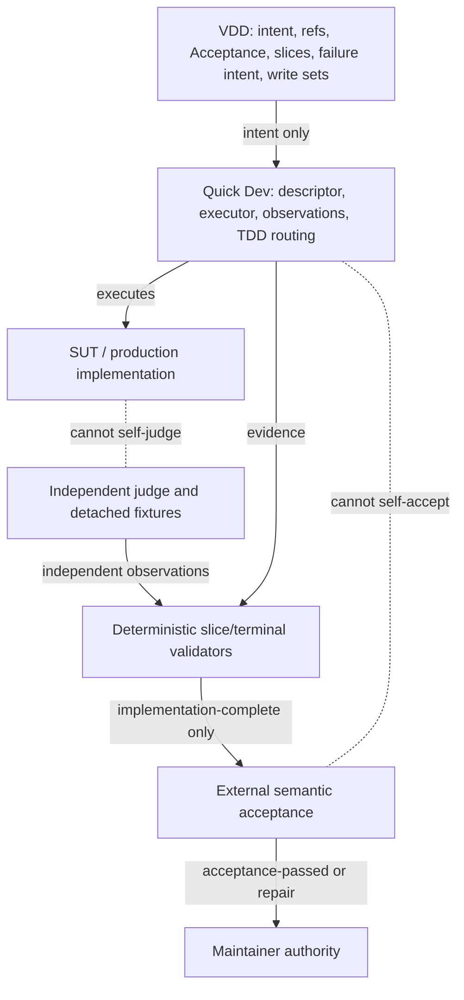
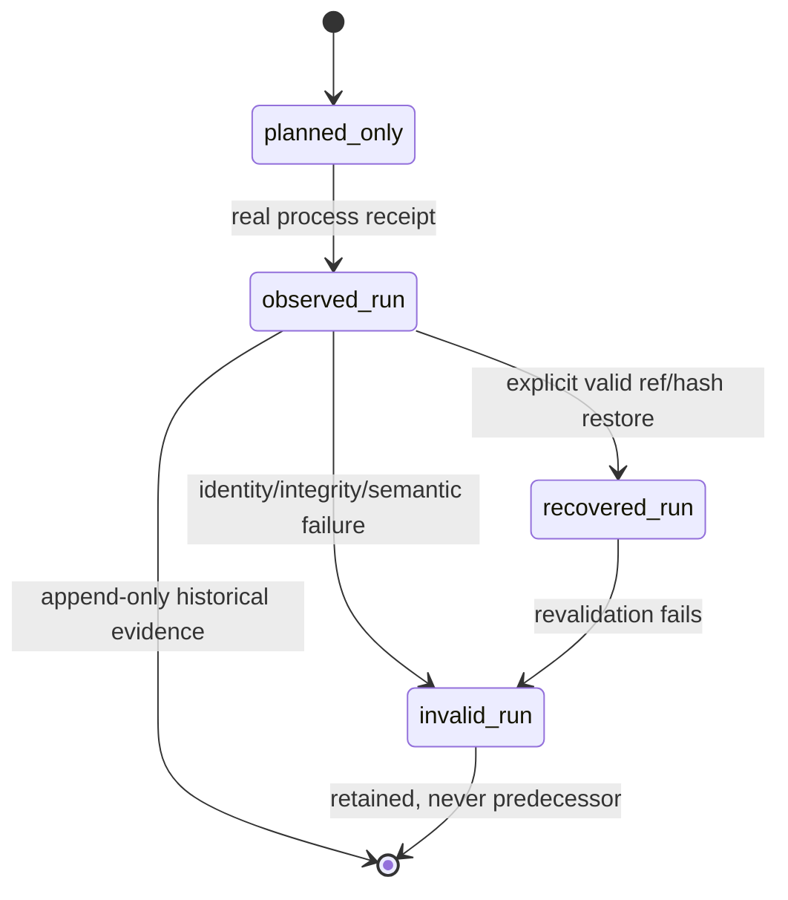

# Architecture Diagrams

## VDD compilation and Quick Dev lifecycle

```mermaid
flowchart LR
  SRC[Canonical requirements and adopted companion] --> V0[V0 source-index]
  V0 --> V1[V1 obligation extract]
  V1 --> V2[V2 guard]
  V2 --> V3[V3 Acceptance compile]
  V3 --> V4[V4 independent semantic align]
  V4 --> V5[V5 many-to-many exact cover]
  V5 --> V6[V6 deterministic slice partition]
  V6 --> V7[V7 write-set feasibility]
  V7 --> PLAN[plan-ready]
  PLAN --> Q0[Q0 recommendation]
  Q0 --> Q1[Q1 preflight]
  Q1 --> Q2[Q2 RED materialize]
  Q2 --> Q3[Q3 RED observed]
  Q3 --> Q4[Q4 implementation]
  Q4 --> Q5[Q5 GREEN]
  Q5 --> Q6[Q6 REFACTOR]
  Q6 --> Q7[Q7 slice-ready]
  Q7 --> Q8[Q8 terminal]
  Q8 --> IC[implementation-complete]
  IC --> EXT[external semantic acceptance]
  EXT --> AP[acceptance-passed or repair]
  AP --> M[maintainer commit/PR/release]
```

## Trust and authority boundaries

```mermaid
flowchart TB
  VDD[VDD: intent, refs, Acceptance, slices, failure intent, write sets]
  QD[Quick Dev: descriptor, executor, observations, TDD routing]
  SUT[SUT / production implementation]
  JUDGE[Independent judge and detached fixtures]
  TERM[Deterministic slice/terminal validators]
  EXT[External semantic acceptance]
  MAINT[Maintainer authority]
  VDD -->|intent only| QD
  QD -->|executes| SUT
  JUDGE -->|independent observations| TERM
  QD -->|evidence| TERM
  TERM -->|implementation-complete only| EXT
  EXT -->|acceptance-passed or repair| MAINT
  QD -.cannot self-accept.- EXT
  SUT -.cannot self-judge.- JUDGE
```

## Explicit run states

```mermaid
stateDiagram-v2
  [*] --> planned_only
  planned_only --> observed_run: real process receipt
  observed_run --> recovered_run: explicit valid ref/hash restore
  observed_run --> invalid_run: identity/integrity/semantic failure
  recovered_run --> invalid_run: revalidation fails
  observed_run --> [*]: append-only historical evidence
  invalid_run --> [*]: retained, never predecessor
```
