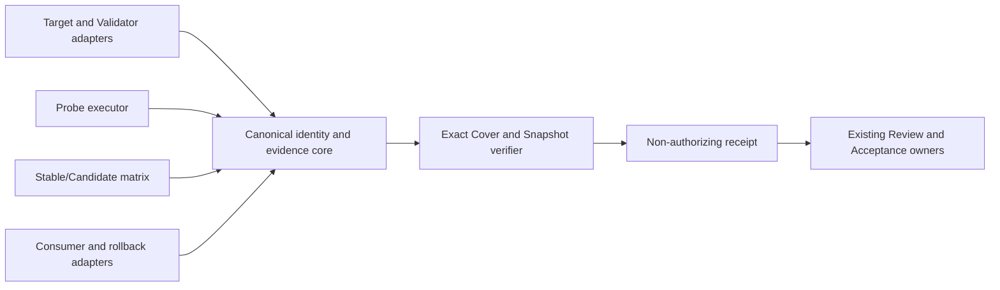

# FR-1
Target package identity and effective inspection are independently verified; missing, illegal, unsupported, escaping, substituted, or wrong targets fail closed.

<!-- selector-repair-binding-start -->
## Compiler execution-path binding

This is execution metadata for the existing requirement above, not an additional product obligation or runtime result. The source semantics, C3 OPEN decisions, protected paths and authorizes=[] remain unchanged.
Use the following exact per-obligation test-author entries. Original slice IDs are locators only; canonical compilation owns new slice grouping and identities. Preserve each independent oracle and assertion, including all behavior RED and non-runtime failure-family distinctions.
Do not invent alternate test filenames. A planned test is not an existing test and cannot establish present/missing until Quick Dev authors and executes its real assertions. Keep the exact entry in planned_new_files, execution_snapshot_paths and allowed_write_paths for its corresponding hint. Keep production owners outside frozen test snapshots.

### S3 execution context

Bound existing obligations: O-0795BA09F6F1.
Real production entry points: `.agents/skills/run-refactor-implementation-acceptance/scripts/package_validation.py`.
Quick Dev test selector: `py -3 -m pytest scripts/sc/tests/tc_d1_cer/test_s3.py`.
Do not substitute CLI help, a schema file, a capability descriptor, or an old receipt for this behavior test.
Quick Dev must create `scripts/sc/tests/tc_d1_cer/test_s3.py` as a real test or fixture under the owning slice before freezing and probing; this declaration is not execution evidence.
Retain existing fixture `.agents/skills/run-refactor-implementation-acceptance/tests/test_package.py` only for its actual declared role; file existence alone proves no behavior.

### S10 execution context

Bound existing obligations: O-3DFB21DC3981.
Real production entry points: `scripts/sc/_semantic_gate_all_runtime.py`, `scripts/sc/skill_package_replay.py`.
Quick Dev test selector: `py -3 -m pytest scripts/sc/tests/tc_d1_cer/test_s10.py`.
Do not substitute CLI help, a schema file, a capability descriptor, or an old receipt for this behavior test.
Quick Dev must create `scripts/sc/tests/tc_d1_cer/test_s10.py` as a real test or fixture under the owning slice before freezing and probing; this declaration is not execution evidence.
Retain existing fixture `.agents/skills/quick-dev-tdd-adapter/tools/controlled_red_probe.py` only for its actual declared role; file existence alone proves no behavior.
Retain existing fixture `.agents/skills/quick-dev-tdd-adapter/tools/tests/test_candidate_identity.py` only for its actual declared role; file existence alone proves no behavior.
Retain existing fixture `.agents/skills/quick-dev-tdd-adapter/tools/tests/test_ch456_snapshot_exclusions.py` only for its actual declared role; file existence alone proves no behavior.
Retain existing fixture `.agents/skills/run-refactor-implementation-acceptance/tests/test_skill_replay_contract.py` only for its actual declared role; file existence alone proves no behavior.
Retain existing fixture `.agents/skills/vdd-conformance-exact-cover/tests/validators/readonly_target.py` only for its actual declared role; file existence alone proves no behavior.
Retain existing fixture `.agents/skills/vdd-execution-plan/scripts/fixtures/validation-result-stale.json` only for its actual declared role; file existence alone proves no behavior.

### S16 execution context

Bound existing obligations: O-1ABD57D8AC26.
Real production entry points: `scripts/sc/_semantic_gate_all_runtime.py`, `scripts/sc/skill_package_replay.py`.
Quick Dev test selector: `py -3 -m pytest scripts/sc/tests/tc_d1_cer/test_s16.py`.
Do not substitute CLI help, a schema file, a capability descriptor, or an old receipt for this behavior test.
Quick Dev must create `scripts/sc/tests/tc_d1_cer/test_s16.py` as a real test or fixture under the owning slice before freezing and probing; this declaration is not execution evidence.
Retain existing fixture `.agents/skills/authorization/tests/validators/preflight_negative.py` only for its actual declared role; file existence alone proves no behavior.
Retain existing fixture `.agents/skills/quick-dev-tdd-adapter/tools/tests/test_candidate_identity.py` only for its actual declared role; file existence alone proves no behavior.
Retain existing fixture `.agents/skills/run-phase-bootstrap-review/references/historical-policy-revisions.v1.json` only for its actual declared role; file existence alone proves no behavior.
Retain existing fixture `.agents/skills/run-refactor-implementation-acceptance/schemas/acceptance-baseline-content-manifest.v1.schema.json` only for its actual declared role; file existence alone proves no behavior.
Retain existing fixture `.agents/skills/run-refactor-implementation-acceptance/tests/test_skill_replay_contract.py` only for its actual declared role; file existence alone proves no behavior.
Retain existing fixture `.agents/skills/vdd-conformance-exact-cover/tests/validators/readonly_target.py` only for its actual declared role; file existence alone proves no behavior.
Retain existing fixture `scripts/sc/tests/test_skill_package_replay.py` only for its actual declared role; file existence alone proves no behavior.

### S25 execution context

Bound existing obligations: O-34BC4C5A71D5.
Real production entry points: `scripts/toolchain/candidate_content_paths.py`.
Quick Dev test selector: `py -3 -m pytest scripts/sc/tests/tc_d1_cer/test_s25.py`.
Do not substitute CLI help, a schema file, a capability descriptor, or an old receipt for this behavior test.
Quick Dev must create `scripts/sc/tests/tc_d1_cer/test_s25.py` as a real test or fixture under the owning slice before freezing and probing; this declaration is not execution evidence.
Retain existing fixture `.agents/skills/vdd-execution-plan/tests/validators/scope_boundary_negative.py` only for its actual declared role; file existence alone proves no behavior.

### S26 execution context

Bound existing obligations: O-F6D991AB8FDC.
Real production entry points: `.agents/skills/quick-dev-tdd-adapter/tools/candidate_workspace.py`, `scripts/sc/skill_package_replay.py`.
Quick Dev test selector: `py -3 -m pytest scripts/sc/tests/tc_d1_cer/test_s26.py`.
Do not substitute CLI help, a schema file, a capability descriptor, or an old receipt for this behavior test.
Quick Dev must create `scripts/sc/tests/tc_d1_cer/test_s26.py` as a real test or fixture under the owning slice before freezing and probing; this declaration is not execution evidence.
Retain existing fixture `.agents/skills/quick-dev-tdd-adapter/tools/tests/test_candidate_identity.py` only for its actual declared role; file existence alone proves no behavior.

### S36 execution context

Bound existing obligations: O-91DAEDC1DFD9, O-D997EB1175E7.
Real production entry points: `scripts/sc/skill_package_replay.py`.
Quick Dev test selector: `py -3 -m pytest scripts/sc/tests/tc_d1_cer/test_s36.py`.
Do not substitute CLI help, a schema file, a capability descriptor, or an old receipt for this behavior test.
Quick Dev must create `scripts/sc/tests/tc_d1_cer/test_s36.py` as a real test or fixture under the owning slice before freezing and probing; this declaration is not execution evidence.
Quick Dev must create `scripts/sc/tests/test_skill_package_replay_source_identity.py` as a real test or fixture under the owning slice before freezing and probing; this declaration is not execution evidence.
Retain existing fixture `.agents/skills/vdd-conformance-exact-cover/tests/validators/exact_cover_negative.py` only for its actual declared role; file existence alone proves no behavior.
Retain existing fixture `scripts/sc/config/skill-package-validator-capability.v1.json` only for its actual declared role; file existence alone proves no behavior.
Retain existing fixture `scripts/sc/schemas/toolchain-evaluation-seed-manifest.v1.schema.json` only for its actual declared role; file existence alone proves no behavior.
Retain existing fixture `scripts/sc/tests/test_git_snapshot.py` only for its actual declared role; file existence alone proves no behavior.
Retain existing fixture `scripts/sc/tests/test_skill_package_replay.py` only for its actual declared role; file existence alone proves no behavior.

### S41 execution context

Bound existing obligations: O-99BE8823A018.
Real production entry points: `scripts/sc/_semantic_gate_all_runtime.py`, `scripts/sc/skill_package_replay.py`.
Quick Dev test selector: `py -3 -m pytest scripts/sc/tests/tc_d1_cer/test_s41.py`.
Do not substitute CLI help, a schema file, a capability descriptor, or an old receipt for this behavior test.
Quick Dev must create `scripts/sc/tests/tc_d1_cer/test_s41.py` as a real test or fixture under the owning slice before freezing and probing; this declaration is not execution evidence.
Retain existing fixture `.agents/skills/quick-dev-tdd-adapter/tools/tests/test_candidate_identity.py` only for its actual declared role; file existence alone proves no behavior.
Retain existing fixture `.agents/skills/quick-dev-tdd-adapter/tools/tests/test_candidate_review_binding.py` only for its actual declared role; file existence alone proves no behavior.
Retain existing fixture `.agents/skills/quick-dev-tdd-adapter/tools/tests/test_ch456_snapshot_exclusions.py` only for its actual declared role; file existence alone proves no behavior.
Retain existing fixture `.agents/skills/run-refactor-implementation-acceptance/tests/test_skill_replay_contract.py` only for its actual declared role; file existence alone proves no behavior.
Retain existing fixture `.agents/skills/vdd-conformance-exact-cover/tests/validators/exact_cover_negative.py` only for its actual declared role; file existence alone proves no behavior.
Retain existing fixture `scripts/toolchain/tests/test_candidate_content_paths.py` only for its actual declared role; file existence alone proves no behavior.

<!-- selector-repair-binding-end -->

# FR-2
Supported VDD and Acceptance package routes remain available and successful evidence binds the effective inspected content.

<!-- selector-repair-binding-start -->
## Compiler execution-path binding

This is execution metadata for the existing requirement above, not an additional product obligation or runtime result. The source semantics, C3 OPEN decisions, protected paths and authorizes=[] remain unchanged.
Use the following exact per-obligation test-author entries. Original slice IDs are locators only; canonical compilation owns new slice grouping and identities. Preserve each independent oracle and assertion, including all behavior RED and non-runtime failure-family distinctions.
Do not invent alternate test filenames. A planned test is not an existing test and cannot establish present/missing until Quick Dev authors and executes its real assertions. Keep the exact entry in planned_new_files, execution_snapshot_paths and allowed_write_paths for its corresponding hint. Keep production owners outside frozen test snapshots.

### S4 execution context

Bound existing obligations: O-7C7C62221239.
Real production entry points: `scripts/sc/skill_package_replay.py`, `scripts/toolchain/candidate_content_paths.py`.
Quick Dev test selector: `py -3 -m pytest scripts/sc/tests/tc_d1_cer/test_s4.py`.
Do not substitute CLI help, a schema file, a capability descriptor, or an old receipt for this behavior test.
Quick Dev must create `scripts/sc/tests/tc_d1_cer/test_s4.py` as a real test or fixture under the owning slice before freezing and probing; this declaration is not execution evidence.
Retain existing fixture `.agents/skills/run-refactor-implementation-acceptance/tests/test_package.py` only for its actual declared role; file existence alone proves no behavior.
Retain existing fixture `scripts/toolchain/tests/test_candidate_content_paths.py` only for its actual declared role; file existence alone proves no behavior.

### S7 execution context

Bound existing obligations: O-27B7552328F0.
Real production entry points: `scripts/sc/skill_package_replay.py`.
Quick Dev test selector: `py -3 -m pytest scripts/sc/tests/tc_d1_cer/test_s7.py`.
Do not substitute CLI help, a schema file, a capability descriptor, or an old receipt for this behavior test.
Quick Dev must create `scripts/sc/tests/tc_d1_cer/test_s7.py` as a real test or fixture under the owning slice before freezing and probing; this declaration is not execution evidence.
Retain existing fixture `.agents/skills/quick-dev-tdd-adapter/tools/tests/fixtures/candidate-identity.v1.json` only for its actual declared role; file existence alone proves no behavior.
Retain existing fixture `.agents/skills/vdd-conformance-exact-cover/tests/validators/exact_cover_negative.py` only for its actual declared role; file existence alone proves no behavior.
Retain existing fixture `execution-plans/2026-08-05-toolchain-core-skill-replay-portability-and-evaluation-seed/stable-candidate-replay-matrix.v1.json` only for its actual declared role; file existence alone proves no behavior.
Retain existing fixture `scripts/sc/schemas/toolchain-evaluation-seed-manifest.v1.schema.json` only for its actual declared role; file existence alone proves no behavior.
Retain existing fixture `scripts/sc/tests/test_805_round6_full_replay.py` only for its actual declared role; file existence alone proves no behavior.
Retain existing fixture `scripts/sc/tests/test_skill_package_replay.py` only for its actual declared role; file existence alone proves no behavior.

### S41 execution context

Bound existing obligations: O-5CA6AF01E90E.
Real production entry points: `scripts/sc/_semantic_gate_all_runtime.py`, `scripts/sc/skill_package_replay.py`.
Quick Dev test selector: `py -3 -m pytest scripts/sc/tests/tc_d1_cer/test_s41.py`.
Do not substitute CLI help, a schema file, a capability descriptor, or an old receipt for this behavior test.
Quick Dev must create `scripts/sc/tests/tc_d1_cer/test_s41.py` as a real test or fixture under the owning slice before freezing and probing; this declaration is not execution evidence.
Retain existing fixture `.agents/skills/quick-dev-tdd-adapter/tools/tests/test_candidate_identity.py` only for its actual declared role; file existence alone proves no behavior.
Retain existing fixture `.agents/skills/quick-dev-tdd-adapter/tools/tests/test_candidate_review_binding.py` only for its actual declared role; file existence alone proves no behavior.
Retain existing fixture `.agents/skills/quick-dev-tdd-adapter/tools/tests/test_ch456_snapshot_exclusions.py` only for its actual declared role; file existence alone proves no behavior.
Retain existing fixture `.agents/skills/run-refactor-implementation-acceptance/tests/test_skill_replay_contract.py` only for its actual declared role; file existence alone proves no behavior.
Retain existing fixture `.agents/skills/vdd-conformance-exact-cover/tests/validators/exact_cover_negative.py` only for its actual declared role; file existence alone proves no behavior.
Retain existing fixture `scripts/toolchain/tests/test_candidate_content_paths.py` only for its actual declared role; file existence alone proves no behavior.

<!-- selector-repair-binding-end -->

# FR-3
Validator source, content, semantic-dependency closure, compatibility, support policy, and candidate-external trust are independently verified.

<!-- selector-repair-binding-start -->
## Compiler execution-path binding

This is execution metadata for the existing requirement above, not an additional product obligation or runtime result. The source semantics, C3 OPEN decisions, protected paths and authorizes=[] remain unchanged.
Use the following exact per-obligation test-author entries. Original slice IDs are locators only; canonical compilation owns new slice grouping and identities. Preserve each independent oracle and assertion, including all behavior RED and non-runtime failure-family distinctions.
Do not invent alternate test filenames. A planned test is not an existing test and cannot establish present/missing until Quick Dev authors and executes its real assertions. Keep the exact entry in planned_new_files, execution_snapshot_paths and allowed_write_paths for its corresponding hint. Keep production owners outside frozen test snapshots.

### S14 execution context

Bound existing obligations: O-1CE47AE1EB0A.
Real production entry points: `scripts/sc/_semantic_gate_all_contract.py`.
Quick Dev test selector: `py -3 -m pytest scripts/sc/tests/tc_d1_cer/test_s14.py`.
Do not substitute CLI help, a schema file, a capability descriptor, or an old receipt for this behavior test.
Quick Dev must create `scripts/sc/tests/tc_d1_cer/test_s14.py` as a real test or fixture under the owning slice before freezing and probing; this declaration is not execution evidence.

### S24 execution context

Bound existing obligations: O-803F9A786E8B.
Real production entry points: `scripts/sc/skill_package_replay.py`.
Quick Dev test selector: `py -3 -m pytest scripts/sc/tests/tc_d1_cer/test_s24.py`.
Do not substitute CLI help, a schema file, a capability descriptor, or an old receipt for this behavior test.
Quick Dev must create `scripts/sc/tests/tc_d1_cer/test_s24.py` as a real test or fixture under the owning slice before freezing and probing; this declaration is not execution evidence.
Retain existing fixture `.agents/skills/quick-dev-tdd-adapter/tools/tests/test_candidate_review_binding.py` only for its actual declared role; file existence alone proves no behavior.
Retain existing fixture `.agents/skills/quick-dev-tdd-adapter/tools/tests/test_ch456_snapshot_exclusions.py` only for its actual declared role; file existence alone proves no behavior.
Retain existing fixture `.agents/skills/run-refactor-implementation-acceptance/tests/test_skill_replay_contract.py` only for its actual declared role; file existence alone proves no behavior.
Retain existing fixture `.agents/skills/vdd-execution-plan/scripts/fixtures/validation-result-stale.json` only for its actual declared role; file existence alone proves no behavior.
Retain existing fixture `scripts/sc/config/skill-package-validator-capability.v1.json` only for its actual declared role; file existence alone proves no behavior.
Retain existing fixture `scripts/sc/schemas/toolchain-evaluation-seed-manifest.v1.schema.json` only for its actual declared role; file existence alone proves no behavior.
Retain existing fixture `scripts/sc/tests/test_skill_package_replay.py` only for its actual declared role; file existence alone proves no behavior.

### S29 execution context

Bound existing obligations: O-42A5A51ADC81.
Real production entry points: `.agents/skills/quick-dev-tdd-adapter/tools/candidate_workspace.py`, `scripts/sc/_semantic_gate_all_runtime.py`, `scripts/sc/skill_package_replay.py`.
Quick Dev test selector: `py -3 -m pytest scripts/sc/tests/tc_d1_cer/test_s29.py`.
Do not substitute CLI help, a schema file, a capability descriptor, or an old receipt for this behavior test.
Quick Dev must create `scripts/sc/tests/tc_d1_cer/test_s29.py` as a real test or fixture under the owning slice before freezing and probing; this declaration is not execution evidence.
Retain existing fixture `.agents/skills/vdd-conformance-exact-cover/tests/validators/exact_cover_negative.py` only for its actual declared role; file existence alone proves no behavior.

### S34 execution context

Bound existing obligations: O-A6B735D2FE39.
Real production entry points: `.agents/skills/vdd-execution-plan/scripts/semantic_repository_context.py`.
Quick Dev test selector: `py -3 -m pytest scripts/sc/tests/tc_d1_cer/test_s34.py`.
Do not substitute CLI help, a schema file, a capability descriptor, or an old receipt for this behavior test.
Quick Dev must create `scripts/sc/tests/tc_d1_cer/test_s34.py` as a real test or fixture under the owning slice before freezing and probing; this declaration is not execution evidence.
Retain existing fixture `.agents/skills/vdd-execution-plan/scripts/tests/test_ch456_v4_active_alignment_scope.py` only for its actual declared role; file existence alone proves no behavior.

### S36 execution context

Bound existing obligations: O-ED0A48ADEC44, O-FE2997A9B717.
Real production entry points: `scripts/sc/skill_package_replay.py`.
Quick Dev test selector: `py -3 -m pytest scripts/sc/tests/tc_d1_cer/test_s36.py`.
Do not substitute CLI help, a schema file, a capability descriptor, or an old receipt for this behavior test.
Quick Dev must create `scripts/sc/tests/tc_d1_cer/test_s36.py` as a real test or fixture under the owning slice before freezing and probing; this declaration is not execution evidence.
Quick Dev must create `scripts/sc/tests/test_skill_package_replay_source_identity.py` as a real test or fixture under the owning slice before freezing and probing; this declaration is not execution evidence.
Retain existing fixture `.agents/skills/vdd-conformance-exact-cover/tests/validators/exact_cover_negative.py` only for its actual declared role; file existence alone proves no behavior.
Retain existing fixture `scripts/sc/config/skill-package-validator-capability.v1.json` only for its actual declared role; file existence alone proves no behavior.
Retain existing fixture `scripts/sc/schemas/toolchain-evaluation-seed-manifest.v1.schema.json` only for its actual declared role; file existence alone proves no behavior.
Retain existing fixture `scripts/sc/tests/test_git_snapshot.py` only for its actual declared role; file existence alone proves no behavior.
Retain existing fixture `scripts/sc/tests/test_skill_package_replay.py` only for its actual declared role; file existence alone proves no behavior.

<!-- selector-repair-binding-end -->

# FR-4
Detached positive and negative Probes execute as real independent processes with bound inputs and outputs; always-success and infrastructure-failure false negatives fail.

<!-- selector-repair-binding-start -->
## Compiler execution-path binding

This is execution metadata for the existing requirement above, not an additional product obligation or runtime result. The source semantics, C3 OPEN decisions, protected paths and authorizes=[] remain unchanged.
Use the following exact per-obligation test-author entries. Original slice IDs are locators only; canonical compilation owns new slice grouping and identities. Preserve each independent oracle and assertion, including all behavior RED and non-runtime failure-family distinctions.
Do not invent alternate test filenames. A planned test is not an existing test and cannot establish present/missing until Quick Dev authors and executes its real assertions. Keep the exact entry in planned_new_files, execution_snapshot_paths and allowed_write_paths for its corresponding hint. Keep production owners outside frozen test snapshots.

### S10 execution context

Bound existing obligations: O-702BB22D8884.
Real production entry points: `scripts/sc/_semantic_gate_all_runtime.py`, `scripts/sc/skill_package_replay.py`.
Quick Dev test selector: `py -3 -m pytest scripts/sc/tests/tc_d1_cer/test_s10.py`.
Do not substitute CLI help, a schema file, a capability descriptor, or an old receipt for this behavior test.
Quick Dev must create `scripts/sc/tests/tc_d1_cer/test_s10.py` as a real test or fixture under the owning slice before freezing and probing; this declaration is not execution evidence.
Retain existing fixture `.agents/skills/quick-dev-tdd-adapter/tools/controlled_red_probe.py` only for its actual declared role; file existence alone proves no behavior.
Retain existing fixture `.agents/skills/quick-dev-tdd-adapter/tools/tests/test_candidate_identity.py` only for its actual declared role; file existence alone proves no behavior.
Retain existing fixture `.agents/skills/quick-dev-tdd-adapter/tools/tests/test_ch456_snapshot_exclusions.py` only for its actual declared role; file existence alone proves no behavior.
Retain existing fixture `.agents/skills/run-refactor-implementation-acceptance/tests/test_skill_replay_contract.py` only for its actual declared role; file existence alone proves no behavior.
Retain existing fixture `.agents/skills/vdd-conformance-exact-cover/tests/validators/readonly_target.py` only for its actual declared role; file existence alone proves no behavior.
Retain existing fixture `.agents/skills/vdd-execution-plan/scripts/fixtures/validation-result-stale.json` only for its actual declared role; file existence alone proves no behavior.

### S15 execution context

Bound existing obligations: O-B0ECAFB3019C, O-BBAD25910009.
Real production entry points: `scripts/sc/skill_package_replay.py`, `scripts/vdd/probe_real_worker.py`.
Quick Dev test selector: `py -3 -m pytest scripts/sc/tests/tc_d1_cer/test_s15.py`.
Do not substitute CLI help, a schema file, a capability descriptor, or an old receipt for this behavior test.
Quick Dev must create `scripts/sc/tests/tc_d1_cer/test_s15.py` as a real test or fixture under the owning slice before freezing and probing; this declaration is not execution evidence.
Retain existing fixture `.agents/skills/run-refactor-implementation-acceptance/tests/test_skill_replay_contract.py` only for its actual declared role; file existence alone proves no behavior.

### S40 execution context

Bound existing obligations: O-D03461F9C448.
Real production entry points: `scripts/sc/skill_package_replay.py`, `scripts/vdd/probe_real_worker.py`.
Quick Dev test selector: `py -3 -m pytest scripts/sc/tests/tc_d1_cer/test_s40.py`.
Do not substitute CLI help, a schema file, a capability descriptor, or an old receipt for this behavior test.
Quick Dev must create `scripts/sc/tests/tc_d1_cer/test_s40.py` as a real test or fixture under the owning slice before freezing and probing; this declaration is not execution evidence.
Retain existing fixture `.agents/skills/quick-dev-tdd-adapter/tools/controlled_red_probe.py` only for its actual declared role; file existence alone proves no behavior.

<!-- selector-repair-binding-end -->

# FR-5
Historical tracked membership, repository-relative paths, native command identity, and bytes remain unchanged; repair evidence is append-only and historical evidence is non-authorizing.

<!-- selector-repair-binding-start -->
## Compiler execution-path binding

This is execution metadata for the existing requirement above, not an additional product obligation or runtime result. The source semantics, C3 OPEN decisions, protected paths and authorizes=[] remain unchanged.
Use the following exact per-obligation test-author entries. Original slice IDs are locators only; canonical compilation owns new slice grouping and identities. Preserve each independent oracle and assertion, including all behavior RED and non-runtime failure-family distinctions.
Do not invent alternate test filenames. A planned test is not an existing test and cannot establish present/missing until Quick Dev authors and executes its real assertions. Keep the exact entry in planned_new_files, execution_snapshot_paths and allowed_write_paths for its corresponding hint. Keep production owners outside frozen test snapshots.

### S1 execution context

Bound existing obligations: O-B148C5C61A99.
Real production entry points: `.agents/skills/quick-dev-tdd-adapter/tools/worker_orchestrator.py`.
Quick Dev test selector: `py -3 -m pytest .agents/skills/quick-dev-tdd-adapter/tools/tests/test_candidate_authorization_transition.py`.
Do not substitute CLI help, a schema file, a capability descriptor, or an old receipt for this behavior test.
Retain existing fixture `.agents/skills/quick-dev-tdd-adapter/tools/tests/test_candidate_authorization_transition.py` only for its actual declared role; file existence alone proves no behavior.

### S6 execution context

Bound existing obligations: O-1DAE06DD1785.
Real production entry points: `scripts/sc/_git_snapshot.py`.
Quick Dev test selector: `py -3 -m pytest scripts/sc/tests/tc_d1_cer/test_s6.py`.
Do not substitute CLI help, a schema file, a capability descriptor, or an old receipt for this behavior test.
Quick Dev must create `scripts/sc/tests/tc_d1_cer/test_s6.py` as a real test or fixture under the owning slice before freezing and probing; this declaration is not execution evidence.

### S8 execution context

Bound existing obligations: O-FBCAFDC0B6E0.
Real production entry points: `.agents/skills/quick-dev-tdd-adapter/tools/case_evidence.py`.
Quick Dev test selector: `py -3 -m pytest scripts/sc/tests/tc_d1_cer/test_s8.py`.
Do not substitute CLI help, a schema file, a capability descriptor, or an old receipt for this behavior test.
Quick Dev must create `scripts/sc/tests/tc_d1_cer/test_s8.py` as a real test or fixture under the owning slice before freezing and probing; this declaration is not execution evidence.
Retain existing fixture `.agents/skills/quick-dev-tdd-adapter/tools/tests/test_candidate_review_binding.py` only for its actual declared role; file existence alone proves no behavior.
Retain existing fixture `.agents/skills/quick-dev-tdd-adapter/tools/tests/test_stage_lifecycle.py` only for its actual declared role; file existence alone proves no behavior.

### S16 execution context

Bound existing obligations: O-11033BFB2E08, O-CED49D9C08EF.
Real production entry points: `scripts/sc/_semantic_gate_all_runtime.py`, `scripts/sc/skill_package_replay.py`.
Quick Dev test selector: `py -3 -m pytest scripts/sc/tests/tc_d1_cer/test_s16.py`.
Do not substitute CLI help, a schema file, a capability descriptor, or an old receipt for this behavior test.
Quick Dev must create `scripts/sc/tests/tc_d1_cer/test_s16.py` as a real test or fixture under the owning slice before freezing and probing; this declaration is not execution evidence.
Retain existing fixture `.agents/skills/authorization/tests/validators/preflight_negative.py` only for its actual declared role; file existence alone proves no behavior.
Retain existing fixture `.agents/skills/quick-dev-tdd-adapter/tools/tests/test_candidate_identity.py` only for its actual declared role; file existence alone proves no behavior.
Retain existing fixture `.agents/skills/run-phase-bootstrap-review/references/historical-policy-revisions.v1.json` only for its actual declared role; file existence alone proves no behavior.
Retain existing fixture `.agents/skills/run-refactor-implementation-acceptance/schemas/acceptance-baseline-content-manifest.v1.schema.json` only for its actual declared role; file existence alone proves no behavior.
Retain existing fixture `.agents/skills/run-refactor-implementation-acceptance/tests/test_skill_replay_contract.py` only for its actual declared role; file existence alone proves no behavior.
Retain existing fixture `.agents/skills/vdd-conformance-exact-cover/tests/validators/readonly_target.py` only for its actual declared role; file existence alone proves no behavior.
Retain existing fixture `scripts/sc/tests/test_skill_package_replay.py` only for its actual declared role; file existence alone proves no behavior.

### S36 execution context

Bound existing obligations: O-FFDC28045C38.
Real production entry points: `scripts/sc/skill_package_replay.py`.
Quick Dev test selector: `py -3 -m pytest scripts/sc/tests/tc_d1_cer/test_s36.py`.
Do not substitute CLI help, a schema file, a capability descriptor, or an old receipt for this behavior test.
Quick Dev must create `scripts/sc/tests/tc_d1_cer/test_s36.py` as a real test or fixture under the owning slice before freezing and probing; this declaration is not execution evidence.
Quick Dev must create `scripts/sc/tests/test_skill_package_replay_source_identity.py` as a real test or fixture under the owning slice before freezing and probing; this declaration is not execution evidence.
Retain existing fixture `.agents/skills/vdd-conformance-exact-cover/tests/validators/exact_cover_negative.py` only for its actual declared role; file existence alone proves no behavior.
Retain existing fixture `scripts/sc/config/skill-package-validator-capability.v1.json` only for its actual declared role; file existence alone proves no behavior.
Retain existing fixture `scripts/sc/schemas/toolchain-evaluation-seed-manifest.v1.schema.json` only for its actual declared role; file existence alone proves no behavior.
Retain existing fixture `scripts/sc/tests/test_git_snapshot.py` only for its actual declared role; file existence alone proves no behavior.
Retain existing fixture `scripts/sc/tests/test_skill_package_replay.py` only for its actual declared role; file existence alone proves no behavior.

<!-- selector-repair-binding-end -->

# FR-6
The three named evaluation seeds occur exactly once with provenance, applicability, missing labels, counterexample or explicit absence, and approved non-baseline classification.

<!-- selector-repair-binding-start -->
## Compiler execution-path binding

This is execution metadata for the existing requirement above, not an additional product obligation or runtime result. The source semantics, C3 OPEN decisions, protected paths and authorizes=[] remain unchanged.
Use the following exact per-obligation test-author entries. Original slice IDs are locators only; canonical compilation owns new slice grouping and identities. Preserve each independent oracle and assertion, including all behavior RED and non-runtime failure-family distinctions.
Do not invent alternate test filenames. A planned test is not an existing test and cannot establish present/missing until Quick Dev authors and executes its real assertions. Keep the exact entry in planned_new_files, execution_snapshot_paths and allowed_write_paths for its corresponding hint. Keep production owners outside frozen test snapshots.

### S7 execution context

Bound existing obligations: O-254C4E8B4C4A.
Real production entry points: `scripts/sc/skill_package_replay.py`.
Quick Dev test selector: `py -3 -m pytest scripts/sc/tests/tc_d1_cer/test_s7.py`.
Do not substitute CLI help, a schema file, a capability descriptor, or an old receipt for this behavior test.
Quick Dev must create `scripts/sc/tests/tc_d1_cer/test_s7.py` as a real test or fixture under the owning slice before freezing and probing; this declaration is not execution evidence.
Retain existing fixture `.agents/skills/quick-dev-tdd-adapter/tools/tests/fixtures/candidate-identity.v1.json` only for its actual declared role; file existence alone proves no behavior.
Retain existing fixture `.agents/skills/vdd-conformance-exact-cover/tests/validators/exact_cover_negative.py` only for its actual declared role; file existence alone proves no behavior.
Retain existing fixture `execution-plans/2026-08-05-toolchain-core-skill-replay-portability-and-evaluation-seed/stable-candidate-replay-matrix.v1.json` only for its actual declared role; file existence alone proves no behavior.
Retain existing fixture `scripts/sc/schemas/toolchain-evaluation-seed-manifest.v1.schema.json` only for its actual declared role; file existence alone proves no behavior.
Retain existing fixture `scripts/sc/tests/test_805_round6_full_replay.py` only for its actual declared role; file existence alone proves no behavior.
Retain existing fixture `scripts/sc/tests/test_skill_package_replay.py` only for its actual declared role; file existence alone proves no behavior.

### S19 execution context

Bound existing obligations: O-4B49FA8820F5.
Real production entry points: `execution-plans/2026-08-05-toolchain-core-skill-replay-portability-and-evaluation-seed/tools/validate_implementation.py`.
Quick Dev test selector: `py -3 -m pytest scripts/sc/tests/tc_d1_cer/test_s19.py`.
Do not substitute CLI help, a schema file, a capability descriptor, or an old receipt for this behavior test.
Quick Dev must create `scripts/sc/tests/tc_d1_cer/test_s19.py` as a real test or fixture under the owning slice before freezing and probing; this declaration is not execution evidence.
Retain existing fixture `execution-plans/2026-08-05-toolchain-core-skill-replay-portability-and-evaluation-seed/evaluation-seeds.v1.json` only for its actual declared role; file existence alone proves no behavior.
Retain existing fixture `execution-plans/2026-08-05-toolchain-core-skill-replay-portability-and-evaluation-seed/stable-candidate-replay-matrix.v1.json` only for its actual declared role; file existence alone proves no behavior.
Retain existing fixture `scripts/sc/tests/test_805_round6_full_replay.py` only for its actual declared role; file existence alone proves no behavior.

### S33 execution context

Bound existing obligations: O-03DC09C64B9A, O-962E2FBDDB67.
Real production entry points: `execution-plans/2026-08-05-toolchain-core-skill-replay-portability-and-evaluation-seed/tools/validate_implementation.py`.
Quick Dev test selector: `py -3 -m pytest scripts/sc/tests/tc_d1_cer/test_s33.py`.
Do not substitute CLI help, a schema file, a capability descriptor, or an old receipt for this behavior test.
Quick Dev must create `scripts/sc/tests/tc_d1_cer/test_s33.py` as a real test or fixture under the owning slice before freezing and probing; this declaration is not execution evidence.
Retain existing fixture `scripts/sc/tests/test_805_round6_full_replay.py` only for its actual declared role; file existence alone proves no behavior.

### S36 execution context

Bound existing obligations: O-A7F889921688.
Real production entry points: `scripts/sc/skill_package_replay.py`.
Quick Dev test selector: `py -3 -m pytest scripts/sc/tests/tc_d1_cer/test_s36.py`.
Do not substitute CLI help, a schema file, a capability descriptor, or an old receipt for this behavior test.
Quick Dev must create `scripts/sc/tests/tc_d1_cer/test_s36.py` as a real test or fixture under the owning slice before freezing and probing; this declaration is not execution evidence.
Quick Dev must create `scripts/sc/tests/test_skill_package_replay_source_identity.py` as a real test or fixture under the owning slice before freezing and probing; this declaration is not execution evidence.
Retain existing fixture `.agents/skills/vdd-conformance-exact-cover/tests/validators/exact_cover_negative.py` only for its actual declared role; file existence alone proves no behavior.
Retain existing fixture `scripts/sc/config/skill-package-validator-capability.v1.json` only for its actual declared role; file existence alone proves no behavior.
Retain existing fixture `scripts/sc/schemas/toolchain-evaluation-seed-manifest.v1.schema.json` only for its actual declared role; file existence alone proves no behavior.
Retain existing fixture `scripts/sc/tests/test_git_snapshot.py` only for its actual declared role; file existence alone proves no behavior.
Retain existing fixture `scripts/sc/tests/test_skill_package_replay.py` only for its actual declared role; file existence alone proves no behavior.

### S42 execution context

Bound existing obligations: O-3F59ADA0501E.
Real production entry points: `scripts/sc/_semantic_gate_all_runtime.py`, `scripts/sc/schemas/toolchain-evaluation-seed-manifest.v1.schema.json`, `scripts/sc/skill_package_replay.py`.
Quick Dev test selector: `py -3 -m pytest scripts/sc/tests/tc_d1_cer/test_s42.py`.
Do not substitute CLI help, a schema file, a capability descriptor, or an old receipt for this behavior test.
Quick Dev must create `scripts/sc/tests/tc_d1_cer/test_s42.py` as a real test or fixture under the owning slice before freezing and probing; this declaration is not execution evidence.
Retain existing fixture `scripts/sc/tests/test_skill_package_replay.py` only for its actual declared role; file existence alone proves no behavior.

<!-- selector-repair-binding-end -->

# FR-7
All six materially distinct Matrix Cases execute immutable Stable and Candidate subjects with distinct fixtures/state and attributable evidence.

<!-- selector-repair-binding-start -->
## Compiler execution-path binding

This is execution metadata for the existing requirement above, not an additional product obligation or runtime result. The source semantics, C3 OPEN decisions, protected paths and authorizes=[] remain unchanged.
Use the following exact per-obligation test-author entries. Original slice IDs are locators only; canonical compilation owns new slice grouping and identities. Preserve each independent oracle and assertion, including all behavior RED and non-runtime failure-family distinctions.
Do not invent alternate test filenames. A planned test is not an existing test and cannot establish present/missing until Quick Dev authors and executes its real assertions. Keep the exact entry in planned_new_files, execution_snapshot_paths and allowed_write_paths for its corresponding hint. Keep production owners outside frozen test snapshots.

### S2 execution context

Bound existing obligations: O-01945E2C5791.
Real production entry points: `.agents/skills/quick-dev-tdd-adapter/tools/case_evidence.py`, `scripts/sc/_semantic_gate_all_runtime.py`, `scripts/sc/skill_package_replay.py`.
Quick Dev test selector: `py -3 -m pytest scripts/sc/tests/tc_d1_cer/test_s2.py`.
Do not substitute CLI help, a schema file, a capability descriptor, or an old receipt for this behavior test.
Quick Dev must create `scripts/sc/tests/tc_d1_cer/test_s2.py` as a real test or fixture under the owning slice before freezing and probing; this declaration is not execution evidence.
Retain existing fixture `.agents/skills/quick-dev-tdd-adapter/tools/tests/test_candidate_review_binding.py` only for its actual declared role; file existence alone proves no behavior.
Retain existing fixture `.agents/skills/run-refactor-implementation-acceptance/tests/test_skill_replay_contract.py` only for its actual declared role; file existence alone proves no behavior.

### S7 execution context

Bound existing obligations: O-FEC69CA8A599.
Real production entry points: `scripts/sc/skill_package_replay.py`.
Quick Dev test selector: `py -3 -m pytest scripts/sc/tests/tc_d1_cer/test_s7.py`.
Do not substitute CLI help, a schema file, a capability descriptor, or an old receipt for this behavior test.
Quick Dev must create `scripts/sc/tests/tc_d1_cer/test_s7.py` as a real test or fixture under the owning slice before freezing and probing; this declaration is not execution evidence.
Retain existing fixture `.agents/skills/quick-dev-tdd-adapter/tools/tests/fixtures/candidate-identity.v1.json` only for its actual declared role; file existence alone proves no behavior.
Retain existing fixture `.agents/skills/vdd-conformance-exact-cover/tests/validators/exact_cover_negative.py` only for its actual declared role; file existence alone proves no behavior.
Retain existing fixture `execution-plans/2026-08-05-toolchain-core-skill-replay-portability-and-evaluation-seed/stable-candidate-replay-matrix.v1.json` only for its actual declared role; file existence alone proves no behavior.
Retain existing fixture `scripts/sc/schemas/toolchain-evaluation-seed-manifest.v1.schema.json` only for its actual declared role; file existence alone proves no behavior.
Retain existing fixture `scripts/sc/tests/test_805_round6_full_replay.py` only for its actual declared role; file existence alone proves no behavior.
Retain existing fixture `scripts/sc/tests/test_skill_package_replay.py` only for its actual declared role; file existence alone proves no behavior.

### S24 execution context

Bound existing obligations: O-829D8B75C2D7.
Real production entry points: `scripts/sc/skill_package_replay.py`.
Quick Dev test selector: `py -3 -m pytest scripts/sc/tests/tc_d1_cer/test_s24.py`.
Do not substitute CLI help, a schema file, a capability descriptor, or an old receipt for this behavior test.
Quick Dev must create `scripts/sc/tests/tc_d1_cer/test_s24.py` as a real test or fixture under the owning slice before freezing and probing; this declaration is not execution evidence.
Retain existing fixture `.agents/skills/quick-dev-tdd-adapter/tools/tests/test_candidate_review_binding.py` only for its actual declared role; file existence alone proves no behavior.
Retain existing fixture `.agents/skills/quick-dev-tdd-adapter/tools/tests/test_ch456_snapshot_exclusions.py` only for its actual declared role; file existence alone proves no behavior.
Retain existing fixture `.agents/skills/run-refactor-implementation-acceptance/tests/test_skill_replay_contract.py` only for its actual declared role; file existence alone proves no behavior.
Retain existing fixture `.agents/skills/vdd-execution-plan/scripts/fixtures/validation-result-stale.json` only for its actual declared role; file existence alone proves no behavior.
Retain existing fixture `scripts/sc/config/skill-package-validator-capability.v1.json` only for its actual declared role; file existence alone proves no behavior.
Retain existing fixture `scripts/sc/schemas/toolchain-evaluation-seed-manifest.v1.schema.json` only for its actual declared role; file existence alone proves no behavior.
Retain existing fixture `scripts/sc/tests/test_skill_package_replay.py` only for its actual declared role; file existence alone proves no behavior.

<!-- selector-repair-binding-end -->

# FR-8
Missing, copied, mislabeled, stale, reused, wrong-target, infrastructure-failed, or non-executed matrix evidence invalidates the aggregate.

<!-- selector-repair-binding-start -->
## Compiler execution-path binding

This is execution metadata for the existing requirement above, not an additional product obligation or runtime result. The source semantics, C3 OPEN decisions, protected paths and authorizes=[] remain unchanged.
Use the following exact per-obligation test-author entries. Original slice IDs are locators only; canonical compilation owns new slice grouping and identities. Preserve each independent oracle and assertion, including all behavior RED and non-runtime failure-family distinctions.
Do not invent alternate test filenames. A planned test is not an existing test and cannot establish present/missing until Quick Dev authors and executes its real assertions. Keep the exact entry in planned_new_files, execution_snapshot_paths and allowed_write_paths for its corresponding hint. Keep production owners outside frozen test snapshots.

### S5 execution context

Bound existing obligations: O-8891D0898629.
Real production entry points: `.agents/skills/quick-dev-tdd-adapter/tools/independent_judge_v2.py`.
Quick Dev test selector: `py -3 -m pytest scripts/sc/tests/tc_d1_cer/test_s5.py`.
Do not substitute CLI help, a schema file, a capability descriptor, or an old receipt for this behavior test.
Quick Dev must create `scripts/sc/tests/tc_d1_cer/test_s5.py` as a real test or fixture under the owning slice before freezing and probing; this declaration is not execution evidence.
Retain existing fixture `.agents/skills/quick-dev-tdd-adapter/tools/tests/test_ch456_recovery_mutations.py` only for its actual declared role; file existence alone proves no behavior.

### S7 execution context

Bound existing obligations: O-E6AF6B812B2C.
Real production entry points: `scripts/sc/skill_package_replay.py`.
Quick Dev test selector: `py -3 -m pytest scripts/sc/tests/tc_d1_cer/test_s7.py`.
Do not substitute CLI help, a schema file, a capability descriptor, or an old receipt for this behavior test.
Quick Dev must create `scripts/sc/tests/tc_d1_cer/test_s7.py` as a real test or fixture under the owning slice before freezing and probing; this declaration is not execution evidence.
Retain existing fixture `.agents/skills/quick-dev-tdd-adapter/tools/tests/fixtures/candidate-identity.v1.json` only for its actual declared role; file existence alone proves no behavior.
Retain existing fixture `.agents/skills/vdd-conformance-exact-cover/tests/validators/exact_cover_negative.py` only for its actual declared role; file existence alone proves no behavior.
Retain existing fixture `execution-plans/2026-08-05-toolchain-core-skill-replay-portability-and-evaluation-seed/stable-candidate-replay-matrix.v1.json` only for its actual declared role; file existence alone proves no behavior.
Retain existing fixture `scripts/sc/schemas/toolchain-evaluation-seed-manifest.v1.schema.json` only for its actual declared role; file existence alone proves no behavior.
Retain existing fixture `scripts/sc/tests/test_805_round6_full_replay.py` only for its actual declared role; file existence alone proves no behavior.
Retain existing fixture `scripts/sc/tests/test_skill_package_replay.py` only for its actual declared role; file existence alone proves no behavior.

### S8 execution context

Bound existing obligations: O-097894799E2C.
Real production entry points: `.agents/skills/quick-dev-tdd-adapter/tools/case_evidence.py`.
Quick Dev test selector: `py -3 -m pytest scripts/sc/tests/tc_d1_cer/test_s8.py`.
Do not substitute CLI help, a schema file, a capability descriptor, or an old receipt for this behavior test.
Quick Dev must create `scripts/sc/tests/tc_d1_cer/test_s8.py` as a real test or fixture under the owning slice before freezing and probing; this declaration is not execution evidence.
Retain existing fixture `.agents/skills/quick-dev-tdd-adapter/tools/tests/test_candidate_review_binding.py` only for its actual declared role; file existence alone proves no behavior.
Retain existing fixture `.agents/skills/quick-dev-tdd-adapter/tools/tests/test_stage_lifecycle.py` only for its actual declared role; file existence alone proves no behavior.

### S19 execution context

Bound existing obligations: O-474EE6B352BF.
Real production entry points: `execution-plans/2026-08-05-toolchain-core-skill-replay-portability-and-evaluation-seed/tools/validate_implementation.py`.
Quick Dev test selector: `py -3 -m pytest scripts/sc/tests/tc_d1_cer/test_s19.py`.
Do not substitute CLI help, a schema file, a capability descriptor, or an old receipt for this behavior test.
Quick Dev must create `scripts/sc/tests/tc_d1_cer/test_s19.py` as a real test or fixture under the owning slice before freezing and probing; this declaration is not execution evidence.
Retain existing fixture `execution-plans/2026-08-05-toolchain-core-skill-replay-portability-and-evaluation-seed/evaluation-seeds.v1.json` only for its actual declared role; file existence alone proves no behavior.
Retain existing fixture `execution-plans/2026-08-05-toolchain-core-skill-replay-portability-and-evaluation-seed/stable-candidate-replay-matrix.v1.json` only for its actual declared role; file existence alone proves no behavior.
Retain existing fixture `scripts/sc/tests/test_805_round6_full_replay.py` only for its actual declared role; file existence alone proves no behavior.

### S24 execution context

Bound existing obligations: O-04BDE4D05D87, O-80E6F7396DD4.
Real production entry points: `scripts/sc/skill_package_replay.py`.
Quick Dev test selector: `py -3 -m pytest scripts/sc/tests/tc_d1_cer/test_s24.py`.
Do not substitute CLI help, a schema file, a capability descriptor, or an old receipt for this behavior test.
Quick Dev must create `scripts/sc/tests/tc_d1_cer/test_s24.py` as a real test or fixture under the owning slice before freezing and probing; this declaration is not execution evidence.
Retain existing fixture `.agents/skills/quick-dev-tdd-adapter/tools/tests/test_candidate_review_binding.py` only for its actual declared role; file existence alone proves no behavior.
Retain existing fixture `.agents/skills/quick-dev-tdd-adapter/tools/tests/test_ch456_snapshot_exclusions.py` only for its actual declared role; file existence alone proves no behavior.
Retain existing fixture `.agents/skills/run-refactor-implementation-acceptance/tests/test_skill_replay_contract.py` only for its actual declared role; file existence alone proves no behavior.
Retain existing fixture `.agents/skills/vdd-execution-plan/scripts/fixtures/validation-result-stale.json` only for its actual declared role; file existence alone proves no behavior.
Retain existing fixture `scripts/sc/config/skill-package-validator-capability.v1.json` only for its actual declared role; file existence alone proves no behavior.
Retain existing fixture `scripts/sc/schemas/toolchain-evaluation-seed-manifest.v1.schema.json` only for its actual declared role; file existence alone proves no behavior.
Retain existing fixture `scripts/sc/tests/test_skill_package_replay.py` only for its actual declared role; file existence alone proves no behavior.

### S37 execution context

Bound existing obligations: O-69BAD9213215.
Real production entry points: `scripts/sc/_semantic_gate_all_runtime.py`.
Quick Dev test selector: `py -3 -m pytest scripts/sc/tests/tc_d1_cer/test_s37.py`.
Do not substitute CLI help, a schema file, a capability descriptor, or an old receipt for this behavior test.
Quick Dev must create `scripts/sc/tests/tc_d1_cer/test_s37.py` as a real test or fixture under the owning slice before freezing and probing; this declaration is not execution evidence.
Retain existing fixture `.agents/skills/quick-dev-tdd-adapter/tools/tests/test_ch456_fresh_medium_task.py` only for its actual declared role; file existence alone proves no behavior.
Retain existing fixture `.agents/skills/run-refactor-implementation-acceptance/tests/test_skill_replay_contract.py` only for its actual declared role; file existence alone proves no behavior.
Retain existing fixture `.agents/skills/vdd-conformance-exact-cover/tests/validators/exact_cover_negative.py` only for its actual declared role; file existence alone proves no behavior.
Retain existing fixture `.agents/skills/vdd-execution-plan/scripts/fixtures/validation-result-stale.json` only for its actual declared role; file existence alone proves no behavior.

### S41 execution context

Bound existing obligations: O-70C83FC99D02.
Real production entry points: `scripts/sc/_semantic_gate_all_runtime.py`, `scripts/sc/skill_package_replay.py`.
Quick Dev test selector: `py -3 -m pytest scripts/sc/tests/tc_d1_cer/test_s41.py`.
Do not substitute CLI help, a schema file, a capability descriptor, or an old receipt for this behavior test.
Quick Dev must create `scripts/sc/tests/tc_d1_cer/test_s41.py` as a real test or fixture under the owning slice before freezing and probing; this declaration is not execution evidence.
Retain existing fixture `.agents/skills/quick-dev-tdd-adapter/tools/tests/test_candidate_identity.py` only for its actual declared role; file existence alone proves no behavior.
Retain existing fixture `.agents/skills/quick-dev-tdd-adapter/tools/tests/test_candidate_review_binding.py` only for its actual declared role; file existence alone proves no behavior.
Retain existing fixture `.agents/skills/quick-dev-tdd-adapter/tools/tests/test_ch456_snapshot_exclusions.py` only for its actual declared role; file existence alone proves no behavior.
Retain existing fixture `.agents/skills/run-refactor-implementation-acceptance/tests/test_skill_replay_contract.py` only for its actual declared role; file existence alone proves no behavior.
Retain existing fixture `.agents/skills/vdd-conformance-exact-cover/tests/validators/exact_cover_negative.py` only for its actual declared role; file existence alone proves no behavior.
Retain existing fixture `scripts/toolchain/tests/test_candidate_content_paths.py` only for its actual declared role; file existence alone proves no behavior.

<!-- selector-repair-binding-end -->

# FR-9
The complete current Consumer Manifest is reconciled bidirectionally with repository callers, including VDD, Acceptance, and workflow-model-routing.

<!-- selector-repair-binding-start -->
## Compiler execution-path binding

This is execution metadata for the existing requirement above, not an additional product obligation or runtime result. The source semantics, C3 OPEN decisions, protected paths and authorizes=[] remain unchanged.
Use the following exact per-obligation test-author entries. Original slice IDs are locators only; canonical compilation owns new slice grouping and identities. Preserve each independent oracle and assertion, including all behavior RED and non-runtime failure-family distinctions.
Do not invent alternate test filenames. A planned test is not an existing test and cannot establish present/missing until Quick Dev authors and executes its real assertions. Keep the exact entry in planned_new_files, execution_snapshot_paths and allowed_write_paths for its corresponding hint. Keep production owners outside frozen test snapshots.

### S7 execution context

Bound existing obligations: O-C4C975467FC7.
Real production entry points: `scripts/sc/skill_package_replay.py`.
Quick Dev test selector: `py -3 -m pytest scripts/sc/tests/tc_d1_cer/test_s7.py`.
Do not substitute CLI help, a schema file, a capability descriptor, or an old receipt for this behavior test.
Quick Dev must create `scripts/sc/tests/tc_d1_cer/test_s7.py` as a real test or fixture under the owning slice before freezing and probing; this declaration is not execution evidence.
Retain existing fixture `.agents/skills/quick-dev-tdd-adapter/tools/tests/fixtures/candidate-identity.v1.json` only for its actual declared role; file existence alone proves no behavior.
Retain existing fixture `.agents/skills/vdd-conformance-exact-cover/tests/validators/exact_cover_negative.py` only for its actual declared role; file existence alone proves no behavior.
Retain existing fixture `execution-plans/2026-08-05-toolchain-core-skill-replay-portability-and-evaluation-seed/stable-candidate-replay-matrix.v1.json` only for its actual declared role; file existence alone proves no behavior.
Retain existing fixture `scripts/sc/schemas/toolchain-evaluation-seed-manifest.v1.schema.json` only for its actual declared role; file existence alone proves no behavior.
Retain existing fixture `scripts/sc/tests/test_805_round6_full_replay.py` only for its actual declared role; file existence alone proves no behavior.
Retain existing fixture `scripts/sc/tests/test_skill_package_replay.py` only for its actual declared role; file existence alone proves no behavior.

<!-- selector-repair-binding-end -->

# FR-10
Every applicable Consumer executes enable, disable, behavioral rollback, and re-enable through real call surfaces, restoring Prior Route identity and verdict/diagnostic baseline.

<!-- selector-repair-binding-start -->
## Compiler execution-path binding

This is execution metadata for the existing requirement above, not an additional product obligation or runtime result. The source semantics, C3 OPEN decisions, protected paths and authorizes=[] remain unchanged.
Use the following exact per-obligation test-author entries. Original slice IDs are locators only; canonical compilation owns new slice grouping and identities. Preserve each independent oracle and assertion, including all behavior RED and non-runtime failure-family distinctions.
Do not invent alternate test filenames. A planned test is not an existing test and cannot establish present/missing until Quick Dev authors and executes its real assertions. Keep the exact entry in planned_new_files, execution_snapshot_paths and allowed_write_paths for its corresponding hint. Keep production owners outside frozen test snapshots.

### S7 execution context

Bound existing obligations: O-01FA0DFAC7D7.
Real production entry points: `scripts/sc/skill_package_replay.py`.
Quick Dev test selector: `py -3 -m pytest scripts/sc/tests/tc_d1_cer/test_s7.py`.
Do not substitute CLI help, a schema file, a capability descriptor, or an old receipt for this behavior test.
Quick Dev must create `scripts/sc/tests/tc_d1_cer/test_s7.py` as a real test or fixture under the owning slice before freezing and probing; this declaration is not execution evidence.
Retain existing fixture `.agents/skills/quick-dev-tdd-adapter/tools/tests/fixtures/candidate-identity.v1.json` only for its actual declared role; file existence alone proves no behavior.
Retain existing fixture `.agents/skills/vdd-conformance-exact-cover/tests/validators/exact_cover_negative.py` only for its actual declared role; file existence alone proves no behavior.
Retain existing fixture `execution-plans/2026-08-05-toolchain-core-skill-replay-portability-and-evaluation-seed/stable-candidate-replay-matrix.v1.json` only for its actual declared role; file existence alone proves no behavior.
Retain existing fixture `scripts/sc/schemas/toolchain-evaluation-seed-manifest.v1.schema.json` only for its actual declared role; file existence alone proves no behavior.
Retain existing fixture `scripts/sc/tests/test_805_round6_full_replay.py` only for its actual declared role; file existence alone proves no behavior.
Retain existing fixture `scripts/sc/tests/test_skill_package_replay.py` only for its actual declared role; file existence alone proves no behavior.

### S21 execution context

Bound existing obligations: O-F3CC32D3224D.
Real production entry points: `scripts/sc/skill_package_replay.py`, `scripts/sc/workflow_model_routing.py`.
Quick Dev test selector: `py -3 -m pytest scripts/sc/tests/tc_d1_cer/test_s21.py`.
Do not substitute CLI help, a schema file, a capability descriptor, or an old receipt for this behavior test.
Quick Dev must create `scripts/sc/tests/tc_d1_cer/test_s21.py` as a real test or fixture under the owning slice before freezing and probing; this declaration is not execution evidence.
Retain existing fixture `scripts/sc/tests/test_workflow_model_routing_evaluation.py` only for its actual declared role; file existence alone proves no behavior.

### S28 execution context

Bound existing obligations: O-B588D6E2A20A.
Real production entry points: `.agents/skills/quick-dev-tdd-adapter/tools/behavior_routing.py`.
Quick Dev test selector: `py -3 -m pytest scripts/sc/tests/tc_d1_cer/test_s28.py`.
Do not substitute CLI help, a schema file, a capability descriptor, or an old receipt for this behavior test.
Quick Dev must create `scripts/sc/tests/tc_d1_cer/test_s28.py` as a real test or fixture under the owning slice before freezing and probing; this declaration is not execution evidence.
Retain existing fixture `.agents/skills/quick-dev-tdd-adapter/tools/tests/test_candidate_authorization_transition.py` only for its actual declared role; file existence alone proves no behavior.

### S41 execution context

Bound existing obligations: O-1C62B0A1A49C, O-D84E8B7A4E96.
Real production entry points: `scripts/sc/_semantic_gate_all_runtime.py`, `scripts/sc/skill_package_replay.py`.
Quick Dev test selector: `py -3 -m pytest scripts/sc/tests/tc_d1_cer/test_s41.py`.
Do not substitute CLI help, a schema file, a capability descriptor, or an old receipt for this behavior test.
Quick Dev must create `scripts/sc/tests/tc_d1_cer/test_s41.py` as a real test or fixture under the owning slice before freezing and probing; this declaration is not execution evidence.
Retain existing fixture `.agents/skills/quick-dev-tdd-adapter/tools/tests/test_candidate_identity.py` only for its actual declared role; file existence alone proves no behavior.
Retain existing fixture `.agents/skills/quick-dev-tdd-adapter/tools/tests/test_candidate_review_binding.py` only for its actual declared role; file existence alone proves no behavior.
Retain existing fixture `.agents/skills/quick-dev-tdd-adapter/tools/tests/test_ch456_snapshot_exclusions.py` only for its actual declared role; file existence alone proves no behavior.
Retain existing fixture `.agents/skills/run-refactor-implementation-acceptance/tests/test_skill_replay_contract.py` only for its actual declared role; file existence alone proves no behavior.
Retain existing fixture `.agents/skills/vdd-conformance-exact-cover/tests/validators/exact_cover_negative.py` only for its actual declared role; file existence alone proves no behavior.
Retain existing fixture `scripts/toolchain/tests/test_candidate_content_paths.py` only for its actual declared role; file existence alone proves no behavior.

<!-- selector-repair-binding-end -->

# FR-11
Every Atomic Obligation has bidirectional Exact Cover to assertions, selectors, commands, witnesses, and runtime evidence, with no orphan nodes.

<!-- selector-repair-binding-start -->
## Compiler execution-path binding

This is execution metadata for the existing requirement above, not an additional product obligation or runtime result. The source semantics, C3 OPEN decisions, protected paths and authorizes=[] remain unchanged.
Use the following exact per-obligation test-author entries. Original slice IDs are locators only; canonical compilation owns new slice grouping and identities. Preserve each independent oracle and assertion, including all behavior RED and non-runtime failure-family distinctions.
Do not invent alternate test filenames. A planned test is not an existing test and cannot establish present/missing until Quick Dev authors and executes its real assertions. Keep the exact entry in planned_new_files, execution_snapshot_paths and allowed_write_paths for its corresponding hint. Keep production owners outside frozen test snapshots.

### S12 execution context

Bound existing obligations: O-6C7B066E7147.
Real production entry points: `.agents/skills/vdd-execution-plan/scripts/semantic_atomic_recall_result_patch.py`.
Quick Dev test selector: `py -3 -m pytest scripts/sc/tests/tc_d1_cer/test_s12.py`.
Do not substitute CLI help, a schema file, a capability descriptor, or an old receipt for this behavior test.
Quick Dev must create `scripts/sc/tests/tc_d1_cer/test_s12.py` as a real test or fixture under the owning slice before freezing and probing; this declaration is not execution evidence.
Retain existing fixture `.agents/skills/vdd-conformance-exact-cover/tests/validators/exact_cover_negative.py` only for its actual declared role; file existence alone proves no behavior.

### S17 execution context

Bound existing obligations: O-25DF8E94251F.
Real production entry points: `.agents/skills/vdd-conformance-exact-cover/tests/validators/exact_cover_negative.py`.
Quick Dev test selector: `py -3 -m pytest scripts/sc/tests/tc_d1_cer/test_s17.py`.
Do not substitute CLI help, a schema file, a capability descriptor, or an old receipt for this behavior test.
Quick Dev must create `scripts/sc/tests/tc_d1_cer/test_s17.py` as a real test or fixture under the owning slice before freezing and probing; this declaration is not execution evidence.

### S20 execution context

Bound existing obligations: O-90C19D2FAF04, O-B0A9A5B205DC, O-D8BD61C2D74D.
Real production entry points: `.agents/skills/vdd-conformance-exact-cover/scripts/conformance.py`.
Quick Dev test selector: `py -3 -m pytest scripts/sc/tests/tc_d1_cer/test_s20.py`.
Do not substitute CLI help, a schema file, a capability descriptor, or an old receipt for this behavior test.
Quick Dev must create `scripts/sc/tests/tc_d1_cer/test_s20.py` as a real test or fixture under the owning slice before freezing and probing; this declaration is not execution evidence.
Retain existing fixture `.agents/skills/vdd-conformance-exact-cover/tests/validators/exact_cover.py` only for its actual declared role; file existence alone proves no behavior.
Retain existing fixture `.agents/skills/vdd-conformance-exact-cover/tests/validators/exact_cover_negative.py` only for its actual declared role; file existence alone proves no behavior.

### S38 execution context

Bound existing obligations: O-96E6BF09247C.
Real production entry points: `.agents/skills/vdd-conformance-exact-cover/scripts/conformance.py`, `.agents/skills/vdd-conformance-exact-cover/tests/validators/exact_cover.py`.
Quick Dev test selector: `py -3 -m pytest scripts/sc/tests/tc_d1_cer/test_s38.py`.
Do not substitute CLI help, a schema file, a capability descriptor, or an old receipt for this behavior test.
Quick Dev must create `scripts/sc/tests/tc_d1_cer/test_s38.py` as a real test or fixture under the owning slice before freezing and probing; this declaration is not execution evidence.
Retain existing fixture `.agents/skills/vdd-conformance-exact-cover/tests/validators/exact_cover_negative.py` only for its actual declared role; file existence alone proves no behavior.

<!-- selector-repair-binding-end -->

# FR-12
Replay results bind a complete Current Snapshot and reproduce from a fresh checkout; unexplained result-determining input drift makes the result stale or fail closed.

<!-- selector-repair-binding-start -->
## Compiler execution-path binding

This is execution metadata for the existing requirement above, not an additional product obligation or runtime result. The source semantics, C3 OPEN decisions, protected paths and authorizes=[] remain unchanged.
Use the following exact per-obligation test-author entries. Original slice IDs are locators only; canonical compilation owns new slice grouping and identities. Preserve each independent oracle and assertion, including all behavior RED and non-runtime failure-family distinctions.
Do not invent alternate test filenames. A planned test is not an existing test and cannot establish present/missing until Quick Dev authors and executes its real assertions. Keep the exact entry in planned_new_files, execution_snapshot_paths and allowed_write_paths for its corresponding hint. Keep production owners outside frozen test snapshots.

### S10 execution context

Bound existing obligations: O-F2E47966D037.
Real production entry points: `scripts/sc/_semantic_gate_all_runtime.py`, `scripts/sc/skill_package_replay.py`.
Quick Dev test selector: `py -3 -m pytest scripts/sc/tests/tc_d1_cer/test_s10.py`.
Do not substitute CLI help, a schema file, a capability descriptor, or an old receipt for this behavior test.
Quick Dev must create `scripts/sc/tests/tc_d1_cer/test_s10.py` as a real test or fixture under the owning slice before freezing and probing; this declaration is not execution evidence.
Retain existing fixture `.agents/skills/quick-dev-tdd-adapter/tools/controlled_red_probe.py` only for its actual declared role; file existence alone proves no behavior.
Retain existing fixture `.agents/skills/quick-dev-tdd-adapter/tools/tests/test_candidate_identity.py` only for its actual declared role; file existence alone proves no behavior.
Retain existing fixture `.agents/skills/quick-dev-tdd-adapter/tools/tests/test_ch456_snapshot_exclusions.py` only for its actual declared role; file existence alone proves no behavior.
Retain existing fixture `.agents/skills/run-refactor-implementation-acceptance/tests/test_skill_replay_contract.py` only for its actual declared role; file existence alone proves no behavior.
Retain existing fixture `.agents/skills/vdd-conformance-exact-cover/tests/validators/readonly_target.py` only for its actual declared role; file existence alone proves no behavior.
Retain existing fixture `.agents/skills/vdd-execution-plan/scripts/fixtures/validation-result-stale.json` only for its actual declared role; file existence alone proves no behavior.

### S22 execution context

Bound existing obligations: O-546D137F3B63.
Real production entry points: `execution-plans/2026-08-05-toolchain-core-skill-replay-portability-and-evaluation-seed/tools/validate_implementation.py`, `scripts/sc/skill_package_replay.py`.
Quick Dev test selector: `py -3 -m pytest scripts/sc/tests/tc_d1_cer/test_s22.py`.
Do not substitute CLI help, a schema file, a capability descriptor, or an old receipt for this behavior test.
Quick Dev must create `scripts/sc/tests/tc_d1_cer/test_s22.py` as a real test or fixture under the owning slice before freezing and probing; this declaration is not execution evidence.
Retain existing fixture `execution-plans/2026-08-05-toolchain-core-skill-replay-portability-and-evaluation-seed/historical-compatibility-replay.v1.json` only for its actual declared role; file existence alone proves no behavior.
Retain existing fixture `scripts/sc/tests/test_805_round6_full_replay.py` only for its actual declared role; file existence alone proves no behavior.

### S41 execution context

Bound existing obligations: O-41C207D0CD81.
Real production entry points: `scripts/sc/_semantic_gate_all_runtime.py`, `scripts/sc/skill_package_replay.py`.
Quick Dev test selector: `py -3 -m pytest scripts/sc/tests/tc_d1_cer/test_s41.py`.
Do not substitute CLI help, a schema file, a capability descriptor, or an old receipt for this behavior test.
Quick Dev must create `scripts/sc/tests/tc_d1_cer/test_s41.py` as a real test or fixture under the owning slice before freezing and probing; this declaration is not execution evidence.
Retain existing fixture `.agents/skills/quick-dev-tdd-adapter/tools/tests/test_candidate_identity.py` only for its actual declared role; file existence alone proves no behavior.
Retain existing fixture `.agents/skills/quick-dev-tdd-adapter/tools/tests/test_candidate_review_binding.py` only for its actual declared role; file existence alone proves no behavior.
Retain existing fixture `.agents/skills/quick-dev-tdd-adapter/tools/tests/test_ch456_snapshot_exclusions.py` only for its actual declared role; file existence alone proves no behavior.
Retain existing fixture `.agents/skills/run-refactor-implementation-acceptance/tests/test_skill_replay_contract.py` only for its actual declared role; file existence alone proves no behavior.
Retain existing fixture `.agents/skills/vdd-conformance-exact-cover/tests/validators/exact_cover_negative.py` only for its actual declared role; file existence alone proves no behavior.
Retain existing fixture `scripts/toolchain/tests/test_candidate_content_paths.py` only for its actual declared role; file existence alone proves no behavior.

<!-- selector-repair-binding-end -->

# FR-13
Replay, seed, matrix, review, and Quick Dev artifacts expose an empty machine-verifiable authorization set; only the current Acceptance lifecycle owner can publish acceptance-passed.

<!-- selector-repair-binding-start -->
## Compiler execution-path binding

This is execution metadata for the existing requirement above, not an additional product obligation or runtime result. The source semantics, C3 OPEN decisions, protected paths and authorizes=[] remain unchanged.
Use the following exact per-obligation test-author entries. Original slice IDs are locators only; canonical compilation owns new slice grouping and identities. Preserve each independent oracle and assertion, including all behavior RED and non-runtime failure-family distinctions.
Do not invent alternate test filenames. A planned test is not an existing test and cannot establish present/missing until Quick Dev authors and executes its real assertions. Keep the exact entry in planned_new_files, execution_snapshot_paths and allowed_write_paths for its corresponding hint. Keep production owners outside frozen test snapshots.

### S23 execution context

Bound existing obligations: O-6D716355B126.
Real production entry points: `.agents/skills/run-refactor-implementation-acceptance/scripts/package_validation.py`, `scripts/sc/skill_package_replay.py`.
Quick Dev test selector: `py -3 -m pytest scripts/sc/tests/tc_d1_cer/test_s23.py`.
Do not substitute CLI help, a schema file, a capability descriptor, or an old receipt for this behavior test.
Quick Dev must create `scripts/sc/tests/tc_d1_cer/test_s23.py` as a real test or fixture under the owning slice before freezing and probing; this declaration is not execution evidence.
Retain existing fixture `.agents/skills/run-refactor-implementation-acceptance/tests/test_package.py` only for its actual declared role; file existence alone proves no behavior.
Retain existing fixture `scripts/sc/schemas/toolchain-evaluation-seed-manifest.v1.schema.json` only for its actual declared role; file existence alone proves no behavior.

### S27 execution context

Bound existing obligations: O-9597B95FD605.
Real production entry points: `.agents/skills/run-refactor-implementation-acceptance/scripts/deterministic_finalization.py`.
Quick Dev test selector: `py -3 -m pytest scripts/sc/tests/tc_d1_cer/test_s27.py`.
Do not substitute CLI help, a schema file, a capability descriptor, or an old receipt for this behavior test.
Quick Dev must create `scripts/sc/tests/tc_d1_cer/test_s27.py` as a real test or fixture under the owning slice before freezing and probing; this declaration is not execution evidence.
Retain existing fixture `.agents/skills/run-refactor-implementation-acceptance/tests/test_deterministic_finalization.py` only for its actual declared role; file existence alone proves no behavior.

<!-- selector-repair-binding-end -->

# NFR-1
Unknown, missing, stale, ambiguous, or unverifiable identity and execution facts prevent success.

<!-- selector-repair-binding-start -->
## Compiler execution-path binding

This is execution metadata for the existing requirement above, not an additional product obligation or runtime result. The source semantics, C3 OPEN decisions, protected paths and authorizes=[] remain unchanged.
Use the following exact per-obligation test-author entries. Original slice IDs are locators only; canonical compilation owns new slice grouping and identities. Preserve each independent oracle and assertion, including all behavior RED and non-runtime failure-family distinctions.
Do not invent alternate test filenames. A planned test is not an existing test and cannot establish present/missing until Quick Dev authors and executes its real assertions. Keep the exact entry in planned_new_files, execution_snapshot_paths and allowed_write_paths for its corresponding hint. Keep production owners outside frozen test snapshots.

### S16 execution context

Bound existing obligations: O-5A4EF7ACF8D3.
Real production entry points: `scripts/sc/_semantic_gate_all_runtime.py`, `scripts/sc/skill_package_replay.py`.
Quick Dev test selector: `py -3 -m pytest scripts/sc/tests/tc_d1_cer/test_s16.py`.
Do not substitute CLI help, a schema file, a capability descriptor, or an old receipt for this behavior test.
Quick Dev must create `scripts/sc/tests/tc_d1_cer/test_s16.py` as a real test or fixture under the owning slice before freezing and probing; this declaration is not execution evidence.
Retain existing fixture `.agents/skills/authorization/tests/validators/preflight_negative.py` only for its actual declared role; file existence alone proves no behavior.
Retain existing fixture `.agents/skills/quick-dev-tdd-adapter/tools/tests/test_candidate_identity.py` only for its actual declared role; file existence alone proves no behavior.
Retain existing fixture `.agents/skills/run-phase-bootstrap-review/references/historical-policy-revisions.v1.json` only for its actual declared role; file existence alone proves no behavior.
Retain existing fixture `.agents/skills/run-refactor-implementation-acceptance/schemas/acceptance-baseline-content-manifest.v1.schema.json` only for its actual declared role; file existence alone proves no behavior.
Retain existing fixture `.agents/skills/run-refactor-implementation-acceptance/tests/test_skill_replay_contract.py` only for its actual declared role; file existence alone proves no behavior.
Retain existing fixture `.agents/skills/vdd-conformance-exact-cover/tests/validators/readonly_target.py` only for its actual declared role; file existence alone proves no behavior.
Retain existing fixture `scripts/sc/tests/test_skill_package_replay.py` only for its actual declared role; file existence alone proves no behavior.

<!-- selector-repair-binding-end -->

# NFR-2
Every verdict traces to current source identity and real execution without assistant prose.

<!-- selector-repair-binding-start -->
## Compiler execution-path binding

This is execution metadata for the existing requirement above, not an additional product obligation or runtime result. The source semantics, C3 OPEN decisions, protected paths and authorizes=[] remain unchanged.
Use the following exact per-obligation test-author entries. Original slice IDs are locators only; canonical compilation owns new slice grouping and identities. Preserve each independent oracle and assertion, including all behavior RED and non-runtime failure-family distinctions.
Do not invent alternate test filenames. A planned test is not an existing test and cannot establish present/missing until Quick Dev authors and executes its real assertions. Keep the exact entry in planned_new_files, execution_snapshot_paths and allowed_write_paths for its corresponding hint. Keep production owners outside frozen test snapshots.

### S7 execution context

Bound existing obligations: O-EB0672424FD1.
Real production entry points: `scripts/sc/skill_package_replay.py`.
Quick Dev test selector: `py -3 -m pytest scripts/sc/tests/tc_d1_cer/test_s7.py`.
Do not substitute CLI help, a schema file, a capability descriptor, or an old receipt for this behavior test.
Quick Dev must create `scripts/sc/tests/tc_d1_cer/test_s7.py` as a real test or fixture under the owning slice before freezing and probing; this declaration is not execution evidence.
Retain existing fixture `.agents/skills/quick-dev-tdd-adapter/tools/tests/fixtures/candidate-identity.v1.json` only for its actual declared role; file existence alone proves no behavior.
Retain existing fixture `.agents/skills/vdd-conformance-exact-cover/tests/validators/exact_cover_negative.py` only for its actual declared role; file existence alone proves no behavior.
Retain existing fixture `execution-plans/2026-08-05-toolchain-core-skill-replay-portability-and-evaluation-seed/stable-candidate-replay-matrix.v1.json` only for its actual declared role; file existence alone proves no behavior.
Retain existing fixture `scripts/sc/schemas/toolchain-evaluation-seed-manifest.v1.schema.json` only for its actual declared role; file existence alone proves no behavior.
Retain existing fixture `scripts/sc/tests/test_805_round6_full_replay.py` only for its actual declared role; file existence alone proves no behavior.
Retain existing fixture `scripts/sc/tests/test_skill_package_replay.py` only for its actual declared role; file existence alone proves no behavior.

### S36 execution context

Bound existing obligations: O-D965F9B31A68.
Real production entry points: `scripts/sc/skill_package_replay.py`.
Quick Dev test selector: `py -3 -m pytest scripts/sc/tests/tc_d1_cer/test_s36.py`.
Do not substitute CLI help, a schema file, a capability descriptor, or an old receipt for this behavior test.
Quick Dev must create `scripts/sc/tests/tc_d1_cer/test_s36.py` as a real test or fixture under the owning slice before freezing and probing; this declaration is not execution evidence.
Quick Dev must create `scripts/sc/tests/test_skill_package_replay_source_identity.py` as a real test or fixture under the owning slice before freezing and probing; this declaration is not execution evidence.
Retain existing fixture `.agents/skills/vdd-conformance-exact-cover/tests/validators/exact_cover_negative.py` only for its actual declared role; file existence alone proves no behavior.
Retain existing fixture `scripts/sc/config/skill-package-validator-capability.v1.json` only for its actual declared role; file existence alone proves no behavior.
Retain existing fixture `scripts/sc/schemas/toolchain-evaluation-seed-manifest.v1.schema.json` only for its actual declared role; file existence alone proves no behavior.
Retain existing fixture `scripts/sc/tests/test_git_snapshot.py` only for its actual declared role; file existence alone proves no behavior.
Retain existing fixture `scripts/sc/tests/test_skill_package_replay.py` only for its actual declared role; file existence alone proves no behavior.

### S41 execution context

Bound existing obligations: O-696642C53EB9.
Real production entry points: `scripts/sc/_semantic_gate_all_runtime.py`, `scripts/sc/skill_package_replay.py`.
Quick Dev test selector: `py -3 -m pytest scripts/sc/tests/tc_d1_cer/test_s41.py`.
Do not substitute CLI help, a schema file, a capability descriptor, or an old receipt for this behavior test.
Quick Dev must create `scripts/sc/tests/tc_d1_cer/test_s41.py` as a real test or fixture under the owning slice before freezing and probing; this declaration is not execution evidence.
Retain existing fixture `.agents/skills/quick-dev-tdd-adapter/tools/tests/test_candidate_identity.py` only for its actual declared role; file existence alone proves no behavior.
Retain existing fixture `.agents/skills/quick-dev-tdd-adapter/tools/tests/test_candidate_review_binding.py` only for its actual declared role; file existence alone proves no behavior.
Retain existing fixture `.agents/skills/quick-dev-tdd-adapter/tools/tests/test_ch456_snapshot_exclusions.py` only for its actual declared role; file existence alone proves no behavior.
Retain existing fixture `.agents/skills/run-refactor-implementation-acceptance/tests/test_skill_replay_contract.py` only for its actual declared role; file existence alone proves no behavior.
Retain existing fixture `.agents/skills/vdd-conformance-exact-cover/tests/validators/exact_cover_negative.py` only for its actual declared role; file existence alone proves no behavior.
Retain existing fixture `scripts/toolchain/tests/test_candidate_content_paths.py` only for its actual declared role; file existence alone proves no behavior.

<!-- selector-repair-binding-end -->

# NFR-3
Pinned inputs in a fresh checkout reproduce the semantic verdict and coverage result.

<!-- selector-repair-binding-start -->
## Compiler execution-path binding

This is execution metadata for the existing requirement above, not an additional product obligation or runtime result. The source semantics, C3 OPEN decisions, protected paths and authorizes=[] remain unchanged.
Use the following exact per-obligation test-author entries. Original slice IDs are locators only; canonical compilation owns new slice grouping and identities. Preserve each independent oracle and assertion, including all behavior RED and non-runtime failure-family distinctions.
Do not invent alternate test filenames. A planned test is not an existing test and cannot establish present/missing until Quick Dev authors and executes its real assertions. Keep the exact entry in planned_new_files, execution_snapshot_paths and allowed_write_paths for its corresponding hint. Keep production owners outside frozen test snapshots.

### S24 execution context

Bound existing obligations: O-A7FB094E51A8, O-B0C5B5034583.
Real production entry points: `scripts/sc/skill_package_replay.py`.
Quick Dev test selector: `py -3 -m pytest scripts/sc/tests/tc_d1_cer/test_s24.py`.
Do not substitute CLI help, a schema file, a capability descriptor, or an old receipt for this behavior test.
Quick Dev must create `scripts/sc/tests/tc_d1_cer/test_s24.py` as a real test or fixture under the owning slice before freezing and probing; this declaration is not execution evidence.
Retain existing fixture `.agents/skills/quick-dev-tdd-adapter/tools/tests/test_candidate_review_binding.py` only for its actual declared role; file existence alone proves no behavior.
Retain existing fixture `.agents/skills/quick-dev-tdd-adapter/tools/tests/test_ch456_snapshot_exclusions.py` only for its actual declared role; file existence alone proves no behavior.
Retain existing fixture `.agents/skills/run-refactor-implementation-acceptance/tests/test_skill_replay_contract.py` only for its actual declared role; file existence alone proves no behavior.
Retain existing fixture `.agents/skills/vdd-execution-plan/scripts/fixtures/validation-result-stale.json` only for its actual declared role; file existence alone proves no behavior.
Retain existing fixture `scripts/sc/config/skill-package-validator-capability.v1.json` only for its actual declared role; file existence alone proves no behavior.
Retain existing fixture `scripts/sc/schemas/toolchain-evaluation-seed-manifest.v1.schema.json` only for its actual declared role; file existence alone proves no behavior.
Retain existing fixture `scripts/sc/tests/test_skill_package_replay.py` only for its actual declared role; file existence alone proves no behavior.

<!-- selector-repair-binding-end -->

# NFR-4
Subjects, Probes, Matrix Cases, Consumers, and rollback stages cannot share mutable state or evidence that creates false success.

<!-- selector-repair-binding-start -->
## Compiler execution-path binding

This is execution metadata for the existing requirement above, not an additional product obligation or runtime result. The source semantics, C3 OPEN decisions, protected paths and authorizes=[] remain unchanged.
Use the following exact per-obligation test-author entries. Original slice IDs are locators only; canonical compilation owns new slice grouping and identities. Preserve each independent oracle and assertion, including all behavior RED and non-runtime failure-family distinctions.
Do not invent alternate test filenames. A planned test is not an existing test and cannot establish present/missing until Quick Dev authors and executes its real assertions. Keep the exact entry in planned_new_files, execution_snapshot_paths and allowed_write_paths for its corresponding hint. Keep production owners outside frozen test snapshots.

### S7 execution context

Bound existing obligations: O-DE783F6F3DF4.
Real production entry points: `scripts/sc/skill_package_replay.py`.
Quick Dev test selector: `py -3 -m pytest scripts/sc/tests/tc_d1_cer/test_s7.py`.
Do not substitute CLI help, a schema file, a capability descriptor, or an old receipt for this behavior test.
Quick Dev must create `scripts/sc/tests/tc_d1_cer/test_s7.py` as a real test or fixture under the owning slice before freezing and probing; this declaration is not execution evidence.
Retain existing fixture `.agents/skills/quick-dev-tdd-adapter/tools/tests/fixtures/candidate-identity.v1.json` only for its actual declared role; file existence alone proves no behavior.
Retain existing fixture `.agents/skills/vdd-conformance-exact-cover/tests/validators/exact_cover_negative.py` only for its actual declared role; file existence alone proves no behavior.
Retain existing fixture `execution-plans/2026-08-05-toolchain-core-skill-replay-portability-and-evaluation-seed/stable-candidate-replay-matrix.v1.json` only for its actual declared role; file existence alone proves no behavior.
Retain existing fixture `scripts/sc/schemas/toolchain-evaluation-seed-manifest.v1.schema.json` only for its actual declared role; file existence alone proves no behavior.
Retain existing fixture `scripts/sc/tests/test_805_round6_full_replay.py` only for its actual declared role; file existence alone proves no behavior.
Retain existing fixture `scripts/sc/tests/test_skill_package_replay.py` only for its actual declared role; file existence alone proves no behavior.

### S31 execution context

Bound existing obligations: O-8CA61F7AC174.
Real production entry points: `.agents/skills/quick-dev-tdd-adapter/tools/case_evidence.py`.
Quick Dev test selector: `py -3 -m pytest scripts/sc/tests/tc_d1_cer/test_s31.py`.
Do not substitute CLI help, a schema file, a capability descriptor, or an old receipt for this behavior test.
Quick Dev must create `scripts/sc/tests/tc_d1_cer/test_s31.py` as a real test or fixture under the owning slice before freezing and probing; this declaration is not execution evidence.
Retain existing fixture `.agents/skills/quick-dev-tdd-adapter/tools/tests/test_cer_case_evidence.py` only for its actual declared role; file existence alone proves no behavior.

<!-- selector-repair-binding-end -->

# NFR-5
Frozen historical membership, paths, and bytes remain unchanged; repair and runtime evidence are appended under declared boundaries.

<!-- selector-repair-binding-start -->
## Compiler execution-path binding

This is execution metadata for the existing requirement above, not an additional product obligation or runtime result. The source semantics, C3 OPEN decisions, protected paths and authorizes=[] remain unchanged.
Use the following exact per-obligation test-author entries. Original slice IDs are locators only; canonical compilation owns new slice grouping and identities. Preserve each independent oracle and assertion, including all behavior RED and non-runtime failure-family distinctions.
Do not invent alternate test filenames. A planned test is not an existing test and cannot establish present/missing until Quick Dev authors and executes its real assertions. Keep the exact entry in planned_new_files, execution_snapshot_paths and allowed_write_paths for its corresponding hint. Keep production owners outside frozen test snapshots.

### S13 execution context

Bound existing obligations: O-DAD49E70D054.
Real production entry points: `.agents/skills/quick-dev-tdd-adapter/tools/runtime_evidence.py`.
Quick Dev test selector: `py -3 -m pytest scripts/sc/tests/tc_d1_cer/test_s13.py`.
Do not substitute CLI help, a schema file, a capability descriptor, or an old receipt for this behavior test.
Quick Dev must create `scripts/sc/tests/tc_d1_cer/test_s13.py` as a real test or fixture under the owning slice before freezing and probing; this declaration is not execution evidence.
Retain existing fixture `.agents/skills/quick-dev-tdd-adapter/tools/tests/test_ch456_snapshot_exclusions.py` only for its actual declared role; file existence alone proves no behavior.
Retain existing fixture `.agents/skills/quick-dev-tdd-adapter/tools/tests/test_runtime_stage_pipeline.py` only for its actual declared role; file existence alone proves no behavior.

### S16 execution context

Bound existing obligations: O-7ADDC9FB7294.
Real production entry points: `scripts/sc/_semantic_gate_all_runtime.py`, `scripts/sc/skill_package_replay.py`.
Quick Dev test selector: `py -3 -m pytest scripts/sc/tests/tc_d1_cer/test_s16.py`.
Do not substitute CLI help, a schema file, a capability descriptor, or an old receipt for this behavior test.
Quick Dev must create `scripts/sc/tests/tc_d1_cer/test_s16.py` as a real test or fixture under the owning slice before freezing and probing; this declaration is not execution evidence.
Retain existing fixture `.agents/skills/authorization/tests/validators/preflight_negative.py` only for its actual declared role; file existence alone proves no behavior.
Retain existing fixture `.agents/skills/quick-dev-tdd-adapter/tools/tests/test_candidate_identity.py` only for its actual declared role; file existence alone proves no behavior.
Retain existing fixture `.agents/skills/run-phase-bootstrap-review/references/historical-policy-revisions.v1.json` only for its actual declared role; file existence alone proves no behavior.
Retain existing fixture `.agents/skills/run-refactor-implementation-acceptance/schemas/acceptance-baseline-content-manifest.v1.schema.json` only for its actual declared role; file existence alone proves no behavior.
Retain existing fixture `.agents/skills/run-refactor-implementation-acceptance/tests/test_skill_replay_contract.py` only for its actual declared role; file existence alone proves no behavior.
Retain existing fixture `.agents/skills/vdd-conformance-exact-cover/tests/validators/readonly_target.py` only for its actual declared role; file existence alone proves no behavior.
Retain existing fixture `scripts/sc/tests/test_skill_package_replay.py` only for its actual declared role; file existence alone proves no behavior.

<!-- selector-repair-binding-end -->

# NFR-6
Windows is supported, platform-specific behavior is declared, and user-profile paths cannot act as current authority.

<!-- selector-repair-binding-start -->
## Compiler execution-path binding

This is execution metadata for the existing requirement above, not an additional product obligation or runtime result. The source semantics, C3 OPEN decisions, protected paths and authorizes=[] remain unchanged.
Use the following exact per-obligation test-author entries. Original slice IDs are locators only; canonical compilation owns new slice grouping and identities. Preserve each independent oracle and assertion, including all behavior RED and non-runtime failure-family distinctions.
Do not invent alternate test filenames. A planned test is not an existing test and cannot establish present/missing until Quick Dev authors and executes its real assertions. Keep the exact entry in planned_new_files, execution_snapshot_paths and allowed_write_paths for its corresponding hint. Keep production owners outside frozen test snapshots.

### S7 execution context

Bound existing obligations: O-BE33AC230A51, O-C2DAB74BCBB8.
Real production entry points: `scripts/sc/skill_package_replay.py`.
Quick Dev test selector: `py -3 -m pytest scripts/sc/tests/tc_d1_cer/test_s7.py`.
Do not substitute CLI help, a schema file, a capability descriptor, or an old receipt for this behavior test.
Quick Dev must create `scripts/sc/tests/tc_d1_cer/test_s7.py` as a real test or fixture under the owning slice before freezing and probing; this declaration is not execution evidence.
Retain existing fixture `.agents/skills/quick-dev-tdd-adapter/tools/tests/fixtures/candidate-identity.v1.json` only for its actual declared role; file existence alone proves no behavior.
Retain existing fixture `.agents/skills/vdd-conformance-exact-cover/tests/validators/exact_cover_negative.py` only for its actual declared role; file existence alone proves no behavior.
Retain existing fixture `execution-plans/2026-08-05-toolchain-core-skill-replay-portability-and-evaluation-seed/stable-candidate-replay-matrix.v1.json` only for its actual declared role; file existence alone proves no behavior.
Retain existing fixture `scripts/sc/schemas/toolchain-evaluation-seed-manifest.v1.schema.json` only for its actual declared role; file existence alone proves no behavior.
Retain existing fixture `scripts/sc/tests/test_805_round6_full_replay.py` only for its actual declared role; file existence alone proves no behavior.
Retain existing fixture `scripts/sc/tests/test_skill_package_replay.py` only for its actual declared role; file existence alone proves no behavior.

### S13 execution context

Bound existing obligations: O-46C602AD8B0F.
Real production entry points: `.agents/skills/quick-dev-tdd-adapter/tools/runtime_evidence.py`.
Quick Dev test selector: `py -3 -m pytest scripts/sc/tests/tc_d1_cer/test_s13.py`.
Do not substitute CLI help, a schema file, a capability descriptor, or an old receipt for this behavior test.
Quick Dev must create `scripts/sc/tests/tc_d1_cer/test_s13.py` as a real test or fixture under the owning slice before freezing and probing; this declaration is not execution evidence.
Retain existing fixture `.agents/skills/quick-dev-tdd-adapter/tools/tests/test_ch456_snapshot_exclusions.py` only for its actual declared role; file existence alone proves no behavior.
Retain existing fixture `.agents/skills/quick-dev-tdd-adapter/tools/tests/test_runtime_stage_pipeline.py` only for its actual declared role; file existence alone proves no behavior.

<!-- selector-repair-binding-end -->

# NFR-7
Each external process and aggregate has bounded time/output and a deterministic terminal state; budget exhaustion is unsuccessful.

<!-- selector-repair-binding-start -->
## Compiler execution-path binding

This is execution metadata for the existing requirement above, not an additional product obligation or runtime result. The source semantics, C3 OPEN decisions, protected paths and authorizes=[] remain unchanged.
Use the following exact per-obligation test-author entries. Original slice IDs are locators only; canonical compilation owns new slice grouping and identities. Preserve each independent oracle and assertion, including all behavior RED and non-runtime failure-family distinctions.
Do not invent alternate test filenames. A planned test is not an existing test and cannot establish present/missing until Quick Dev authors and executes its real assertions. Keep the exact entry in planned_new_files, execution_snapshot_paths and allowed_write_paths for its corresponding hint. Keep production owners outside frozen test snapshots.

### S11 execution context

Bound existing obligations: O-7F60D4FAF050.
Real production entry points: `scripts/sc/_semantic_gate_all_runtime.py`, `scripts/sc/skill_package_replay.py`, `scripts/vdd/probe_real_worker.py`.
Quick Dev test selector: `py -3 -m pytest scripts/sc/tests/tc_d1_cer/test_s11.py`.
Do not substitute CLI help, a schema file, a capability descriptor, or an old receipt for this behavior test.
Quick Dev must create `scripts/sc/tests/tc_d1_cer/test_s11.py` as a real test or fixture under the owning slice before freezing and probing; this declaration is not execution evidence.
Retain existing fixture `.agents/skills/quick-dev-tdd-adapter/tools/closure_predicate.py` only for its actual declared role; file existence alone proves no behavior.
Retain existing fixture `.agents/skills/quick-dev-tdd-adapter/tools/process_executor_v2.py` only for its actual declared role; file existence alone proves no behavior.

### S30 execution context

Bound existing obligations: O-657A413D37AC.
Real production entry points: `.agents/skills/quick-dev-tdd-adapter/tools/process_executor_v2.py`, `scripts/sc/skill_package_replay.py`.
Quick Dev test selector: `py -3 -m pytest scripts/sc/tests/tc_d1_cer/test_s30.py`.
Do not substitute CLI help, a schema file, a capability descriptor, or an old receipt for this behavior test.
Quick Dev must create `scripts/sc/tests/tc_d1_cer/test_s30.py` as a real test or fixture under the owning slice before freezing and probing; this declaration is not execution evidence.
Retain existing fixture `.agents/skills/run-refactor-implementation-acceptance/tests/test_skill_replay_contract.py` only for its actual declared role; file existence alone proves no behavior.

### S35 execution context

Bound existing obligations: O-0792423A4DF4, O-8D0B9771E53E, O-9A1DB71ECAE1, O-9BA8D63B656C.
Real production entry points: `.agents/skills/quick-dev-tdd-adapter/tools/process_executor_v2.py`.
Quick Dev test selector: `py -3 -m pytest scripts/sc/tests/tc_d1_cer/test_s35.py`.
Do not substitute CLI help, a schema file, a capability descriptor, or an old receipt for this behavior test.
Quick Dev must create `scripts/sc/tests/tc_d1_cer/test_s35.py` as a real test or fixture under the owning slice before freezing and probing; this declaration is not execution evidence.
Retain existing fixture `.agents/skills/quick-dev-tdd-adapter/tools/tests/test_ch456_recovery_mutations.py` only for its actual declared role; file existence alone proves no behavior.
Retain existing fixture `.agents/skills/quick-dev-tdd-adapter/tools/tests/test_runtime_stage_pipeline.py` only for its actual declared role; file existence alone proves no behavior.
Retain existing fixture `.agents/skills/quick-dev-tdd-adapter/tools/tests/test_stage_lifecycle.py` only for its actual declared role; file existence alone proves no behavior.
Retain existing fixture `.agents/skills/run-refactor-implementation-acceptance/tests/test_skill_replay_contract.py` only for its actual declared role; file existence alone proves no behavior.

### S37 execution context

Bound existing obligations: O-39205E183502.
Real production entry points: `scripts/sc/_semantic_gate_all_runtime.py`.
Quick Dev test selector: `py -3 -m pytest scripts/sc/tests/tc_d1_cer/test_s37.py`.
Do not substitute CLI help, a schema file, a capability descriptor, or an old receipt for this behavior test.
Quick Dev must create `scripts/sc/tests/tc_d1_cer/test_s37.py` as a real test or fixture under the owning slice before freezing and probing; this declaration is not execution evidence.
Retain existing fixture `.agents/skills/quick-dev-tdd-adapter/tools/tests/test_ch456_fresh_medium_task.py` only for its actual declared role; file existence alone proves no behavior.
Retain existing fixture `.agents/skills/run-refactor-implementation-acceptance/tests/test_skill_replay_contract.py` only for its actual declared role; file existence alone proves no behavior.
Retain existing fixture `.agents/skills/vdd-conformance-exact-cover/tests/validators/exact_cover_negative.py` only for its actual declared role; file existence alone proves no behavior.
Retain existing fixture `.agents/skills/vdd-execution-plan/scripts/fixtures/validation-result-stale.json` only for its actual declared role; file existence alone proves no behavior.

<!-- selector-repair-binding-end -->

# SM-1
100% of Atomic Obligations have bidirectional Exact Cover and required witnesses; zero orphans.

<!-- selector-repair-binding-start -->
## Compiler execution-path binding

This is execution metadata for the existing requirement above, not an additional product obligation or runtime result. The source semantics, C3 OPEN decisions, protected paths and authorizes=[] remain unchanged.
Use the following exact per-obligation test-author entries. Original slice IDs are locators only; canonical compilation owns new slice grouping and identities. Preserve each independent oracle and assertion, including all behavior RED and non-runtime failure-family distinctions.
Do not invent alternate test filenames. A planned test is not an existing test and cannot establish present/missing until Quick Dev authors and executes its real assertions. Keep the exact entry in planned_new_files, execution_snapshot_paths and allowed_write_paths for its corresponding hint. Keep production owners outside frozen test snapshots.

### S12 execution context

Bound existing obligations: O-F5AAEB5C59ED.
Real production entry points: `.agents/skills/vdd-execution-plan/scripts/semantic_atomic_recall_result_patch.py`.
Quick Dev test selector: `py -3 -m pytest scripts/sc/tests/tc_d1_cer/test_s12.py`.
Do not substitute CLI help, a schema file, a capability descriptor, or an old receipt for this behavior test.
Quick Dev must create `scripts/sc/tests/tc_d1_cer/test_s12.py` as a real test or fixture under the owning slice before freezing and probing; this declaration is not execution evidence.
Retain existing fixture `.agents/skills/vdd-conformance-exact-cover/tests/validators/exact_cover_negative.py` only for its actual declared role; file existence alone proves no behavior.

### S17 execution context

Bound existing obligations: O-3A5BB2318B31.
Real production entry points: `.agents/skills/vdd-conformance-exact-cover/tests/validators/exact_cover_negative.py`.
Quick Dev test selector: `py -3 -m pytest scripts/sc/tests/tc_d1_cer/test_s17.py`.
Do not substitute CLI help, a schema file, a capability descriptor, or an old receipt for this behavior test.
Quick Dev must create `scripts/sc/tests/tc_d1_cer/test_s17.py` as a real test or fixture under the owning slice before freezing and probing; this declaration is not execution evidence.

### S18 execution context

Bound existing obligations: O-88A67B43962A.
Real production entry points: `.agents/skills/quick-dev-tdd-adapter/tools/coverage_predicates.py`.
Quick Dev test selector: `py -3 -m pytest scripts/sc/tests/tc_d1_cer/test_s18.py`.
Do not substitute CLI help, a schema file, a capability descriptor, or an old receipt for this behavior test.
Quick Dev must create `scripts/sc/tests/tc_d1_cer/test_s18.py` as a real test or fixture under the owning slice before freezing and probing; this declaration is not execution evidence.
Retain existing fixture `.agents/skills/quick-dev-tdd-adapter/tools/tests/test_coverage_predicates.py` only for its actual declared role; file existence alone proves no behavior.
Retain existing fixture `.agents/skills/vdd-conformance-exact-cover/tests/validators/exact_cover_negative.py` only for its actual declared role; file existence alone proves no behavior.

<!-- selector-repair-binding-end -->

# SM-2
All adversarial target, validator, dependency, invalid-package, unexecuted-case, reused-evidence, skipped-Consumer, stale-input, and foreign-authority cases reject success.

<!-- selector-repair-binding-start -->
## Compiler execution-path binding

This is execution metadata for the existing requirement above, not an additional product obligation or runtime result. The source semantics, C3 OPEN decisions, protected paths and authorizes=[] remain unchanged.
Use the following exact per-obligation test-author entries. Original slice IDs are locators only; canonical compilation owns new slice grouping and identities. Preserve each independent oracle and assertion, including all behavior RED and non-runtime failure-family distinctions.
Do not invent alternate test filenames. A planned test is not an existing test and cannot establish present/missing until Quick Dev authors and executes its real assertions. Keep the exact entry in planned_new_files, execution_snapshot_paths and allowed_write_paths for its corresponding hint. Keep production owners outside frozen test snapshots.

### S7 execution context

Bound existing obligations: O-CA342F0FD723, O-E35AF0C09011.
Real production entry points: `scripts/sc/skill_package_replay.py`.
Quick Dev test selector: `py -3 -m pytest scripts/sc/tests/tc_d1_cer/test_s7.py`.
Do not substitute CLI help, a schema file, a capability descriptor, or an old receipt for this behavior test.
Quick Dev must create `scripts/sc/tests/tc_d1_cer/test_s7.py` as a real test or fixture under the owning slice before freezing and probing; this declaration is not execution evidence.
Retain existing fixture `.agents/skills/quick-dev-tdd-adapter/tools/tests/fixtures/candidate-identity.v1.json` only for its actual declared role; file existence alone proves no behavior.
Retain existing fixture `.agents/skills/vdd-conformance-exact-cover/tests/validators/exact_cover_negative.py` only for its actual declared role; file existence alone proves no behavior.
Retain existing fixture `execution-plans/2026-08-05-toolchain-core-skill-replay-portability-and-evaluation-seed/stable-candidate-replay-matrix.v1.json` only for its actual declared role; file existence alone proves no behavior.
Retain existing fixture `scripts/sc/schemas/toolchain-evaluation-seed-manifest.v1.schema.json` only for its actual declared role; file existence alone proves no behavior.
Retain existing fixture `scripts/sc/tests/test_805_round6_full_replay.py` only for its actual declared role; file existence alone proves no behavior.
Retain existing fixture `scripts/sc/tests/test_skill_package_replay.py` only for its actual declared role; file existence alone proves no behavior.

### S24 execution context

Bound existing obligations: O-802D030355E0, O-B1497C6F0849, O-F82AB4A3D86A.
Real production entry points: `scripts/sc/skill_package_replay.py`.
Quick Dev test selector: `py -3 -m pytest scripts/sc/tests/tc_d1_cer/test_s24.py`.
Do not substitute CLI help, a schema file, a capability descriptor, or an old receipt for this behavior test.
Quick Dev must create `scripts/sc/tests/tc_d1_cer/test_s24.py` as a real test or fixture under the owning slice before freezing and probing; this declaration is not execution evidence.
Retain existing fixture `.agents/skills/quick-dev-tdd-adapter/tools/tests/test_candidate_review_binding.py` only for its actual declared role; file existence alone proves no behavior.
Retain existing fixture `.agents/skills/quick-dev-tdd-adapter/tools/tests/test_ch456_snapshot_exclusions.py` only for its actual declared role; file existence alone proves no behavior.
Retain existing fixture `.agents/skills/run-refactor-implementation-acceptance/tests/test_skill_replay_contract.py` only for its actual declared role; file existence alone proves no behavior.
Retain existing fixture `.agents/skills/vdd-execution-plan/scripts/fixtures/validation-result-stale.json` only for its actual declared role; file existence alone proves no behavior.
Retain existing fixture `scripts/sc/config/skill-package-validator-capability.v1.json` only for its actual declared role; file existence alone proves no behavior.
Retain existing fixture `scripts/sc/schemas/toolchain-evaluation-seed-manifest.v1.schema.json` only for its actual declared role; file existence alone proves no behavior.
Retain existing fixture `scripts/sc/tests/test_skill_package_replay.py` only for its actual declared role; file existence alone proves no behavior.

### S37 execution context

Bound existing obligations: O-2A9ED5117B84, O-FFFF38EAA3E2.
Real production entry points: `scripts/sc/_semantic_gate_all_runtime.py`.
Quick Dev test selector: `py -3 -m pytest scripts/sc/tests/tc_d1_cer/test_s37.py`.
Do not substitute CLI help, a schema file, a capability descriptor, or an old receipt for this behavior test.
Quick Dev must create `scripts/sc/tests/tc_d1_cer/test_s37.py` as a real test or fixture under the owning slice before freezing and probing; this declaration is not execution evidence.
Retain existing fixture `.agents/skills/quick-dev-tdd-adapter/tools/tests/test_ch456_fresh_medium_task.py` only for its actual declared role; file existence alone proves no behavior.
Retain existing fixture `.agents/skills/run-refactor-implementation-acceptance/tests/test_skill_replay_contract.py` only for its actual declared role; file existence alone proves no behavior.
Retain existing fixture `.agents/skills/vdd-conformance-exact-cover/tests/validators/exact_cover_negative.py` only for its actual declared role; file existence alone proves no behavior.
Retain existing fixture `.agents/skills/vdd-execution-plan/scripts/fixtures/validation-result-stale.json` only for its actual declared role; file existence alone proves no behavior.

### S41 execution context

Bound existing obligations: O-46ADD99F457E, O-99266BE5D6EE.
Real production entry points: `scripts/sc/_semantic_gate_all_runtime.py`, `scripts/sc/skill_package_replay.py`.
Quick Dev test selector: `py -3 -m pytest scripts/sc/tests/tc_d1_cer/test_s41.py`.
Do not substitute CLI help, a schema file, a capability descriptor, or an old receipt for this behavior test.
Quick Dev must create `scripts/sc/tests/tc_d1_cer/test_s41.py` as a real test or fixture under the owning slice before freezing and probing; this declaration is not execution evidence.
Retain existing fixture `.agents/skills/quick-dev-tdd-adapter/tools/tests/test_candidate_identity.py` only for its actual declared role; file existence alone proves no behavior.
Retain existing fixture `.agents/skills/quick-dev-tdd-adapter/tools/tests/test_candidate_review_binding.py` only for its actual declared role; file existence alone proves no behavior.
Retain existing fixture `.agents/skills/quick-dev-tdd-adapter/tools/tests/test_ch456_snapshot_exclusions.py` only for its actual declared role; file existence alone proves no behavior.
Retain existing fixture `.agents/skills/run-refactor-implementation-acceptance/tests/test_skill_replay_contract.py` only for its actual declared role; file existence alone proves no behavior.
Retain existing fixture `.agents/skills/vdd-conformance-exact-cover/tests/validators/exact_cover_negative.py` only for its actual declared role; file existence alone proves no behavior.
Retain existing fixture `scripts/toolchain/tests/test_candidate_content_paths.py` only for its actual declared role; file existence alone proves no behavior.

<!-- selector-repair-binding-end -->

# SM-3
All six Matrix Cases execute distinct inputs and both subjects; any missing execution fails the aggregate.

<!-- selector-repair-binding-start -->
## Compiler execution-path binding

This is execution metadata for the existing requirement above, not an additional product obligation or runtime result. The source semantics, C3 OPEN decisions, protected paths and authorizes=[] remain unchanged.
Use the following exact per-obligation test-author entries. Original slice IDs are locators only; canonical compilation owns new slice grouping and identities. Preserve each independent oracle and assertion, including all behavior RED and non-runtime failure-family distinctions.
Do not invent alternate test filenames. A planned test is not an existing test and cannot establish present/missing until Quick Dev authors and executes its real assertions. Keep the exact entry in planned_new_files, execution_snapshot_paths and allowed_write_paths for its corresponding hint. Keep production owners outside frozen test snapshots.

### S32 execution context

Bound existing obligations: O-14A1C833906E.
Real production entry points: `scripts/sc/_semantic_gate_all_runtime.py`, `scripts/sc/skill_package_replay.py`.
Quick Dev test selector: `py -3 -m pytest scripts/sc/tests/tc_d1_cer/test_s32.py`.
Do not substitute CLI help, a schema file, a capability descriptor, or an old receipt for this behavior test.
Quick Dev must create `scripts/sc/tests/tc_d1_cer/test_s32.py` as a real test or fixture under the owning slice before freezing and probing; this declaration is not execution evidence.
Retain existing fixture `scripts/sc/schemas/toolchain-evaluation-seed-manifest.v1.schema.json` only for its actual declared role; file existence alone proves no behavior.

### S41 execution context

Bound existing obligations: O-6FC536AFB1EF, O-99250A6EC20B.
Real production entry points: `scripts/sc/_semantic_gate_all_runtime.py`, `scripts/sc/skill_package_replay.py`.
Quick Dev test selector: `py -3 -m pytest scripts/sc/tests/tc_d1_cer/test_s41.py`.
Do not substitute CLI help, a schema file, a capability descriptor, or an old receipt for this behavior test.
Quick Dev must create `scripts/sc/tests/tc_d1_cer/test_s41.py` as a real test or fixture under the owning slice before freezing and probing; this declaration is not execution evidence.
Retain existing fixture `.agents/skills/quick-dev-tdd-adapter/tools/tests/test_candidate_identity.py` only for its actual declared role; file existence alone proves no behavior.
Retain existing fixture `.agents/skills/quick-dev-tdd-adapter/tools/tests/test_candidate_review_binding.py` only for its actual declared role; file existence alone proves no behavior.
Retain existing fixture `.agents/skills/quick-dev-tdd-adapter/tools/tests/test_ch456_snapshot_exclusions.py` only for its actual declared role; file existence alone proves no behavior.
Retain existing fixture `.agents/skills/run-refactor-implementation-acceptance/tests/test_skill_replay_contract.py` only for its actual declared role; file existence alone proves no behavior.
Retain existing fixture `.agents/skills/vdd-conformance-exact-cover/tests/validators/exact_cover_negative.py` only for its actual declared role; file existence alone proves no behavior.
Retain existing fixture `scripts/toolchain/tests/test_candidate_content_paths.py` only for its actual declared role; file existence alone proves no behavior.

<!-- selector-repair-binding-end -->

# SM-4
100% of the non-empty Consumer Manifest completes every applicable route transition and observes the Prior Behavior Baseline after rollback.

<!-- selector-repair-binding-start -->
## Compiler execution-path binding

This is execution metadata for the existing requirement above, not an additional product obligation or runtime result. The source semantics, C3 OPEN decisions, protected paths and authorizes=[] remain unchanged.
Use the following exact per-obligation test-author entries. Original slice IDs are locators only; canonical compilation owns new slice grouping and identities. Preserve each independent oracle and assertion, including all behavior RED and non-runtime failure-family distinctions.
Do not invent alternate test filenames. A planned test is not an existing test and cannot establish present/missing until Quick Dev authors and executes its real assertions. Keep the exact entry in planned_new_files, execution_snapshot_paths and allowed_write_paths for its corresponding hint. Keep production owners outside frozen test snapshots.

### S7 execution context

Bound existing obligations: O-FE8E2DC01674.
Real production entry points: `scripts/sc/skill_package_replay.py`.
Quick Dev test selector: `py -3 -m pytest scripts/sc/tests/tc_d1_cer/test_s7.py`.
Do not substitute CLI help, a schema file, a capability descriptor, or an old receipt for this behavior test.
Quick Dev must create `scripts/sc/tests/tc_d1_cer/test_s7.py` as a real test or fixture under the owning slice before freezing and probing; this declaration is not execution evidence.
Retain existing fixture `.agents/skills/quick-dev-tdd-adapter/tools/tests/fixtures/candidate-identity.v1.json` only for its actual declared role; file existence alone proves no behavior.
Retain existing fixture `.agents/skills/vdd-conformance-exact-cover/tests/validators/exact_cover_negative.py` only for its actual declared role; file existence alone proves no behavior.
Retain existing fixture `execution-plans/2026-08-05-toolchain-core-skill-replay-portability-and-evaluation-seed/stable-candidate-replay-matrix.v1.json` only for its actual declared role; file existence alone proves no behavior.
Retain existing fixture `scripts/sc/schemas/toolchain-evaluation-seed-manifest.v1.schema.json` only for its actual declared role; file existence alone proves no behavior.
Retain existing fixture `scripts/sc/tests/test_805_round6_full_replay.py` only for its actual declared role; file existence alone proves no behavior.
Retain existing fixture `scripts/sc/tests/test_skill_package_replay.py` only for its actual declared role; file existence alone proves no behavior.

### S41 execution context

Bound existing obligations: O-6DCBC47A4EE4.
Real production entry points: `scripts/sc/_semantic_gate_all_runtime.py`, `scripts/sc/skill_package_replay.py`.
Quick Dev test selector: `py -3 -m pytest scripts/sc/tests/tc_d1_cer/test_s41.py`.
Do not substitute CLI help, a schema file, a capability descriptor, or an old receipt for this behavior test.
Quick Dev must create `scripts/sc/tests/tc_d1_cer/test_s41.py` as a real test or fixture under the owning slice before freezing and probing; this declaration is not execution evidence.
Retain existing fixture `.agents/skills/quick-dev-tdd-adapter/tools/tests/test_candidate_identity.py` only for its actual declared role; file existence alone proves no behavior.
Retain existing fixture `.agents/skills/quick-dev-tdd-adapter/tools/tests/test_candidate_review_binding.py` only for its actual declared role; file existence alone proves no behavior.
Retain existing fixture `.agents/skills/quick-dev-tdd-adapter/tools/tests/test_ch456_snapshot_exclusions.py` only for its actual declared role; file existence alone proves no behavior.
Retain existing fixture `.agents/skills/run-refactor-implementation-acceptance/tests/test_skill_replay_contract.py` only for its actual declared role; file existence alone proves no behavior.
Retain existing fixture `.agents/skills/vdd-conformance-exact-cover/tests/validators/exact_cover_negative.py` only for its actual declared role; file existence alone proves no behavior.
Retain existing fixture `scripts/toolchain/tests/test_candidate_content_paths.py` only for its actual declared role; file existence alone proves no behavior.

<!-- selector-repair-binding-end -->

# SM-5
Each successful Replay Result independently verifies target, Validator Capability, dependencies, command, Probe, output, Consumer, snapshot, and non-authority bindings.

<!-- selector-repair-binding-start -->
## Compiler execution-path binding

This is execution metadata for the existing requirement above, not an additional product obligation or runtime result. The source semantics, C3 OPEN decisions, protected paths and authorizes=[] remain unchanged.
Use the following exact per-obligation test-author entries. Original slice IDs are locators only; canonical compilation owns new slice grouping and identities. Preserve each independent oracle and assertion, including all behavior RED and non-runtime failure-family distinctions.
Do not invent alternate test filenames. A planned test is not an existing test and cannot establish present/missing until Quick Dev authors and executes its real assertions. Keep the exact entry in planned_new_files, execution_snapshot_paths and allowed_write_paths for its corresponding hint. Keep production owners outside frozen test snapshots.

### S7 execution context

Bound existing obligations: O-CA8B83A27DD6.
Real production entry points: `scripts/sc/skill_package_replay.py`.
Quick Dev test selector: `py -3 -m pytest scripts/sc/tests/tc_d1_cer/test_s7.py`.
Do not substitute CLI help, a schema file, a capability descriptor, or an old receipt for this behavior test.
Quick Dev must create `scripts/sc/tests/tc_d1_cer/test_s7.py` as a real test or fixture under the owning slice before freezing and probing; this declaration is not execution evidence.
Retain existing fixture `.agents/skills/quick-dev-tdd-adapter/tools/tests/fixtures/candidate-identity.v1.json` only for its actual declared role; file existence alone proves no behavior.
Retain existing fixture `.agents/skills/vdd-conformance-exact-cover/tests/validators/exact_cover_negative.py` only for its actual declared role; file existence alone proves no behavior.
Retain existing fixture `execution-plans/2026-08-05-toolchain-core-skill-replay-portability-and-evaluation-seed/stable-candidate-replay-matrix.v1.json` only for its actual declared role; file existence alone proves no behavior.
Retain existing fixture `scripts/sc/schemas/toolchain-evaluation-seed-manifest.v1.schema.json` only for its actual declared role; file existence alone proves no behavior.
Retain existing fixture `scripts/sc/tests/test_805_round6_full_replay.py` only for its actual declared role; file existence alone proves no behavior.
Retain existing fixture `scripts/sc/tests/test_skill_package_replay.py` only for its actual declared role; file existence alone proves no behavior.

### S10 execution context

Bound existing obligations: O-3E2672AA3FB4, O-3EC0875DCAA3.
Real production entry points: `scripts/sc/_semantic_gate_all_runtime.py`, `scripts/sc/skill_package_replay.py`.
Quick Dev test selector: `py -3 -m pytest scripts/sc/tests/tc_d1_cer/test_s10.py`.
Do not substitute CLI help, a schema file, a capability descriptor, or an old receipt for this behavior test.
Quick Dev must create `scripts/sc/tests/tc_d1_cer/test_s10.py` as a real test or fixture under the owning slice before freezing and probing; this declaration is not execution evidence.
Retain existing fixture `.agents/skills/quick-dev-tdd-adapter/tools/controlled_red_probe.py` only for its actual declared role; file existence alone proves no behavior.
Retain existing fixture `.agents/skills/quick-dev-tdd-adapter/tools/tests/test_candidate_identity.py` only for its actual declared role; file existence alone proves no behavior.
Retain existing fixture `.agents/skills/quick-dev-tdd-adapter/tools/tests/test_ch456_snapshot_exclusions.py` only for its actual declared role; file existence alone proves no behavior.
Retain existing fixture `.agents/skills/run-refactor-implementation-acceptance/tests/test_skill_replay_contract.py` only for its actual declared role; file existence alone proves no behavior.
Retain existing fixture `.agents/skills/vdd-conformance-exact-cover/tests/validators/readonly_target.py` only for its actual declared role; file existence alone proves no behavior.
Retain existing fixture `.agents/skills/vdd-execution-plan/scripts/fixtures/validation-result-stale.json` only for its actual declared role; file existence alone proves no behavior.

### S16 execution context

Bound existing obligations: O-EFB7C0B35832.
Real production entry points: `scripts/sc/_semantic_gate_all_runtime.py`, `scripts/sc/skill_package_replay.py`.
Quick Dev test selector: `py -3 -m pytest scripts/sc/tests/tc_d1_cer/test_s16.py`.
Do not substitute CLI help, a schema file, a capability descriptor, or an old receipt for this behavior test.
Quick Dev must create `scripts/sc/tests/tc_d1_cer/test_s16.py` as a real test or fixture under the owning slice before freezing and probing; this declaration is not execution evidence.
Retain existing fixture `.agents/skills/authorization/tests/validators/preflight_negative.py` only for its actual declared role; file existence alone proves no behavior.
Retain existing fixture `.agents/skills/quick-dev-tdd-adapter/tools/tests/test_candidate_identity.py` only for its actual declared role; file existence alone proves no behavior.
Retain existing fixture `.agents/skills/run-phase-bootstrap-review/references/historical-policy-revisions.v1.json` only for its actual declared role; file existence alone proves no behavior.
Retain existing fixture `.agents/skills/run-refactor-implementation-acceptance/schemas/acceptance-baseline-content-manifest.v1.schema.json` only for its actual declared role; file existence alone proves no behavior.
Retain existing fixture `.agents/skills/run-refactor-implementation-acceptance/tests/test_skill_replay_contract.py` only for its actual declared role; file existence alone proves no behavior.
Retain existing fixture `.agents/skills/vdd-conformance-exact-cover/tests/validators/readonly_target.py` only for its actual declared role; file existence alone proves no behavior.
Retain existing fixture `scripts/sc/tests/test_skill_package_replay.py` only for its actual declared role; file existence alone proves no behavior.

### S24 execution context

Bound existing obligations: O-6B7CC58F1CA6, O-F43128370517.
Real production entry points: `scripts/sc/skill_package_replay.py`.
Quick Dev test selector: `py -3 -m pytest scripts/sc/tests/tc_d1_cer/test_s24.py`.
Do not substitute CLI help, a schema file, a capability descriptor, or an old receipt for this behavior test.
Quick Dev must create `scripts/sc/tests/tc_d1_cer/test_s24.py` as a real test or fixture under the owning slice before freezing and probing; this declaration is not execution evidence.
Retain existing fixture `.agents/skills/quick-dev-tdd-adapter/tools/tests/test_candidate_review_binding.py` only for its actual declared role; file existence alone proves no behavior.
Retain existing fixture `.agents/skills/quick-dev-tdd-adapter/tools/tests/test_ch456_snapshot_exclusions.py` only for its actual declared role; file existence alone proves no behavior.
Retain existing fixture `.agents/skills/run-refactor-implementation-acceptance/tests/test_skill_replay_contract.py` only for its actual declared role; file existence alone proves no behavior.
Retain existing fixture `.agents/skills/vdd-execution-plan/scripts/fixtures/validation-result-stale.json` only for its actual declared role; file existence alone proves no behavior.
Retain existing fixture `scripts/sc/config/skill-package-validator-capability.v1.json` only for its actual declared role; file existence alone proves no behavior.
Retain existing fixture `scripts/sc/schemas/toolchain-evaluation-seed-manifest.v1.schema.json` only for its actual declared role; file existence alone proves no behavior.
Retain existing fixture `scripts/sc/tests/test_skill_package_replay.py` only for its actual declared role; file existence alone proves no behavior.

### S39 execution context

Bound existing obligations: O-086A12A18136.
Real production entry points: `.agents/skills/run-refactor-implementation-acceptance/scripts/package_validation.py`, `scripts/vdd/probe_real_worker.py`.
Quick Dev test selector: `py -3 -m pytest scripts/sc/tests/tc_d1_cer/test_s39.py`.
Do not substitute CLI help, a schema file, a capability descriptor, or an old receipt for this behavior test.
Quick Dev must create `scripts/sc/tests/tc_d1_cer/test_s39.py` as a real test or fixture under the owning slice before freezing and probing; this declaration is not execution evidence.
Retain existing fixture `.agents/skills/run-refactor-implementation-acceptance/tests/test_skill_replay_contract.py` only for its actual declared role; file existence alone proves no behavior.

### S41 execution context

Bound existing obligations: O-7E82D1639DAC, O-D07E716B309D.
Real production entry points: `scripts/sc/_semantic_gate_all_runtime.py`, `scripts/sc/skill_package_replay.py`.
Quick Dev test selector: `py -3 -m pytest scripts/sc/tests/tc_d1_cer/test_s41.py`.
Do not substitute CLI help, a schema file, a capability descriptor, or an old receipt for this behavior test.
Quick Dev must create `scripts/sc/tests/tc_d1_cer/test_s41.py` as a real test or fixture under the owning slice before freezing and probing; this declaration is not execution evidence.
Retain existing fixture `.agents/skills/quick-dev-tdd-adapter/tools/tests/test_candidate_identity.py` only for its actual declared role; file existence alone proves no behavior.
Retain existing fixture `.agents/skills/quick-dev-tdd-adapter/tools/tests/test_candidate_review_binding.py` only for its actual declared role; file existence alone proves no behavior.
Retain existing fixture `.agents/skills/quick-dev-tdd-adapter/tools/tests/test_ch456_snapshot_exclusions.py` only for its actual declared role; file existence alone proves no behavior.
Retain existing fixture `.agents/skills/run-refactor-implementation-acceptance/tests/test_skill_replay_contract.py` only for its actual declared role; file existence alone proves no behavior.
Retain existing fixture `.agents/skills/vdd-conformance-exact-cover/tests/validators/exact_cover_negative.py` only for its actual declared role; file existence alone proves no behavior.
Retain existing fixture `scripts/toolchain/tests/test_candidate_content_paths.py` only for its actual declared role; file existence alone proves no behavior.

<!-- selector-repair-binding-end -->

# SM-6
A fresh checkout and pinned inputs reproduce the terminal semantic verdict and Exact Cover.

<!-- COMPLETE CANONICAL PACKAGE PAYLOAD -->\n\n\n<!-- SOURCE: _bmad-output/specs/spec-tc-d1-trustworthy-skill-replay-and-evaluation-repair/SPEC.md -->\n---
id: SPEC-tc-d1-trustworthy-skill-replay-and-evaluation-repair
package_schema: canonical-spec-package.v1
companions:
  - path: _bmad-output/specs/spec-tc-d1-trustworthy-skill-replay-and-evaluation-repair/requirements-and-acceptance.md
    role: normative_companion
  - path: _bmad-output/specs/spec-tc-d1-trustworthy-skill-replay-and-evaluation-repair/domain-contract.md
    role: normative_companion
  - path: _bmad-output/specs/spec-tc-d1-trustworthy-skill-replay-and-evaluation-repair/authority-and-open-questions.md
    role: normative_companion
  - path: _bmad-output/specs/spec-tc-d1-trustworthy-skill-replay-and-evaluation-repair/atomic-obligations.md
    role: normative_companion
  - path: _bmad-output/planning-artifacts/architecture/architecture-tc-d1-trustworthy-skill-replay-and-evaluation-repair-2026-09-12/ARCHITECTURE-SPINE.md
    role: adopted_companion
  - path: _bmad-output/planning-artifacts/prds/prd-jimuyun-2026-09-11/addendum.md
    role: adopted_companion
sources:
  - path: _bmad-output/planning-artifacts/prds/prd-jimuyun-2026-09-11/prd.md
    role: provenance
---

> **Canonical contract.** This SPEC and the files in `companions:` are the complete, preservation-validated contract for what to build, test, and validate. Source documents listed in frontmatter are retained for traceability only.

# TC-D1 Trustworthy Skill Replay and Evaluation Repair

## Why

The repository must prove that it validated the requested Skill package with the intended trusted validator, executed meaningful stable and candidate scenarios through real processes, exercised every current Consumer and rollback route, and produced evidence another operator can reconstruct. The current 08-05 implementation can create false confidence from wrong targets, weak validator identity, labeled but unexecuted matrices, partial Consumer coverage, or historical results; TC-D1 repairs that existing capability without taking authority from independent review or Acceptance.

## Capabilities

- **CAP-1**
  - **intent:** A maintainer can validate a repository-contained supported Skill package and a reviewer can prove which package was actually inspected.
  - **success:** Missing, non-directory, escaping, unsupported, substituted, or merely recorded targets fail; current VDD and Acceptance routes remain supported and successful evidence binds effective inspected content.
- **CAP-2**
  - **intent:** The system can rely on a bounded Validator Capability only after independently establishing its content, dependencies, compatibility, and discrimination behavior.
  - **success:** Missing, escaping, substituted, drifted, incompatible, self-selected, or always-success validators fail; valid and invalid independent Probes execute with bound inputs and outputs; candidate-controlled or self-reported identity cannot establish trust.
- **CAP-3**
  - **intent:** A reviewer can observe historical compatibility and the three retained evaluation seeds without converting historical or exploratory evidence into current authority or a quality baseline.
  - **success:** Historical tracked bytes and native identities remain intact; a current equivalent replay states its limits; each named seed occurs exactly once with approved non-baseline classification, provenance, applicability, missing labels, and a counterexample or explicit absence.
- **CAP-4**
  - **intent:** A maintainer can compare immutable, independently identifiable Stable and Candidate Packages across six materially distinct cases using real two-sided execution.
  - **success:** Valid package, invalid package, historical compatibility, dirty baseline, knowledge read-set collision, and closed-policy architecture-index cases each execute both subjects with distinct state and evidence; skipped, duplicate, copied, mislabeled, wrong-target, infrastructure-failed, or expectation-forged cases make the aggregate unsuccessful.
- **CAP-5**
  - **intent:** A reviewer can verify every authoritative Consumer and a maintainer can demonstrate enable, disable, behavioral rollback, and re-enable through each applicable real call surface.
  - **success:** A non-empty manifest is complete against repository callers and includes VDD, Acceptance, and workflow-model-routing observations; every applicable transition executes, rollback restores the Prior Route identity and verdict/diagnostic baseline, and omission or configuration-only switching fails.
- **CAP-6**
  - **intent:** A reviewer can navigate bidirectionally between every Atomic Obligation and its assertions, selectors, commands, witnesses, and runtime evidence.
  - **success:** All FR consequences, NFRs, guardrails, and retained historical sub-duties have sound-and-complete Exact Cover; behavioral duties have independent fault witnesses, other duties have deterministic violation witnesses, and no requirement, assertion, command, or evidence item is orphaned.
- **CAP-7**
  - **intent:** An Acceptance operator can reconstruct the semantic result from a fresh checkout and invalidate it whenever a result-determining input changes.
  - **success:** The Current Snapshot binds the Git baseline, Skill-input v2, code, fixtures, contracts, Consumers, tests, targets, validators, dependencies, sources, evidence, and any versioned normalization policy; reconstruction yields Semantic Reproduction and unexplained bound-input drift fails closed.
- **CAP-8**
  - **intent:** The toolchain can hand current implementation and review evidence to the proper lifecycle owner without allowing replay artifacts or assistants to authorize completion.
  - **success:** Replay, seed, matrix, review, and Quick Dev artifacts carry machine-verifiable empty authorization; historical Q8 and Acceptance cannot satisfy a new decision; only the current Acceptance lifecycle owner can publish `acceptance-passed` after required independent review and scoped approval.

## Constraints

- The detailed obligations and success measures in [requirements-and-acceptance.md](requirements-and-acceptance.md) are normative.
- Validator, package, matrix, Consumer, rollback, snapshot, evidence, and terminal semantics follow [domain-contract.md](domain-contract.md); unknown, stale, ambiguous, missing, or unverifiable facts fail closed.
- Authority boundaries and confirmation deadlines follow [authority-and-open-questions.md](authority-and-open-questions.md); this package grants no product-scope, Trust Approval, Consumer-exception, Acceptance, release, or archive authority.
- Historical `TC-D1-003` remains retained. Its `A05` source-root duty is narrowed only under the conditions in the authority companion; bounded, non-escaping, non-self-substitutable validator selection remains mandatory.
- Installed `_bmad/**`, `.agents/skills/bmad-*/**`, and `.agents/skills/gds-*/**` files are forbidden changes; permission to repair replay or Consumer code does not authorize writes there.
- Preserve tracked 08-01 and pre-repair 08-05 files byte-for-byte; add repair rounds and evidence append-only.
- Establish defect-revealing tests before production behavior changes. Existing passing brownfield behavior requires truthful characterization plus a distinct fault witness; fabricated RED or post-hoc failure evidence is invalid.
- Supported execution includes Windows, repository-relative identities, bounded subprocesses, bounded output, and deterministic terminal states; user-profile paths cannot establish current capability authority.

## Non-goals

- Creating another TC-D1 requirement tree, rewriting historical plans or evidence, or redesigning Skill-input v1/current-pointer semantics.
- Implementing TC-E0 or TC-D2 through TC-D6, creating quality baselines, admitting evaluation-set members, or promoting seeds, packages, or Skill versions.
- Changing Phase service, runtime, browser/API, accounts, Hosted workspaces, user sandboxes, installed BMAD/GDS Skills, or public product behavior.
- Adding Miner, Memory, Curator, autonomous Skill modification, SkillOS, learned ranking, percentage canaries, reinforcement learning, generalized governance, review-topology experiments, or cross-plan observability beyond TC-D1 evidence.

## Success signal

From a fresh checkout, an independent operator can select the bound current inputs, run every Probe, both subjects of all six Matrix Cases, every Consumer transition, and Exact Cover verification, then reproduce the semantic verdict from attributable real-process evidence. Wrong targets, invalid or drifted dependencies, always-success validators, illegal packages, zero-execution matrices, skipped Consumers, configuration-only rollback, stale snapshots, copied outcomes, and foreign authorization all prevent success.

## Assumptions

- Downstream Toolchain Consumers are direct internal users of this capability.
- Every external process and aggregate run will have an explicit timeout, bounded output capture, and deterministic terminal state; exact budgets depend on current baseline measurement.

## Open Questions

See [authority-and-open-questions.md](authority-and-open-questions.md). No unresolved authority may be assumed by Spec or Architecture.
\n\n<!-- SOURCE: _bmad-output/specs/spec-tc-d1-trustworthy-skill-replay-and-evaluation-repair/requirements-and-acceptance.md -->\n# TC-D1 Requirements and Acceptance Contract

## Normative Requirement Coverage

| Capability | PRD coverage | Required acceptance outcome |
| --- | --- | --- |
| `CAP-1` | FR-1, FR-2 | Supported target rules and effective inspection identity are independently verified; missing, illegal, unsupported, escaping, and wrong targets cannot succeed. |
| `CAP-2` | FR-3, FR-4 | Validator source/content/dependency trust and real positive/negative discrimination are verified; substitution, drift, escape, incompatibility, self-approval, and always-success behavior fail. |
| `CAP-3` | FR-5, FR-6 | Historical bytes and native references remain intact; current replay is bounded; all three seed identities, classifications, provenance, limits, and non-authority are complete. |
| `CAP-4` | FR-7, FR-8 | Six distinct cases execute immutable Stable and Candidate subjects, preserve invariants, and reject missing, duplicate, copied, mislabeled, stale, or non-executed evidence. |
| `CAP-5` | FR-9, FR-10 | The full current Consumer set executes through real interfaces and observes enable, disable, behavioral rollback, and re-enable without evidence loss. |
| `CAP-6` | FR-11 | Every Atomic Obligation has bidirectional Exact Cover and a semantically matching fault or violation witness; all orphans fail. |
| `CAP-7` | FR-12 | A fresh checkout reconstructs the semantic result from pinned current inputs, and every result-determining change invalidates prior evidence. |
| `CAP-8` | FR-13 | Derived evidence declares an empty authorization set, foreign lifecycle publication fails, and only current independent review plus the proper lifecycle owner can advance Acceptance. |

## Cross-Cutting Requirements

- **NFR-1 Fail closed:** unknown, missing, stale, ambiguous, or unverifiable identity and execution facts prevent success.
- **NFR-2 Auditability:** every verdict traces to current source identity and real execution without assistant prose.
- **NFR-3 Reproducibility:** pinned inputs in a fresh checkout reproduce the semantic verdict and coverage result.
- **NFR-4 Evidence isolation:** subjects, Probes, Matrix Cases, Consumers, and rollback stages cannot share mutable state or evidence that creates false success.
- **NFR-5 Historical immutability:** frozen historical membership, paths, and bytes remain unchanged; repair and runtime evidence are appended under their declared boundaries.
- **NFR-6 Platform compatibility:** Windows is supported, platform-specific behavior is declared, and user-profile paths cannot act as current authority.
- **NFR-7 Bounded execution:** each external process and aggregate has bounded time/output and a deterministic terminal state; budget exhaustion is unsuccessful and never reduces coverage.

## Exact Cover Rules

- Decompose every FR consequence, NFR, guardrail, and retained historical sub-duty into independently decidable Atomic Obligations before implementation.
- Each behavioral obligation has its own observable fault witness. Each other obligation has a deterministic violation witness.
- Many-to-many evidence reuse is allowed only when every covered obligation is independently proven.
- Coverage is calculated from this rebuilt contract. Raw test count, evidence volume, and category labels do not establish coverage.
- Zero orphan requirements, assertions, selectors, commands, witnesses, or runtime evidence are allowed.

## Historical Acceptance Preservation

| IDs | Disposition retained by this package |
| --- | --- |
| A01-A02 | Preserve historical membership and bytes; use append-only repair paths. |
| A03-A04 | Retain repository-relative Windows validation and shared VDD/Acceptance package routes. |
| A05 | Narrow only the fixed source-root identity under the authority conditions; preserve bounded, non-escaping, non-self-substitutable selection. |
| A06-A07 | Retain complete provenance and all historical fail-closed cases; add wrong-target, always-success, and jointly drifted dependency witnesses. |
| A08 | Preserve native historical command and hashes without promoting authority. |
| A09-A11 | Preserve the three exact seed identities, reject missing/drifted evidence, and restrict them to approved non-baseline classifications. |
| A12 | Strengthen to two-sided execution, six distinct states, immutable identities, invariant checks, and non-regression comparison. |
| A13 | Preserve workflow-model-routing terminal execution as one Consumer observation. |
| A14 | Strengthen machine-verifiable empty authorization and reject all foreign lifecycle states. |
| A15 | Strengthen disable/rollback to all Consumers, four transitions, and restored Prior Behavior Baseline. |
| A16 | Preserve Phase/runtime/workspace/account/sandbox boundaries and all installed BMAD/GDS forbidden paths. |
| A17 | Preserve TC-E0/D2-D6 separation and prohibit promotion, Miner/Curator, autonomous change, ranking, and RL. |

`TC-D1-001` through `TC-D1-013` remain retained. Only the already-completed one-time directory creation and obsolete live Skill-input v1 design are superseded context; current Skill-input v2 behavior remains governed by ADR-0060.

## Success Measures

- **SM-1:** 100% of Atomic Obligations have bidirectional Exact Cover and required witnesses; zero orphans.
- **SM-2:** all adversarial target, validator, dependency, invalid-package, unexecuted-case, reused-evidence, skipped-Consumer, stale-input, and foreign-authority cases reject success.
- **SM-3:** all six Matrix Cases execute distinct inputs and both subjects; any missing execution fails the aggregate.
- **SM-4:** 100% of the non-empty Consumer Manifest completes every applicable route transition and observes the Prior Behavior Baseline after rollback without historical evidence loss.
- **SM-5:** each successful Replay Result independently verifies target, Validator Capability, dependencies, command, Probe, output, Consumer, snapshot, and non-authority bindings.
- **SM-6:** a fresh checkout and pinned inputs reproduce the terminal semantic verdict and Exact Cover.

Passing test count, evidence volume, added case labels, and reduced runtime are counter-metrics when obtained without unique semantic coverage, attributable identities, distinct inputs, required executions, or complete evidence capture.
\n\n<!-- SOURCE: _bmad-output/specs/spec-tc-d1-trustworthy-skill-replay-and-evaluation-repair/domain-contract.md -->\n# TC-D1 Domain Contract

## Terms

- **Target Package:** the exact repository-contained supported Skill package requested and proven to be inspected.
- **Validator Capability:** bounded validation behavior plus every trusted validator and Semantic Dependency identity that affects it.
- **Stable Package / Candidate Package:** immutable, independently identifiable comparison subjects; the Candidate contains the relevant real change.
- **Probe:** an independently materialized valid or invalid package executed to prove validator discrimination.
- **Replay Matrix / Matrix Case:** the closed six-case comparison and one independently executable scenario within it.
- **Consumer:** a currently declared caller of package validation. The **Consumer Manifest** is its complete version-bound set frozen before review.
- **Prior Route / Candidate Route:** validation behavior before candidate enablement and the behavior under evaluation.
- **Prior Behavior Baseline:** Prior Route identity plus expected verdict and diagnostic category for every rollback fixture.
- **Replay Result:** a current, non-authorizing conclusion derived from identities and real execution.
- **Exact Cover:** bidirectional coverage from every Atomic Obligation to assertions, selectors, commands, witnesses, and runtime evidence.
- **Current Snapshot:** every current input that determines a Replay Result.
- **Semantic Reproduction:** equality of terminal verdict, diagnostic categories, Exact Cover, and required identity/evidence relationships from the same pinned inputs.
- **Trust Approval:** an explicitly authorized, candidate-external binding of Validator Capability content, Semantic Dependencies, support policy, and scope before evaluation.

## Semantic Dependency Closure

The closure includes every executable, data artifact, policy, configuration value, and environment representation that can affect target selection, verdict, diagnostic category, or evidence validity. Probe reachability neither defines nor narrows this closure. Discovery and fixed-point algorithms are deferred to Architecture; implementations may not choose a smaller product boundary.

## Probe Oracle

The detached positive Probe must pass. The detached negative Probe must fail for its declared defect and expected diagnostic category. Import errors, missing dependencies, timeout, non-start, or other infrastructure failures are infrastructure failures, never successful negative validation. Each Probe independently binds input, actual target, command, result, and output evidence; the Matrix invalid-package case does not substitute for this oracle.

## Route Transition Contract

| Transition | Preconditions | Required call | Postcondition |
| --- | --- | --- | --- |
| enable | Candidate identity and applicable approvals are current and bound | Real Consumer invokes Candidate Route | Candidate behavior and evidence are observed. |
| disable | Candidate was enabled; no approved applicability omission | Real Consumer invokes Prior Route | Prior Route identity and Prior Behavior Baseline verdict/category are reproduced for every applicable fixture. |
| rollback | Candidate route is disabled or failed; rollback fixture is applicable | Real Consumer invokes Prior Route, not merely a state setter | Same Prior Route identity, verdict, and diagnostic category are observed; rejection/error/configuration-only changes do not qualify. |
| re-enable | Candidate remains approved and current; any exception is pre-approved and bound | Real Consumer invokes Candidate Route | Candidate Route is actually called and its current result is captured. |

An applicability exception must be approved and bound before execution; implementations cannot skip a transition themselves.

## Stable Eligibility

Stable represents source-supported existing behavior, with a verifiable provenance reference and immutable identity bound before the run. Architecture chooses the concrete commit/package binding. A temporary package constructed for this run cannot qualify merely because it differs from Candidate. Stable eligibility does not create a new quality baseline or Acceptance authority; Candidate must contain the real change under evaluation and both subjects execute with all invariants enforced.

## Target and Validator Invariants

- Supported targets are existing repository-contained Toolchain Skill packages. VDD and Acceptance are the irreducible minimum; candidate policy cannot remove them.
- Successful evidence proves effective target reads. A target identity beside a command that inspected something else is invalid.
- The Validator Capability source remains inside its approved root and cannot be selected or substituted by the candidate.
- Validator trust binds content and the complete Semantic Dependency closure. Version text is descriptive only.
- Any jointly changed validator, descriptor, dependency, support policy, or scope requires a new matching independent Trust Approval and makes prior approval-bound results stale.
- Positive and negative Probes bind input, target, command outcome, and output. Prefilled, inferred, or always-success outcomes fail.

## Historical and Seed Invariants

- Freeze tracked membership, repository-relative paths, and content identity for the historical 08-01 directory and all pre-repair tracked 08-05 files. Do not remove, rename, or change them.
- Preserve the original machine-bound command as native historical fact, without treating it as current execution authority or portability proof.
- A current equivalent replay creates new process evidence and states the equivalence boundary.
- Preserve exactly one of each seed: `candidate-baseline-contamination`, `self-hosted-knowledge-read-set-collision`, and `toolchain-policy-architecture-index-gap`.
- Each seed binds native evidence, identity, applicability, missing labels, and a counterexample or explicit absence, and uses only `anchor_candidate`, `challenge_candidate`, or `non_baseline_exploratory_candidate`.
- Seeds remain non-authorizing candidates and cannot become baselines or evaluation-set members within TC-D1.

## Matrix Contract

| Case | Required semantic distinction |
| --- | --- |
| Valid package | Handles a valid package under its declared contract. |
| Invalid package | Rejects an independently malformed package for its intended defect. |
| Historical compatibility | States machine-bound historical limits without authority promotion. |
| Dirty baseline | Detects and prevents candidate identity contamination. |
| Knowledge read-set collision | Detects the collision without self-reference. |
| Closed-policy architecture-index gap | Fails until the required policy/index relationship is satisfied. |

Every case owns a distinct fixture or state transition, frozen expectation, two subject executions, and separate observations. Distinct hashes alone do not prove a meaningful comparison. Unaffected cases demonstrate preserved behavior. `expected-difference` is valid only when frozen for that case and all execution and evidence gates pass; it cannot approve a regression. Missing identity or execution, timeout, infrastructure failure, stale input, undeclared diagnostics, copied expected output, evidence reuse, relabeling, or wrong-target execution invalidates the aggregate.

## Consumer and Rollback Contract

- Freeze a non-empty Consumer Manifest and check it against the current repository call surface. It includes VDD package validation, Acceptance package validation, and the workflow-model-routing terminal observation at minimum.
- Bind each Consumer's actual interface, input, command, output, result, and dependencies. A success path cannot make a required route check unreachable.
- Exercise enable, disable, rollback, and re-enable through every applicable Consumer. Any approved non-applicability must be explicit and bound before execution.
- Rollback executes the same Prior Route identity and reproduces the Prior Behavior Baseline verdict and diagnostic category for every fixture. Configuration state alone is insufficient.
- Preserve historical and failed-candidate evidence; new evidence is append-only and isolated between subjects, probes, cases, Consumers, and route stages.

## Result and Snapshot Contract

- Terminal categories are `pass`, `comparison-failed`, `invalid-input`, `identity-invalid`, `evidence-invalid`, `stale`, `execution-failed`, and `timed-out`; a case may also report `expected-difference` under the Matrix rules.
- Serialized aliases may be versioned but cannot merge a failure into success or silently reinterpret these categories.
- The Current Snapshot binds the current Git baseline and Skill-input v2 selection/content plus all result-determining code, fixtures, contracts, Consumers, tests, targets, validators, dependencies, sources, and evidence.
- Reconstruct exact original input identities before producing fresh replay evidence. Timestamps and process IDs may vary only when they cannot affect selection, observation, diagnostics, evidence validity, or authority.
- Until a versioned portable-field exclusion policy is approved, unexplained differences in bound inputs fail. Policy changes make dependent results stale.
\n\n<!-- SOURCE: _bmad-output/specs/spec-tc-d1-trustworthy-skill-replay-and-evaluation-repair/authority-and-open-questions.md -->\n# TC-D1 Authority and Open Questions

## Confirmed Boundaries

- The historical 08-05 implementation contract assigns `implementation-authorized` to the maintainer and `implementation-complete` to Quick Dev TDD. Neither assignment grants product-scope, Trust Approval, Consumer-exception, Acceptance, release, or archive authority.
- Independent review supplies formal review evidence and no Acceptance authority.
- Only the deterministic Acceptance lifecycle owner can publish a new `acceptance-passed`; historical Acceptance and Q8 cannot satisfy it.
- ADR-0041 assigns durable semantics and authority to the owning standard, executable protocol to the repository Skill, plan predicates to the execution plan, and business acceptance to the plan-local validator. The runner owns no acceptance, done, commit, handoff, or release decision.
- ADR-0053 keeps Bootstrap semantic review separate from Acceptance. ADR-0058 replay outputs and ADR-0060 Skill-input records are non-authorizing.
- Every replay, seed, matrix, review, and Quick Dev artifact exposes a machine-verifiable empty authorization set and cannot publish another owner's state.
- Conflicts between historical implementation contracts, this source contract, and Accepted ADRs follow repository authority order and require explicit repair.

## A05 Source Evolution

Historical `TC-D1-003` is retained. `A05` is narrowed only so the historical Skill Creator root need not be permanent after valid governance. Until all conditions below are met, that historical root remains the permitted source:

1. An existing authorized repository or ADR owner is identified.
2. The alternate source is coordinated under that existing ownership and Accepted ADR model.
3. Independent Trust Approval binds the exact source and content, the complete Semantic Dependency closure, support policy, and scope.
4. The approval is frozen before evaluation and remains independent of the candidate.

This package approves no alternate source and defines no new approval mechanism.

## Installed Skill Boundary

Writes to `_bmad/**`, `.agents/skills/bmad-*/**`, and `.agents/skills/gds-*/**` remain forbidden. Authority to repair repository replay or Consumer code does not override these paths. This package expands no implementation write set.

## Open Questions and Deadlines

1. What process and aggregate-run budgets apply? The maintainer must use measured full-matrix, Consumer, and rollback timing before implementation authorization; until then, timeout remains mandatory and exhaustion fails.
2. Which Current Snapshot fields may vary across supported machines without changing Semantic Reproduction? Architecture must define a reviewed, versioned exclusion policy; until then, unexplained bound-input differences fail closed.
3. Which existing authorized repository or ADR owner may approve TC-D1 product scope? Confirmation is due before first reliance on that approval or before Spec/Architecture freezes the affected scope, whichever is earlier.
4. Which existing authorized repository or ADR owner may issue a Trust Approval for a source outside the historical Skill Creator root? Confirmation and content-matched independent approval are due before allowing that source or freezing its downstream design.
5. Which existing authorized repository or ADR owner may approve a Consumer Manifest exception? Confirmation and an explicit bound exception are due before omitting any Consumer or freezing the downstream manifest rule. Until then, no exception exists.

Questions 3-5 block the affected downstream decision. Role names and repository practice cannot answer them, and this package creates no owner or approval system.
\n\n<!-- SOURCE: _bmad-output/specs/spec-tc-d1-trustworthy-skill-replay-and-evaluation-repair/atomic-obligations.md -->\n# TC-D1 Atomic Obligation Register

Each row is one independent acceptance unit. Commands and runtime receipts are pending Architecture/implementation binding; no execution is claimed.

| ID | Exact source | Trigger | Observable behavior | Success / rejection | Independent witness | Acceptance / capability |
| --- | --- | --- | --- | --- | --- | --- |
| AO-01a | FR-1 missing target | absent path | reject invalid-input | absent-path fixture | isolated absent-path-fixture fixture; hold all other inputs constant | A03/CAP-1/pending independent witness |
| AO-01b | FR-1 non-directory | file path | reject invalid-input | file-target fixture | isolated file-target-fixture fixture; hold all other inputs constant | A03/CAP-1/pending independent witness |
| AO-01c | FR-1 escaping | traversal path | reject invalid-input | traversal fixture | isolated traversal-fixture fixture; hold all other inputs constant | A03/CAP-1/pending independent witness |
| AO-02a | FR-1 unsupported | unsupported package | reject/no result | unsupported fixture | isolated unsupported-fixture fixture; hold all other inputs constant | A03/CAP-1/pending independent witness |
| AO-02b | FR-1 minimum set | remove VDD/Acceptance | reject policy reduction | policy-removal fixture | isolated policy-removal-fixture fixture; hold all other inputs constant | A04/CAP-1/pending independent witness |
| AO-03a | FR-2 effective target | adapter reads other target | identity-invalid | instrumented adapter | isolated instrumented-adapter fixture; hold all other inputs constant | A06-A07/CAP-1/pending independent witness |
| AO-04a | FR-3 missing validator | validator absent | identity-invalid | missing-validator fixture | isolated missing-validator-fixture fixture; hold all other inputs constant | A05-A07/CAP-2/pending independent witness |
| AO-04b | FR-3 substituted validator | undeclared validator | identity-invalid | substitution fixture | isolated substitution-fixture fixture; hold all other inputs constant | A05-A07/CAP-2/pending independent witness |
| AO-04c | FR-3 escaping validator | root escape | identity-invalid | escape fixture | isolated escape-fixture fixture; hold all other inputs constant | A05-A07/CAP-2/pending independent witness |
| AO-05a | FR-3 validator drift | content changes | stale | byte mutation | isolated byte-mutation fixture; hold all other inputs constant | A06-A07/CAP-2/pending independent witness |
| AO-05b | FR-3 dependency drift | dependency changes | stale | dependency mutation | isolated dependency-mutation fixture; hold all other inputs constant | A06-A07/CAP-2/pending independent witness |
| AO-05c | FR-3 incompatibility | contract mismatch | identity-invalid | incompatible fixture | isolated incompatible-fixture fixture; hold all other inputs constant | A06-A07/CAP-2/pending independent witness |
| AO-06a | FR-3 self-selection | candidate selects identity | reject trust | candidate descriptor | isolated candidate-descriptor fixture; hold all other inputs constant | A05-A07/CAP-2/pending independent witness |
| AO-06b | FR-3 forged version | version text only | reject trust | forged output | isolated forged-output fixture; hold all other inputs constant | A05-A07/CAP-2/pending independent witness |
| AO-06c | FR-3 always-success | all inputs pass | no Replay Result | always-pass validator | isolated always-pass-validator fixture; hold all other inputs constant | A07/CAP-2/pending independent witness |
| AO-07a | FR-4 positive Probe | valid detached input | pass with bindings | independent valid fixture | isolated independent-valid-fixture fixture; hold all other inputs constant | A06-A07/CAP-2/pending independent witness |
| AO-08a | FR-4 negative Probe | declared defect input | fail expected category | malformed fixture; infra controls separate | isolated malformed-fixture;-infra-controls-separate fixture; hold all other inputs constant | A06-A07/CAP-2/pending independent witness |
| AO-09a | FR-5 historical bytes | frozen file write | reject mutation | blob comparison | isolated blob-comparison fixture; hold all other inputs constant | A01-A02/CAP-3/pending independent witness |
| AO-09b | FR-5 historical validator | reference inspected | identity auditable | validator blob | isolated validator-blob fixture; hold all other inputs constant | A08/CAP-3/pending independent witness |
| AO-09c | FR-5 original command | command evidence altered | reject alteration | command mutation | isolated command-mutation fixture; hold all other inputs constant | A08/CAP-3/pending independent witness |
| AO-09d | FR-5 wrapper replay | wrapper not launched | reject no-launch | no-launch fixture | isolated no-launch-fixture fixture; hold all other inputs constant | A08/CAP-3/pending independent witness |
| AO-09e | FR-5 replay binding | identity mismatch | reject replay | binding mutation | isolated binding-mutation fixture; hold all other inputs constant | A08/CAP-3/pending independent witness |
| AO-09f | FR-5 authority limit | history promoted | reject promotion | forged handoff | isolated forged-handoff fixture; hold all other inputs constant | A08/CAP-3/pending independent witness |
| AO-10a | FR-6 seed uniqueness | missing/duplicate seed | reject | cardinality fixture | isolated cardinality-fixture fixture; hold all other inputs constant | A09/CAP-3/pending independent witness |
| AO-10b | FR-6 seed provenance | provenance absent | reject | provenance deletion | isolated provenance-deletion fixture; hold all other inputs constant | A09/CAP-3/pending independent witness |
| AO-10c | FR-6 seed missing | evidence absent | reject | missing evidence | isolated missing-evidence fixture; hold all other inputs constant | A10/CAP-3/pending independent witness |
| AO-10d | FR-6 seed drift | content changes | stale | seed mutation | isolated seed-mutation fixture; hold all other inputs constant | A10/CAP-3/pending independent witness |
| AO-10e | FR-6 classification | disallowed class | reject promotion | classification fixture | isolated classification-fixture fixture; hold all other inputs constant | A11/CAP-3/pending independent witness |
| AO-10f | FR-6 baseline output | baseline label | reject | baseline-label fixture | isolated baseline-label-fixture fixture; hold all other inputs constant | A11/CAP-3/pending independent witness |
| AO-11a | FR-7 Stable provenance | source absent | Stable ineligible | unproven source | isolated unproven-source fixture; hold all other inputs constant | A12/CAP-4/pending independent witness |
| AO-11b | FR-7 Stable immutable | identity changes | stale | identity mutation | isolated identity-mutation fixture; hold all other inputs constant | A12/CAP-4/pending independent witness |
| AO-12a | FR-8 valid case | one side missing | aggregate reject | missing-side fixture | isolated missing-side-fixture fixture; hold all other inputs constant | A12/CAP-4/pending independent witness |
| AO-12b | FR-8 invalid case | copied output | aggregate reject | copy fixture | isolated copy-fixture fixture; hold all other inputs constant | A12/CAP-4/pending independent witness |
| AO-12c | FR-8 historical case | relabelled case | aggregate reject | relabel fixture | isolated relabel-fixture fixture; hold all other inputs constant | A12/CAP-4/pending independent witness |
| AO-13a | FR-9 workflow consumer | route unreachable | closure reject | unreachable fixture | isolated unreachable-fixture fixture; hold all other inputs constant | A13/CAP-5/pending independent witness |
| AO-13b | FR-9 VDD consumer | omitted caller | closure reject | omission fixture | isolated omission-fixture fixture; hold all other inputs constant | A13/CAP-5/pending independent witness |
| AO-13c | FR-9 Acceptance consumer | omitted caller | closure reject | omission fixture | isolated omission-fixture fixture; hold all other inputs constant | A13/CAP-5/pending independent witness |
| AO-14a | FR-10 enable | approved candidate | real Candidate call | no-call fixture | isolated no-call-fixture fixture; hold all other inputs constant | A15/CAP-5/pending independent witness |
| AO-14b | FR-10 disable | candidate enabled | real Prior call | config-only fixture | isolated config-only-fixture fixture; hold all other inputs constant | A15/CAP-5/pending independent witness |
| AO-14c | FR-10 rollback | rollback applicable | Prior identity/verdict/category restored | rejection-only fixture | isolated rejection-only-fixture fixture; hold all other inputs constant | A15/CAP-5/pending independent witness |
| AO-14d | FR-10 re-enable | candidate current | real Candidate call | skip fixture | isolated skip-fixture fixture; hold all other inputs constant | A15/CAP-5/pending independent witness |
| AO-15a | FR-11 Exact Cover | coverage built | no orphan nodes | orphan mapping fixture | isolated orphan-mapping-fixture fixture; hold all other inputs constant | A01-A17/CAP-6/pending independent witness |
| AO-16a | FR-12 snapshot | bound input changes | reproduce or stale | reconstruction mutation | isolated reconstruction-mutation fixture; hold all other inputs constant | A06/A08/CAP-7/pending independent witness |
| AO-17a | FR-13 authorization | non-empty auth | reject publication | forged auth | isolated forged-auth fixture; hold all other inputs constant | A14/CAP-8/pending independent witness |
| AO-17b | FR-13 lifecycle | foreign state | reject publication | foreign-state fixture | isolated foreign-state-fixture fixture; hold all other inputs constant | A14/CAP-8/pending independent witness |
| AO-18a | NFR-1 fail closed | unknown fact | unsuccessful terminal | corrupt fact | isolated corrupt-fact fixture; hold all other inputs constant | NFR-1/CAP-6/pending independent witness |
| AO-18b | NFR-2 auditability | missing trace | evidence-invalid | binding deletion | isolated binding-deletion fixture; hold all other inputs constant | NFR-2/CAP-6/pending independent witness |
| AO-18c | NFR-3 reproducibility | fresh mismatch | fail closed | fresh checkout | isolated fresh-checkout fixture; hold all other inputs constant | NFR-3/CAP-7/pending independent witness |
| AO-18d | NFR-4 isolation | shared mutable evidence | reject | cross-case substitution | isolated cross-case-substitution fixture; hold all other inputs constant | NFR-4/CAP-4/pending independent witness |
| AO-18e | NFR-5 immutability | historical mutation | reject write | rename/delete attempt | isolated rename/delete-attempt fixture; hold all other inputs constant | NFR-5/CAP-3/pending independent witness |
| AO-18f | NFR-6 platform | profile authority/path mismatch | reject | Windows/profile fixture | isolated Windows/profile-fixture fixture; hold all other inputs constant | NFR-6/CAP-1/pending independent witness |
| AO-18g | NFR-7 bounded | timeout/output limit | unsuccessful; coverage unchanged | timeout fixture | isolated timeout-fixture fixture; hold all other inputs constant | NFR-7/CAP-4/pending independent witness |
| AO-18h | Guardrail installed paths | write protected BMAD/GDS | reject write | protected-path fixture | isolated protected-path-fixture fixture; hold all other inputs constant | A16/CAP-8/pending independent witness |
| AO-18l | A16 Phase boundary | Phase file write | reject write | Phase fixture | isolated Phase-fixture fixture; hold all other inputs constant | A16/CAP-8/pending independent witness |
| AO-18m | A16 runtime boundary | runtime file write | reject write | runtime fixture | isolated runtime-fixture fixture; hold all other inputs constant | A16/CAP-8/pending independent witness |
| AO-18n | A16 Hosted workspace | workspace write | reject write | workspace fixture | isolated workspace-fixture fixture; hold all other inputs constant | A16/CAP-8/pending independent witness |
| AO-18o | A16 account boundary | account write | reject write | account fixture | isolated account-fixture fixture; hold all other inputs constant | A16/CAP-8/pending independent witness |
| AO-18p | A16 sandbox boundary | sandbox write | reject write | sandbox fixture | isolated sandbox-fixture fixture; hold all other inputs constant | A16/CAP-8/pending independent witness |
| AO-18q | A17 roadmap separation | TC-E0/D2-D6 work | reject scope | roadmap fixture | isolated roadmap-fixture fixture; hold all other inputs constant | A17/CAP-8/pending independent witness |
| AO-18r | A17 no promotion | promotion requested | reject | promotion fixture | isolated promotion-fixture fixture; hold all other inputs constant | A17/CAP-8/pending independent witness |
| AO-18s | A17 no Miner/Curator | feature requested | reject | feature fixture | isolated feature-fixture fixture; hold all other inputs constant | A17/CAP-8/pending independent witness |
| AO-18t | A17 no autonomous/ranking/RL | autonomy requested | reject | autonomy fixture | isolated autonomy-fixture fixture; hold all other inputs constant | A17/CAP-8/pending independent witness |
| AO-03b | FR-3 successful receipt provenance | validator executes successfully | receipt records trusted content identity and descriptive validator version | remove version/content fields | isolated remove-version/content-fields fixture; hold all other inputs constant | A06/CAP-2/pending independent witness |
| AO-10g | FR-6 seed applicability | seed applicability omitted or false | seed record rejected | applicability deletion fixture | isolated applicability-deletion-fixture fixture; hold all other inputs constant | A09/CAP-3/pending independent witness |
| AO-10h | FR-6 seed missing label | missing label omitted | seed record rejected | missing-label fixture | isolated missing-label-fixture fixture; hold all other inputs constant | A10/CAP-3/pending independent witness |
| AO-10i | FR-6 seed counterexample | counterexample/explicit absence omitted | seed record rejected | counterexample deletion fixture | isolated counterexample-deletion-fixture fixture; hold all other inputs constant | A10/CAP-3/pending independent witness |
| AO-18u | New PRD guardrail no replacement tree | alternate TC-D1 directory created | scope rejected | directory-injection fixture | isolated directory-injection-fixture fixture; hold all other inputs constant | guardrail/CAP-8/pending independent witness |
| AO-18v | New PRD guardrail Skill-input v2 | v1/current-pointer redesign proposed | scope rejected | protocol-redesign fixture | isolated protocol-redesign-fixture fixture; hold all other inputs constant | guardrail/CAP-8/pending independent witness |
| AO-18w | New PRD guardrail defect-revealing tests | production change lacks prior real RED test | change rejected | missing-RED fixture | isolated missing-RED-fixture fixture; hold all other inputs constant | guardrail/CAP-6/pending independent witness |
| AO-12d1 | FR-8 dirty baseline | undeclared baseline change | contamination rejected | dirty-baseline fixture | A12 | CAP-4/A12 |
| AO-12d2 | FR-8 knowledge collision | read-set self-collision | collision rejected | collision fixture | A12 | CAP-4/A12 |
| AO-12d3 | FR-8 policy/index gap | required relation absent | fail closed | policy-gap fixture | A12 | CAP-4/A12 |

## Bidirectional mapping
Every effective FR consequence, NFR, guardrail, and retained A01-A17 duty maps to dedicated rows above, and every row names its exact source and acceptance/capability. Mapping is many-to-many only where the witness independently observes each duty. Historical mapping: A01→AO-09a; A02→AO-09a; A03→AO-01a/b/c,AO-02a,AO-03a; A04→AO-02b; A05→AO-04a/b/c,AO-06a/b; A06→AO-03a,AO-03b,AO-05a/b/c,AO-07a,AO-08a; A07→AO-01a through AO-08a; A08→AO-09b/c/d/e/f; A09→AO-10a/b,AO-10g; A10→AO-10c/d,AO-10h/i; A11→AO-10e/f; A12→AO-11a/b,AO-12a/b/c,AO-12d1/d2/d3; A13→AO-13a/b/c; A14→AO-17a/b; A15→AO-14a/b/c/d; A16→AO-18h,AO-18l,AO-18m,AO-18n,AO-18o,AO-18p; A17→AO-18q–t. Guardrails map to AO-18u/v/w.
\n\n<!-- SOURCE: _bmad-output/planning-artifacts/architecture/architecture-tc-d1-trustworthy-skill-replay-and-evaluation-repair-2026-09-12/ARCHITECTURE-SPINE.md -->\n---
name: TC-D1 Trustworthy Skill Replay and Evaluation Repair
type: architecture-spine
purpose: build-substrate
altitude: feature
paradigm: hexagonal evidence pipeline with content-addressed identity and non-authorizing receipts
scope: target and validator trust, probes, historical replay, stable/candidate matrix, consumers, rollback, exact cover, snapshot freshness, lifecycle handoff
status: final
created: 2026-09-12
updated: 2026-09-12
binds: [CAP-1, CAP-2, CAP-3, CAP-4, CAP-5, CAP-6, CAP-7, CAP-8]
sources:
  - ../../../specs/spec-tc-d1-trustworthy-skill-replay-and-evaluation-repair/SPEC.md
companions:
  - ../../../specs/spec-tc-d1-trustworthy-skill-replay-and-evaluation-repair/domain-contract.md
  - ../../../specs/spec-tc-d1-trustworthy-skill-replay-and-evaluation-repair/requirements-and-acceptance.md
  - ../../../specs/spec-tc-d1-trustworthy-skill-replay-and-evaluation-repair/authority-and-open-questions.md
  - ../../../specs/spec-tc-d1-trustworthy-skill-replay-and-evaluation-repair/atomic-obligations.md
  - ../../../specs/spec-tc-d1-trustworthy-skill-replay-and-evaluation-repair/.memlog.md
---

# Architecture Spine - TC-D1 Trustworthy Skill Replay and Evaluation Repair

## Design Paradigm

Use a hexagonal evidence pipeline. Adapters ingest repository targets, validator capabilities, Probes, Stable/Candidate packages, Consumers, and route transitions; an inward canonical identity/evidence core computes bounded results; an outward non-authorizing handoff exposes receipts to review and Acceptance. No adapter owns another lifecycle's state.



## Architecture Decisions

### AD-1 - Canonical identity core is the sole evidence boundary

- **Binds:** CAP-1, CAP-2, CAP-3, CAP-4, CAP-6, CAP-7
- **Prevents:** caller-supplied target/validator identities, copied outcomes, drifted hashes, and inconsistent verdicts.
- **Rule:** Recompute repository-relative target, validator, dependency, Probe, package, case, Consumer, route, snapshot, and evidence identities from current bytes and canonical serialization. A supplied identity is comparison input only. Unknown, stale, ambiguous, escaping, or mismatched identity fails closed.

### AD-2 - Semantic dependency closure is exhaustive and architecture-owned

- **Binds:** CAP-2, CAP-7
- **Prevents:** implementations shrinking trust to reachable files or omitting policy/environment inputs.
- **Rule:** The closure includes executable, data, policy, configuration, and environment representations that can affect target selection, verdict, diagnostic category, or evidence validity. Probe reachability cannot define or narrow it. Architecture fixes the closure semantics; discovery algorithm and concrete registry remain Deferred.

### AD-2a - Effective target inspection uses an execution witness

- **Binds:** CAP-1, CAP-2
- **Prevents:** a target hash or self-reported result being mistaken for an actual read.
- **Rule:** The validator adapter must execute with an instrumented target observation (opened/read paths or equivalent process-level trace) and bind that observation to the requested target identity and receipt. A manifest or declared path without an observed read fails; concrete tracing technology is Deferred.

### AD-2b - Trust binding is candidate-external and closure-complete

- **Binds:** CAP-2, CAP-7
- **Prevents:** candidate-controlled validator approval or incomplete dependency closure.
- **Rule:** A pre-evaluation trust envelope is produced outside the Candidate change set by the existing authority path and freezes validator content, dependency identities, support policy, and scope. Closure collection traverses all five semantic categories to a fixed point; missing, ambiguous, or changed members invalidate the envelope. The traversal algorithm is Deferred, but omission based on Probe reachability is forbidden.

### AD-3 - Validator and Probe evidence are independent executions

- **Binds:** CAP-2, CAP-3
- **Prevents:** self-approval, always-success validators, and infrastructure failures masquerading as negative validation.
- **Rule:** Positive detached Probes must pass; negative detached Probes must fail for their declared defect and expected diagnostic category. Import errors, missing dependencies, timeout, non-start, and other infrastructure failures are execution failures. Each Probe binds input, actual target, command, result, and output. Validator content, dependency closure, compatibility, and descriptive version are independently bound; version text alone is never trust.

### AD-4 - Stable/Candidate matrix uses source-qualified immutable subjects

- **Binds:** CAP-3, CAP-4
- **Prevents:** temporary packages being promoted as Stable or labels replacing behavioral comparison.
- **Rule:** Stable requires verifiable provenance and immutable identity for existing supported behavior. Candidate contains the real change under evaluation. Both execute for every distinct Matrix Case; hashes alone do not prove meaningful difference. Stable eligibility creates no quality baseline or Acceptance authority.

### AD-5 - Matrix, Consumer, and rollback transitions are real calls

- **Binds:** CAP-4, CAP-5
- **Prevents:** skipped cases, unreachable Consumers, configuration-only rollback, and candidate rejection being misreported as restoration.
- **Rule:** Every Matrix Case runs both subjects with distinct fixtures/state and attributable evidence. The frozen Consumer Manifest is checked against the repository call surface and includes VDD, Acceptance, and workflow-model-routing observations. Enable calls Candidate; disable and rollback call Prior Route and reproduce Prior Route identity, verdict, and diagnostic category for each applicable fixture; re-enable calls current approved Candidate. Any applicability exception is approved and bound before execution.

### AD-5a - Consumer closure is derived from call-surface reconciliation

- **Binds:** CAP-5
- **Prevents:** manifest-only omission of a real caller.
- **Rule:** Build the Consumer Manifest from declared consumers plus a repository call-surface scan, reconcile the sets bidirectionally, and freeze the result before review. Each consumer adapter records the actual invocation and output; persistence details are Deferred.

### AD-5b - Route transitions have explicit state observations

- **Binds:** CAP-5
- **Prevents:** configuration flags or candidate rejection masquerading as rollback.
- **Rule:** Enable observes a real Candidate call; disable and rollback each invoke the Prior Route and compare route identity, verdict, and diagnostic category for every applicable fixture; re-enable invokes the current approved Candidate. A transition is incomplete without the call receipt and postcondition. Applicability exceptions require pre-bound approval.

### AD-6 - Exact Cover is a bidirectional evidence graph

- **Binds:** CAP-6
- **Prevents:** aggregate-only assertions, orphan requirements, and false coverage from test counts.
- **Rule:** Every Atomic Obligation maps to its assertion, selector, command, witness, and runtime evidence; every evidence node maps back to exact source. Many-to-many reuse is valid only where each obligation is independently observed. Commands and receipts are implementation bindings, not architecture authority.

### AD-7 - Snapshot and historical evidence are immutable inputs

- **Binds:** CAP-3, CAP-7
- **Prevents:** historical rewrite, stale replay, and portable claims from machine-bound facts.
- **Rule:** Freeze historical membership, paths, and bytes for 08-01 and pre-repair 08-05; repair evidence is append-only. Current Snapshot binds Git baseline, Skill-input v2, code, fixtures, contracts, Consumers, tests, targets, validators, dependencies, sources, and evidence. Bound changes invalidate results; reconstruction first restores identities, then creates fresh process evidence.

### AD-7a - Snapshot is a typed identity manifest with two-phase replay

- **Binds:** CAP-3, CAP-7
- **Prevents:** old evidence being confused with fresh execution or incomplete input capture.
- **Rule:** Snapshot first freezes a typed manifest of every result-determining input and its immutable identity. Reconstruction verifies the manifest and historical evidence without rewriting it, then launches a fresh process replay bound to the same identities. Any changed member marks the result stale; exact field schema is Deferred.

### AD-8 - Lifecycle authority remains external and explicit

- **Binds:** CAP-8
- **Prevents:** replay or architecture artifacts publishing completion or inventing approvals.
- **Rule:** Replay, seed, matrix, review, and Quick Dev outputs carry `authorizes: []`. This feature grants no product-scope, Trust Approval, Consumer-exception, Acceptance, release, or archive authority. Existing owner contracts govern transitions; C3 questions remain open and must be confirmed before first reliance or downstream freeze.

### AD-9 - Protected paths and roadmap boundaries are hard stops

- **Binds:** CAP-8
- **Prevents:** installed Skill mutation, Phase/user-sandbox writes, replacement requirement trees, Skill-input redesign, and roadmap creep.
- **Rule:** Reject writes to `_bmad/**`, `.agents/skills/bmad-*/**`, `.agents/skills/gds-*/**`, Phase/runtime/Hosted workspace/account/sandbox paths, and any new TC-D1 requirement tree. Do not redesign Skill-input v2, implement TC-E0/D2-D6, promote seeds, or add autonomous modification, Miner/Curator, ranking, or RL. Production changes require prior real defect-revealing tests.

## Inherited Invariants

- Canonical package and selection contract remains `canonical-spec-package.v1` with typed role graph and content-addressed selection.
- ADR-0041 ownership separation, ADR-0053 lifecycle separation, ADR-0058 bounded replay/non-authorizing evidence, and ADR-0060 Skill-input v2 binding are read-only inherited constraints.
- Installed BMAD/GDS files remain forbidden changes; C1/C2 conditions are not relaxed.

## Structural Seed

```text
adapters/
  target-validator/
  probes/
  matrix/
  consumers-rollback/
core/
  canonical-identity/
  evidence-and-verdict/
  dependency-closure/
  exact-cover/
  snapshot/
handoff/
  non-authorizing-receipts/
```

## Deferred

- Concrete validator adapter API, dependency discovery algorithm, schema field names, command registry, fixture layout, hash projection, and Windows launcher details.
- Stable commit/package selection and source registry representation.
- Consumer registry persistence and route-switch implementation.
- Exact timeout/output budgets, normalization exclusions, and retry policy.
- Concrete Trust Approval, product-scope, and Consumer-exception authorities; C3 remains open.
- Runtime implementation, production tests, Quick Dev, VDD, Acceptance, and live backend execution.

## Spec Reconciliation

- SP-H1 atomic obligation register is consumed as the acceptance universe; this spine adds no replacement obligation.
- SP-H2 closure categories and Probe reachability rule are ratified by AD-2.
- SP-M1 route semantics are ratified by AD-5.
- SP-M2 detached Probe oracle is ratified by AD-3.
- SP-M3 source-qualified Stable eligibility is ratified by AD-4.
- The PRD and Spec remain the requirement authorities; this spine fixes only cross-unit invariants and defers implementation choices.
\n\n<!-- SOURCE: _bmad-output/planning-artifacts/prds/prd-jimuyun-2026-09-11/addendum.md -->\n# TC-D1 PRD Addendum

This addendum preserves technical context for `bmad-spec` and
`bmad-architecture`. It is informative and does not add product requirements.

## Existing Assets To Reconcile

- Existing execution-plan directory:
  `execution-plans/2026-08-05-toolchain-core-skill-replay-portability-and-evaluation-seed/`
- Shared replay entrypoint: `scripts/sc/skill_package_replay.py`
- Existing capability descriptor and package-validation receipt schemas.
- ADR-0058 for repository-owned bounded replay and non-authorizing evidence.
- ADR-0060 for Skill-input v2 typed selection, immutable generations, current
  pointers, source/content hashes, baseline-derived changed bytes, custody, and
  retention.
- Round-6 Quick Dev evidence at commit `0dce7806`; useful as implementation
  history but insufficient as rebuilt requirement coverage.
- External review input `docs/fix80501.txt`; informative and non-authorizing. It
  must be preserved in the next candidate tree so the source set is reproducible.

## Architecture Decisions Needed

1. Define the validator adapter interface that proves effective target reads.
2. Define the trust root for validator and semantic-dependency identities so a
   descriptor and implementation cannot drift together undetected.
3. Reconcile producer, schema, and terminal-consumer receipt versions and fields.
4. Define immutable Stable Package and Candidate Package isolation and the six
   case-specific fault injection mechanisms.
5. Define representation, version binding, and terminal closure for the
   maintainer-approved Consumer Manifest.
6. Define Prior Route capture, atomic route transitions, isolated rollback
   exercise, and behavioral equivalence observations.
7. Define Current Snapshot roots, exact source-input restoration, fresh replay
   evidence, and any portable runtime-metadata normalization. No exclusion may
   hide a semantic, target, evidence-validity, or authority input.
8. Define how Exact Cover is generated, validated bidirectionally, and linked to
   runtime evidence without letting generated mappings become source authority.

## Technical Details Deferred From The PRD

- Python CLI subcommands and exact argument vectors.
- Capability JSON and receipt schema field names and version migration.
- SHA-256 manifest algorithms and path containment rules.
- Temporary fixture layout and invalid-package construction.
- Per-case stdout/stderr capture, hashing, and timeout behavior.
- Consumer registry storage and candidate/prior route switching mechanism.
- Quick Dev Q0-Q8 descriptors, runtime edges, snapshot roots, and predecessors.
- Windows launcher behavior and evidence directory naming.

## Current Evidence Gaps To Preserve As Inputs

- Five of six matrix categories currently reuse the same package and capability;
  category presence is stronger than before but does not establish distinct
  stable/candidate semantics.
- Disabled and rolled-back states currently fail closed but do not demonstrate
  execution of a Prior Route by a Consumer.
- Current downstream observations do not bind a complete command/input/output/
  dependency identity.
- Current receipt producer, schema, and historical terminal checks have field
  differences that require one explicit compatibility decision.
- Round-6 covers four repair assertions while the historical requirements
  contain seventeen acceptance assertions; this is the motivating Exact Cover
  gap, not a basis for inheriting the old decomposition.

## Rejected Proof Shortcuts

- JSON output equality without independent semantic execution.
- A target manifest paired with a command that validated another package.
- Validator version read solely from validator output.
- A single empty directory as proof of all invalid-package semantics.
- Different labels over the same fixture, package, or process evidence.
- Configuration state as proof of restored rollback behavior.
- One downstream Consumer as proof of universal compatibility.
- Passing Q8 or historical Acceptance as proof of rebuilt requirements.

## Historical Requirement Disposition

| Historical requirement | Disposition | Rebuilt coverage and reason |
| --- | --- | --- |
| `TC-D1-001` | retained | FR-5 and NFR-5 preserve historical membership and bytes while permitting append-only repair evidence. |
| `TC-D1-002` | retained | FR-1 and FR-2 retain the repository-owned entrypoint outcome and strengthen effective-target proof. |
| `TC-D1-003` | retained | FR-3 and FR-4 retain bounded resolution and receipts while strengthening dependency and execution identity. Only the historical `A05` source-root sub-duty is narrowed under the conditions stated in normative FR-3. |
| `TC-D1-004` | retained | FR-3 and SM-2 retain all fail-closed capability cases and add always-success and dependency drift. |
| `TC-D1-005` | retained | FR-5 preserves the original machine-bound command, native identities, and a bounded current observation. |
| `TC-D1-006` | retained | FR-6 retains the three named repair families and strengthens provenance and counterexample status. |
| `TC-D1-007` | retained | FR-6 preserves non-baseline status; evaluation-set admission remains outside TC-D1. |
| `TC-D1-008` | retained | FR-7 and FR-8 strengthen the matrix from labeled execution to distinct two-sided behavioral comparison. |
| `TC-D1-009` | retained | FR-9 retains the workflow-model-routing observation and places it in the complete Consumer Manifest. |
| `TC-D1-010` | retained | FR-13 requires machine-verifiable non-authority for all derived outputs. |
| `TC-D1-011` | retained | FR-10 strengthens disable/rollback from state rejection to restored Consumer-observed behavior. |
| `TC-D1-012` | retained | Sections 6 and 7 preserve the Phase, runtime, workspace, account, and sandbox boundary and the full historical installed BMAD/GDS forbidden paths. |
| `TC-D1-013` | retained | Sections 6 and 7 preserve TC-E0/D2-D6 separation and exclude Miner, Curator, autonomous changes, ranking, and RL. |

No historical requirement is silently removed. The one-time act of creating
the TC-D1 directory and live Skill-input v1 design are superseded context rather
than requirements in `requirements.v1.json`; ADR-0060 owns current Skill-input
v2 behavior. Initial creation of artifacts that already exist is narrowed to
repair and conformance against the rebuilt FRs.

### Historical acceptance sub-duty disposition

| Historical acceptance | Disposition | Rebuilt coverage |
| --- | --- | --- |
| `A01` | retained | NFR-5 freezes exact historical tracked membership, paths, and content. |
| `A02` | retained | FR-5 and NFR-5 prohibit historical writes and permit only append-only repair paths. |
| `A03` | retained | FR-1/FR-2 retain repository-relative Windows-capable validation of supported packages. |
| `A04` | retained | FR-1/FR-9 require current VDD and Acceptance package routes through the shared capability. |
| `A05` | narrowed | Normative FR-3 retains bounded, non-escaping, non-self-substitutable capability resolution. The historical Skill Creator root remains permitted unless an alternate source is first coordinated under existing owner/ADR authority and receives independent Trust Approval bound to matching content; this revision approves no alternate source. |
| `A06` | retained | FR-2/FR-3/FR-4/SM-5 retain target, validator, version, content, command, probe, exit, and empty-authority provenance and add dependency/trust bindings. |
| `A07` | retained and strengthened | FR-1 through FR-4 and SM-2 retain all old failures and add wrong-target, always-success, and jointly drifted dependency witnesses. |
| `A08` | retained | FR-5 preserves the native command and hashes, records equivalence limits, and forbids authority promotion. |
| `A09` | retained | FR-6 requires the three stable seed identities exactly once with native evidence identity. |
| `A10` | retained | FR-6 rejects missing and drifted seed evidence. |
| `A11` | retained | FR-6 requires the repaired requirement's closed set of non-baseline candidate classifications and forbids accepted-baseline output. |
| `A12` | retained and strengthened | FR-7/FR-8 require two-sided execution, six distinct states, immutable identities, invariants, and non-regression comparison. |
| `A13` | retained | FR-9 requires current workflow-model-routing terminal execution as one observation. |
| `A14` | retained and strengthened | FR-13 requires machine-verifiable empty authorization for all TC-D1 derived evidence and forbids every foreign lifecycle state. |
| `A15` | retained and strengthened | FR-10 requires all current Consumers to observe four route transitions and restored Prior Behavior Baseline. |
| `A16` | retained | Section 6 preserves Phase/runtime/workspace/account/sandbox boundaries and forbids writes to `_bmad/**`, `.agents/skills/bmad-*/**`, and `.agents/skills/gds-*/**`; replay/Consumer repair permission does not override them. |
| `A17` | retained | Sections 6/7 preserve first-class roadmap separation and prohibit promotion, Miner/Curator, autonomous modification, ranking, and RL. |

The `A05` narrowing takes effect for an alternate source only after the
conditions in normative FR-3 are met. Architecture and ADR reconciliation alone
do not constitute Trust Approval and cannot authorize an arbitrary validator
root.

## Normative Constraints Mirrored From The PRD

This section is a design aide and adds no independent requirement. If it
conflicts with `prd.md`, the PRD controls.

- The append-only repair round binds a current Git baseline as a freshness input.
- Replay, seed, matrix, review, and Quick Dev outputs must declare their empty
  authorization set in a machine-verifiable form compatible with current
  repository lifecycle contracts.
- The original machine-bound historical command is retained as an auditable
  fact and cannot become a current executable authority.


<!-- selector-repair-binding-start -->
## Compiler execution-path binding

This is execution metadata for the existing requirement above, not an additional product obligation or runtime result. The source semantics, C3 OPEN decisions, protected paths and authorizes=[] remain unchanged.
Use the following exact per-obligation test-author entries. Original slice IDs are locators only; canonical compilation owns new slice grouping and identities. Preserve each independent oracle and assertion, including all behavior RED and non-runtime failure-family distinctions.
Do not invent alternate test filenames. A planned test is not an existing test and cannot establish present/missing until Quick Dev authors and executes its real assertions. Keep the exact entry in planned_new_files, execution_snapshot_paths and allowed_write_paths for its corresponding hint. Keep production owners outside frozen test snapshots.

### S7 execution context

Bound existing obligations: O-2601E49E5C8F, O-633041A99BFB, O-6E42F4FC1B03, O-AE90B39B0CEF.
Real production entry points: `scripts/sc/skill_package_replay.py`.
Quick Dev test selector: `py -3 -m pytest scripts/sc/tests/tc_d1_cer/test_s7.py`.
Do not substitute CLI help, a schema file, a capability descriptor, or an old receipt for this behavior test.
Quick Dev must create `scripts/sc/tests/tc_d1_cer/test_s7.py` as a real test or fixture under the owning slice before freezing and probing; this declaration is not execution evidence.
Retain existing fixture `.agents/skills/quick-dev-tdd-adapter/tools/tests/fixtures/candidate-identity.v1.json` only for its actual declared role; file existence alone proves no behavior.
Retain existing fixture `.agents/skills/vdd-conformance-exact-cover/tests/validators/exact_cover_negative.py` only for its actual declared role; file existence alone proves no behavior.
Retain existing fixture `execution-plans/2026-08-05-toolchain-core-skill-replay-portability-and-evaluation-seed/stable-candidate-replay-matrix.v1.json` only for its actual declared role; file existence alone proves no behavior.
Retain existing fixture `scripts/sc/schemas/toolchain-evaluation-seed-manifest.v1.schema.json` only for its actual declared role; file existence alone proves no behavior.
Retain existing fixture `scripts/sc/tests/test_805_round6_full_replay.py` only for its actual declared role; file existence alone proves no behavior.
Retain existing fixture `scripts/sc/tests/test_skill_package_replay.py` only for its actual declared role; file existence alone proves no behavior.

### S9 execution context

Bound existing obligations: O-440255786CAB.
Real production entry points: `execution-plans/2026-08-05-toolchain-core-skill-replay-portability-and-evaluation-seed/tools/validate_implementation.py`.
Quick Dev test selector: `py -3 -m pytest scripts/sc/tests/tc_d1_cer/test_s9.py`.
Do not substitute CLI help, a schema file, a capability descriptor, or an old receipt for this behavior test.
Quick Dev must create `scripts/sc/tests/tc_d1_cer/test_s9.py` as a real test or fixture under the owning slice before freezing and probing; this declaration is not execution evidence.
Retain existing fixture `execution-plans/2026-08-05-toolchain-core-skill-replay-portability-and-evaluation-seed/tools/tests/test_validate_implementation.py` only for its actual declared role; file existence alone proves no behavior.

### S36 execution context

Bound existing obligations: O-A46F901953F1, O-FA3B9562EBC6.
Real production entry points: `scripts/sc/skill_package_replay.py`.
Quick Dev test selector: `py -3 -m pytest scripts/sc/tests/tc_d1_cer/test_s36.py`.
Do not substitute CLI help, a schema file, a capability descriptor, or an old receipt for this behavior test.
Quick Dev must create `scripts/sc/tests/tc_d1_cer/test_s36.py` as a real test or fixture under the owning slice before freezing and probing; this declaration is not execution evidence.
Quick Dev must create `scripts/sc/tests/test_skill_package_replay_source_identity.py` as a real test or fixture under the owning slice before freezing and probing; this declaration is not execution evidence.
Retain existing fixture `.agents/skills/vdd-conformance-exact-cover/tests/validators/exact_cover_negative.py` only for its actual declared role; file existence alone proves no behavior.
Retain existing fixture `scripts/sc/config/skill-package-validator-capability.v1.json` only for its actual declared role; file existence alone proves no behavior.
Retain existing fixture `scripts/sc/schemas/toolchain-evaluation-seed-manifest.v1.schema.json` only for its actual declared role; file existence alone proves no behavior.
Retain existing fixture `scripts/sc/tests/test_git_snapshot.py` only for its actual declared role; file existence alone proves no behavior.
Retain existing fixture `scripts/sc/tests/test_skill_package_replay.py` only for its actual declared role; file existence alone proves no behavior.

<!-- selector-repair-binding-end -->

