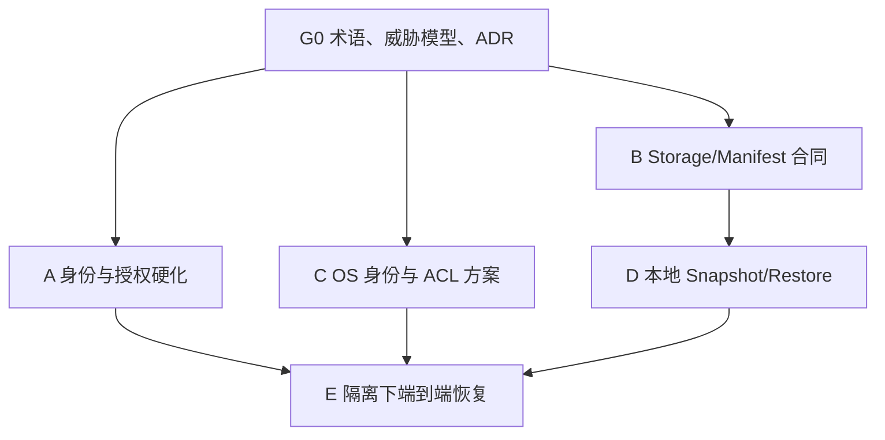

# Phase B/C 身份与隔离、Workspace 恢复需求输入

- Title: Phase B/C 身份、执行隔离与 Workspace 恢复
- Status: `requirements-ready`
- Date: `2026-08-22`
- Repository baseline: `main@da39fac3af33fa7471070a21d8898623848360e7`
- Intended handoff: `bmad-prd → bmad-spec → bmad-architecture → bmad-spec refresh`
- Implementation authority: 无；本文只定义上游需求与约束，不授权实现、发布或迁移
- Scope: 身份模型与账户生命周期、应用层账户/项目隔离、运行器与 Workspace 的 OS 级隔离、Workspace 快照与恢复、审计与验证、未来树状多服务器的兼容契约
- Non-goal: 不重建前端、不重构 `Program.cs`、不实现多节点调度/对象存储/Codex App Server、不引入旧 Tasks/Taskmaster/VDD 工作流、不扩展无关的 Phase 产品能力
- Confidence: `0.90`；范围和优先级已明确，生产身份方式、Windows 隔离粒度、恢复保留策略仍需 PRD/Architecture 作出正式决定

## 0. 本文件的角色和使用方式

本文是一个独立 requirements Markdown，是本地 Codex 执行 `bmad-prd` 的原始需求输入，不是完整 PRD，也不是 execution-plan 目录。

后续建议按以下顺序接力：

1. `bmad-prd` 从本文扩展产品目标、用户旅程、阶段边界、成功指标和未决产品决定；
2. `bmad-spec` 将最终 PRD 蒸馏为 Canonical Spec Package，并保留本文的来源追溯；
3. `bmad-architecture` 基于 Spec 和当前 brownfield 仓库形成 Architecture Spine，固定无法由实现代码自行推导的架构不变量；
4. 再次运行 `bmad-spec refresh`，将 Architecture Spine 作为 `adopted_companion` 纳入最终规范包；
5. 只有用户后续明确要求创建完整 execution-plan 时，才进入 VDD 或其他实现计划流程。

下游产物应保留本文的 `PIWR-*` 需求和验收标识，或提供一一对应关系。不能在蒸馏过程中静默丢弃本文的约束、非目标和未决项。

本文不激活以下旧流程：

- `tasks`、`prepare-task`、Taskmaster triplets；
- `workflow.md` Chapter 3-7；
- overlay-generator、游戏模板发布或旧本地工具链任务恢复；
- 自动创建 VDD requirements 目录。

仓库已经转向 `execution-plans` 承接功能演进；游戏原型创作阶段不需要为旧 Tasks 体系新增入口，也不需要把 `prepare-task` 改造成同名的 execution-plans 服务入口。

## 1. 核心判断

这项工作不是普通 Phase 功能增强，而是未来 AI Native SaaS 能否安全扩展的基础边界。它必须在以下工作之前形成可信闭环：

- 对外宣称生产级多用户或强多租户；
- 将同一账户或项目分配到不同 Worker/服务器；
- 引入对象存储、容器/VM 沙箱或大规模并发执行；
- 把 GDD 和游戏模块工作迁移到长会话 Codex App Server；
- 大幅扩展 Phase 服务层的业务能力。

本需求要先固定四个合同：

1. 谁是经过认证的主体，账户、成员、管理员和服务凭据分别是什么；
2. 哪个账户拥有哪个项目、Workspace、Run、Artifact 和恢复点；
3. 用户代码在什么隔离边界内执行，能访问哪些文件、进程和秘密；
4. Workspace 如何被快照、校验、恢复和迁移，而不依赖某台机器的绝对路径或某次模型会话的隐藏上下文。

本阶段继续采用“单节点、SQLite、本地磁盘优先”的演进策略，但所有新合同必须允许未来形成以下树状部署：

```text
Phase 控制面
  └─ Worker/节点
       └─ 账户或项目沙箱
            └─ Workspace + Agent Runtime
```

“允许未来扩展”不等于本轮实现多服务器。当前目标是消除会阻止未来扩展的隐式耦合，同时保持 Phase A/B 的现有行为可用。

## 2. 当前仓库基线

### 2.1 已有能力，不应重复建设

当前 Phase A/B 已经具备以下原型级基础：

- Host admin token 与数据库账户 token；账户 token 以 hash 形式持久化；
- 管理员可创建、禁用、启用账户并轮换 token；
- 项目、Run、Artifact、Package、Asset、Chat、Workflow 和 LLM 使用等主要数据已按账户作用域读取；
- 已有账户审计、LLM binding/usage、管理员审计和导出基础；
- SQLite 与本地磁盘仍是单节点权威存储；
- Phase 已具备受控 Workspace/Runner、托管路由恢复、共享 LLM/Codex 入口和 evidence/readback 基础；
- 浏览器接口已形成 `/api`、`/api/account`、`/api/admin`、`/api/projects/{projectId}` 的基本边界。

本需求应在这些能力上补强，不重新定义一套平行账户系统、Runner 或恢复系统。

### 2.2 当前缺口

现有能力尚不足以支撑生产级多租户，主要缺口是：

- 当前 `account` 同时承担“登录主体、租户边界、权限容器”等多种含义，未来成员制 SaaS 的概念边界未正式确定；
- 缺少面向外部 SaaS 的正式身份方式和完整会话/凭据生命周期；
- 禁用、撤销、删除、保留、级联处理和审计语义尚未闭合；
- 账户作用域已有实现，但统一认证中间件、负例、跨账户泄漏测试仍不完整；
- Phase 平台进程与用户任务 Runner 尚未形成有证据的 OS 身份和文件权限隔离；
- Workspace 权威仍与本机路径和本地目录结构耦合，缺少版本化快照/恢复合同；
- 缺少在全新根目录、替代节点或故障中断后恢复的端到端演练；
- 当前 Codex `exec` 工作即使可从文件和日志恢复，也没有成为业务层的会话权威；这不阻塞本需求，但要求 Workspace 恢复不能依赖隐藏对话状态。

## 3. 分层与权威边界

浏览器不是与 Phase 服务层、沙箱层并行的第四个业务权威层。它是客户端/呈现面，可发出用户意图、展示状态和承载交互，但不能拥有身份、租户归属、执行状态或恢复真相。

| 边界 | 本需求中的职责 | 明确不能拥有的权威 |
| --- | --- | --- |
| Browser / React client | 登录跳转、发起操作、展示状态与恢复结果 | 不决定 `accountId`、项目所有权、角色、ACL、Runner 身份或恢复是否有效 |
| Phase 服务层 | 认证、授权、账户/项目所有权、调度、元数据、审计、恢复编排、稳定 API | 不直接承载用户代码的长期运行环境，不把浏览器输入当成身份真相 |
| Sandbox / Runner | 执行用户代码，持有项目 Workspace 的受限运行视图，执行快照/恢复中的受控文件操作 | 不拥有账户生命周期、产品权限策略或跨项目调度权威 |
| Toolchain 控制面 | 维护仓库开发协议、skills、execution-plans 和实现证据 | 不成为云端产品账户/Workspace 的运行时服务 |
| Codex/Pi 等 Agent Runtime | 在沙箱中完成模型或编码任务；可使用 exec、SDK 或 App Server 形态 | 不成为新的业务层，不以模型线程替代 GDD、代码、合同、Run 和恢复清单 |

因此，前端重建不应把本应由 Phase 服务层或沙箱执行器保证的安全规则下放到浏览器；浏览器可做体验层校验，但服务端必须独立重验。

## 4. 目标与成功信号

### 4.1 目标

- `G1 身份可信`：每次请求和执行都能解析到服务器认可的主体、账户和角色，凭据可撤销、轮换和审计。
- `G2 租户隔离`：跨账户访问在 API、数据库、文件系统、Runner、预览和恢复各边界均被拒绝且不泄露目标是否存在。
- `G3 执行隔离`：用户任务不能写入 Phase 平台二进制、数据库、代理配置或其他账户的 Workspace。
- `G4 可恢复`：一个已完成快照可在干净的替代根目录恢复为可校验、可继续工作的 Workspace。
- `G5 可迁移`：Workspace 身份不依赖本机绝对路径；未来节点、Runner、沙箱和租约信息可被加入而不破坏当前单节点数据。
- `G6 可运营`：身份、授权、快照、恢复和权限漂移都有稳定状态、失败族、审计记录和关联标识。
- `G7 保持演进速度`：不为未来架构提前实现多节点、对象存储或新前端，不重写已经有效的 Phase A/B 功能。

### 4.2 顶层成功信号

只有在以下条件同时满足时，才可以把本阶段描述为“Phase B/C 身份与隔离、Workspace 恢复基础闭环”：

1. 跨账户 API、数据库、文件、Runner 和恢复负例全部可重复通过；
2. 禁用账户或撤销凭据在约定时间内失效，不能继续启动或恢复任务；
3. 用户 Runner 在 OS 权限层无法写入平台受保护资源和其他账户 Workspace；
4. 标准 Workspace fixture 能从受校验快照恢复到新的根目录，并通过内容、所有权、路由和继续执行检查；
5. 损坏、错租户、版本不兼容或中断的恢复不会发布半成品 Workspace；
6. SQLite 升级、旧账户和旧 Workspace 的现有可用行为保持兼容；
7. 日志、审计和证据中不包含明文 token、token hash、provider key 或未脱敏秘密。

## 5. 范围

### 5.1 本轮必须覆盖

- 身份术语与权威模型：principal、account/tenant、member、role、credential/session；
- 外部 SaaS 身份方向和现有 token 的过渡定位；
- 账户禁用、凭据撤销/轮换、角色变更和必要的删除/保留语义；
- 统一的账户/项目授权边界和负例测试；
- 平台进程与用户任务 Runner 的 OS 身份分离；
- 账户/项目 Workspace 的路径 containment、ACL、权限漂移检测和恢复；
- 本地文件系统优先的 Workspace storage abstraction；
- 版本化 Workspace snapshot manifest、恢复 attempt 和审计合同；
- 恢复的校验、临时 staging、原子发布或等价 fail-safe 机制；
- 恢复后所有权、ACL、路由/readback 和继续执行验证；
- 为未来树状多节点保留逻辑身份、租约/fencing 和 placement 字段的演进空间；
- API、错误、状态、缓存、审计和测试的兼容性要求。

### 5.2 明确不在本轮

- 不迁移旧前端；未来可直接以 React/Vite/Tailwind 重建用户流程；
- 不以拆分或重构 `Program.cs` 作为本需求前置或独立交付；
- 不实现完整 React 管理后台。当前先稳定 API/domain contract 和自动化测试，React 基线建立后再补浏览器 E2E；
- 不实现多节点调度、Worker fleet、节点自动发现、跨区域容灾或对象存储；
- 不实现容器、microVM、VM 编排或 E2B/Daytona/OpenHands 运行时集成；
- 不实现 Codex App Server、长会话 registry、GDD 会话或游戏模块会话；
- 不改变 Codex `exec`/SDK/App Server 的后续选型：当前 bounded、可文件化的任务仍可用 `exec`；长会话另立需求；
- 不实现 Phase C 旧计划中的 Agent Asset Catalog、Doctor、MCP、ECC、遥测 Dashboard 等无关治理内容；
- 不优化与身份、隔离、恢复无直接依赖的 Phase 产品功能；
- 不新增 `prepare-task` 或让云端 Phase 服务承载旧 Tasks/Taskmaster 协议。

### 5.3 可延后但必须在 PRD 中显式处置

- 用户自助注册、密码登录和密码重置；推荐优先使用 OIDC，除非产品明确需要自建密码体系；
- 账户物理删除和全量数据 purge；本轮至少完成可逆停用、立即撤销和明确保留状态；
- 对象存储、远程快照和跨区域备份；本轮只实现本地 backend，但合同不能依赖绝对路径；
- 同一账户下项目之间的强 OS 隔离；跨账户隔离是当前不可降低的最低门槛，按项目的临时身份可作为更高隔离等级；
- 用户可见恢复 UI；在 React 重建前可先通过受保护 API 和运维入口完成闭环。

## 6. 需求

### 6.1 身份、账户和凭据

#### `PIWR-001` 术语必须去歧义

PRD 必须明确区分：

- `principal`：当前通过认证的人员或服务主体；
- `account/tenant`：数据和资源隔离边界；
- `member`：主体与账户之间的成员关系；
- `role`：主体在账户或平台范围内的权限集合；
- `credential/session`：证明主体身份的可撤销载体。

如果原型阶段继续保持“一账户即一用户”，也必须将其声明为临时简化，不能把账户 ID 永久等同于登录主体 ID。

#### `PIWR-002` 服务端拥有身份与归属权威

Phase 必须从经过验证的凭据和服务器端关系解析 principal、account 和 role。浏览器提交的 `accountId`、隐藏字段、路由参数或本地存储值只能作为目标选择，不能覆盖已认证主体的账户上下文。

#### `PIWR-003` 生产身份方向必须在对外发布前确定

建议默认采用 OIDC-first：

- 人类用户通过外部 OIDC 身份提供方登录；
- 现有管理员签发 bearer token 保留为 bootstrap、迁移或受控服务凭据；
- 不在没有明确产品必要性的情况下自建密码、密码重置和风控体系。

PRD 可选择其他方案，但必须记录安全责任、迁移路径和放弃 OIDC 的理由。

#### `PIWR-004` 凭据必须可撤销和轮换

所有 bearer token、session 或 service credential 必须具备唯一身份、作用域、创建时间、最后使用信息、过期或撤销状态。服务端只持久化安全派生值；轮换后旧凭据按合同失效，不能通过缓存继续授权。

#### `PIWR-005` 账户停用必须立即阻断新活动

账户停用后，现有凭据和会话必须在明确的传播时间内失效；不得启动新的 Run、恢复 Workspace、创建预览或读取私有资源。正在运行的任务是立即终止、进入 draining 还是完成当前原子操作，必须由 PRD/Architecture 明确，默认建议 fail-closed 并停止新的副作用。

#### `PIWR-006` 生命周期必须区分停用与删除

本阶段必须完成可逆停用、重新启用、凭据撤销及其审计。物理删除若不在当前发布范围，必须至少定义：删除请求状态、保留期、关联数据清单、法定/运营保留例外、最终 purge 的责任方和不可逆确认点，不能把数据库级联删除等同于完整删除策略。

#### `PIWR-007` 最小角色模型

最低限度必须区分：

- 平台管理员；
- 账户成员/所有者；
- 非人类服务主体或 Runner 身份。

管理员能力必须经独立授权，不能仅依赖普通账户 token 或浏览器是否显示管理按钮。更细角色可后续扩展，但默认权限必须是拒绝。

#### `PIWR-008` 身份和权限事件可审计

创建、登录/换取会话、轮换、撤销、停用、启用、角色变更、删除请求和管理员越权操作必须产生结构化审计事件。事件应包含 actor、target、account、action、result、reason/failure family、timestamp 和 correlation ID，但不得记录秘密材料。

### 6.2 应用层账户与项目隔离

#### `PIWR-009` 所有私有资源必须具有服务器可验证的所有权链

项目、Workspace、Run、Artifact、Package、Asset、Chat、Workflow、LLM binding/usage、Snapshot 和 Restore Attempt 必须可沿服务器端关系追溯到唯一账户。不存在所有权关系的历史数据必须在迁移中被显式隔离、修复或阻断，不能默认为当前请求者所有。

#### `PIWR-010` 授权必须通过统一边界执行

HTTP 入口、后台任务、恢复 worker、readback 和内部服务调用必须使用同一授权语义。不能只在浏览器或个别 endpoint 检查账户作用域，也不能让后台任务通过未验证的 `accountId/projectId` 绕过边界。

#### `PIWR-011` 跨账户访问必须 fail closed 且不泄漏存在性

攻击者猜测其他账户的 project、run、artifact、snapshot、preview 或 route 标识时必须被拒绝。错误合同应避免泄漏资源是否存在、路径、其他账户名称或内部节点信息；具体使用 `403`、`404` 或统一错误族由 API spec 决定，但同类接口必须一致。

#### `PIWR-012` 数据库作用域和迁移必须可证明

新增或改造的账户/项目表必须：

- 使用显式外键/所有权字段和必要索引；
- 采用 additive migration，保留现有数据和 store/restore 行为；
- 同时覆盖 fresh database、旧数据库升级和 reused database 测试；
- 对缺失、冲突或孤立 ownership 的数据 fail closed。

#### `PIWR-013` 私有响应不得被共享缓存

账户、管理员和项目私有 API 必须使用适当的 `Cache-Control: no-store` 或等价策略。预览、下载和临时 ticket 必须具备账户/项目绑定、有效期和撤销语义。

#### `PIWR-014` 秘密注入必须最小化

Provider key、临时 token 和其他秘密只能在授权的 Run/Runner 生命周期内按需注入，不得写入 Workspace snapshot、恢复 manifest、浏览器可读响应、普通 artifact 或原始命令日志。清理失败必须可检测并阻断复用。

### 6.3 Runner 与 OS 级执行隔离

#### `PIWR-015` 平台进程与用户任务必须使用不同的 OS 权限边界

`PhaseA.Platform`、平台数据库、Caddy/代理配置和部署资产必须由平台身份拥有。用户任务 Runner 必须在低权限、可撤销的独立身份下运行，不能继承平台管理员权限或平台服务凭据。

#### `PIWR-016` 跨账户文件访问必须由 OS 权限阻断

即使应用层发生 bug，账户 A 的 Runner 也不能读取或写入账户 B 的 Workspace、snapshot staging、秘密目录或恢复输出。当前 Windows 部署可使用本地账户、受限 token、Job Object 与 NTFS ACL 的组合；最终机制和身份粒度由 Architecture 决定，但必须有真实权限负例证明，而不是只检查路径字符串。

#### `PIWR-017` Workspace 路径必须 containment-safe

所有 Workspace、快照、恢复和 artifact 路径都必须从服务器拥有的逻辑标识解析，并经过 canonicalization、root containment、symlink/reparse point 和 traversal 检查。用户输入的绝对路径、`..`、UNC/device path 或重解析跳转不能越出授权根目录。

#### `PIWR-018` Runner 生命周期必须可控

平台必须能对 Runner 施加超时、取消、并发和清理约束。每个项目同一时间默认最多一个重型写入执行；并发策略变化必须有显式租约或 fencing，而不能只依赖进程内布尔值。

#### `PIWR-019` 权限漂移必须被检测和修复

Workspace 创建、恢复、移动或平台升级后必须验证 owner/ACL。发现权限扩大、继承错误或未知主体时，系统应隔离目标并提供受审计的修复动作；不得在验证失败后继续运行用户任务。

#### `PIWR-020` 强隔离声明必须与证据等级一致

在只有应用作用域或共享低权限 Runner 时，产品不得宣称按项目强沙箱隔离。PRD 必须定义当前隔离等级、已覆盖威胁和剩余风险；Architecture 必须说明升级到按项目临时身份、容器或 microVM 的触发条件。

### 6.4 Workspace 身份、快照与恢复

#### `PIWR-021` Workspace 必须具有与路径解耦的逻辑身份

Workspace 至少由 `workspaceId + accountId + projectId` 唯一确定。绝对路径、当前节点和 Runner 身份是 placement，不是 Workspace 的业务身份；路径变化不能创建一个未经授权的新 Workspace。

#### `PIWR-022` 存储必须通过可替换 backend 合同访问

本轮只要求本地文件系统 backend，但快照、读取、恢复、删除/保留和校验必须通过稳定的 storage contract 表达，不能把某个 Windows 盘符或当前目录结构写进上层业务状态。未来对象存储是新 backend，而不是重写恢复语义。

#### `PIWR-023` 每个可恢复点必须有版本化 manifest

Snapshot Manifest 至少表达：

| 字段族 | 最低要求 |
| --- | --- |
| Schema | manifest schema/version、兼容的 platform/storage contract 版本 |
| Identity | snapshot、workspace、account、project 的稳定 ID |
| Provenance | 创建者/触发动作、时间、来源节点（可空）、来源 revision/branch（适用时） |
| Content | 文件清单或内容索引、大小、hash/checksum、明确排除项 |
| Ownership | 目标账户/项目、期望的逻辑 owner 与 ACL policy reference |
| Recovery | 恢复前置条件、兼容性、所需重建动作、过期/保留状态 |
| Runtime refs | 可选 run/session/runtime reference；只能辅助继续工作，不能成为内容正确性的唯一来源 |
| Security | 加密/key reference（适用时），且不得包含明文秘密 |

具体编码、打包格式和表结构由 Spec/Architecture 决定。

#### `PIWR-024` 快照边界必须确定且可重复

PRD/Spec 必须定义哪些内容进入快照：Git tracked、允许的 untracked、GDD/模块合同、用户资产、Phase 生成的持久 artifact；并明确排除 cache、临时构建产物、provider secret、进程、临时 ticket、绝对路径和不安全链接。相同输入和策略应产生可重算的内容身份或等价完整性证明。

#### `PIWR-025` 恢复必须使用独立 Attempt

每次恢复都必须创建唯一 Restore Attempt，记录 requester、source snapshot、target workspace、状态、阶段、failure family、时间、correlation 和结果。重试不能覆盖旧 attempt；同一 idempotency key 的重复请求不能并行发布多个目标。

#### `PIWR-026` 恢复必须先校验后发布

恢复流程应在受控 staging 中完成以下步骤：

1. 验证调用者和 snapshot ownership；
2. 验证 schema、兼容性、内容 hash、大小/配额和路径安全；
3. 写入 staging，并重新计算完整性；
4. 应用目标 owner/ACL 和必要的安全策略；
5. 验证 Workspace 能被 Phase 读取并满足 route/readback 前置；
6. 以原子切换或等价 fail-safe 方式发布；
7. 失败时回滚或隔离 staging，不暴露半恢复 Workspace。

#### `PIWR-027` 恢复必须重新建立环境相关状态

绝对路径、临时预览 URL/ticket、进程 ID、端口、节点 lease、Runner credential 和 secret 不得从快照原样恢复。恢复后由 Phase 根据当前节点重新分配并重建；旧的临时能力默认失效。

#### `PIWR-028` 恢复必须可中断和重入

进程崩溃、机器重启或取消后，系统必须能根据持久化 Attempt 和 staging 状态确定是继续、回滚、隔离还是重新开始。不能依赖原 Codex thread、内存对象或人工阅读完整日志才能判断。

#### `PIWR-029` Workspace 文件是可恢复业务上下文的权威

GDD、模块合同、源代码、测试、execution-plan/项目内工作文件和持久 artifact 是后续工作可恢复的权威。Codex/Pi 的 thread/session ID 可被记录为辅助引用，但隐藏会话上下文不能替代这些文件，也不能成为恢复成功的必要条件。

#### `PIWR-030` 现有托管路由恢复语义必须保持

Workspace 恢复不得绕过现有 hosted route recovery authority。恢复完成后，Phase 应按仓库现有优先顺序重新解析路由、拒绝 stale/missing route，并确保 readback 只暴露当前账户可见的结果。具体八级恢复来源保持由现有 ADR/实现拥有，本需求不创建第二套规则。

#### `PIWR-031` 快照保留和清理必须可审计

必须定义 snapshot 的保留、pin、过期、删除、配额和失败 staging 清理状态。清理必须尊重正在使用的恢复 attempt 和审计保留；不得通过路径前缀或未校验 glob 批量删除。

#### `PIWR-032` 必须完成替代根目录恢复演练

至少一个真实或代表性 fixture 必须从当前 Workspace 创建快照，在全新临时根目录或替代 Worker 环境中恢复，并验证内容、ownership/ACL、路由/readback、继续启动受控 Run 以及清理。仅验证“压缩包可解压”不算完成。

### 6.5 API、状态与浏览器契约

#### `PIWR-033` 长操作使用异步 Run/Attempt 语义

Snapshot、Restore、权限修复和账户删除/purge 等长操作应返回稳定的 run/attempt ID、状态和 evidence/readback pointer，不能让浏览器连接本身成为执行生命周期。

#### `PIWR-034` API 保持 additive compatibility

现有公开/浏览器 API 默认向后兼容。新增字段应为 additive；破坏性 schema 或 auth 变化必须显式版本化或提供迁移窗口。旧客户端不能因为缺少未来 `nodeId` 等字段而失效。

#### `PIWR-035` 状态和失败使用有界类型

身份、Runner、snapshot 和 restore 状态必须使用 bounded enum；失败必须映射到稳定 family，例如：

- `unauthenticated`、`forbidden`、`account_disabled`、`credential_revoked`；
- `ownership_mismatch`、`path_escape`、`acl_invalid`；
- `snapshot_corrupt`、`schema_unsupported`、`quota_exceeded`；
- `restore_conflict`、`restore_interrupted`、`stale_lease`、`internal_failure`。

Raw exception 只可作为受控诊断，不能成为浏览器或自动化消费者的唯一合同。

#### `PIWR-036` 浏览器只消费服务端决定

React 前端未来可以重建账户、权限和恢复流程，但必须消费 Phase 返回的当前 principal、账户、能力和状态。隐藏按钮、路由守卫和本地缓存不能替代服务端授权。当前旧前端不需要为满足本需求而迁移。

### 6.6 为未来树状多服务器保留的合同

#### `PIWR-037` Placement 字段必须可选且非权威

数据合同应允许未来加入 `nodeId`、`runnerId`、`sandboxId`、`attemptId`、`leaseVersion/fencingToken` 和 `workspaceSnapshotId` 等字段。当前单节点可为空或使用默认值；account/project/workspace ownership 不能从 placement 字段推断。

#### `PIWR-038` 独占写入必须可升级为租约/fencing

当前“每项目一个重型 Run”的约束必须能演进为持久租约和 fencing token。旧 Worker 或超时任务在失去租约后不能继续发布 Workspace 或恢复结果。当前版本可以不实现分布式租约，但 Architecture 不得选择只能依赖单进程内存锁的永久合同。

#### `PIWR-039` Snapshot 是迁移边界，不是节点复制细节

未来 Worker 迁移应通过同一版本化 snapshot/restore 合同完成，而不是复制某台节点的任意目录、模型 thread 或进程状态。对象存储只改变 blob placement，不改变 ownership、manifest、校验和发布规则。

#### `PIWR-040` API/Worker 分离是演进方向

借鉴 Rakazo 等项目时，只吸收与本仓库匹配的模式：API/Worker 分离、耐久 Job/Event、Runtime/Sandbox provider 接口、Workspace checkpoint、数据库 lease/fencing。不得把外部项目的模型运行时或产品信息架构直接当作本仓库依赖。

## 7. 非功能要求

### 7.1 安全

- 所有账户、路径、ACL、manifest 和 restore 验证默认 fail closed；
- token、hash、provider key、原始秘密、未脱敏命令环境不得进入日志、审计、snapshot 或浏览器响应；
- 管理员动作必须有独立认证、授权和审计；
- 权限修复和恢复不能自动扩大 owner/ACL；
- 威胁模型至少覆盖 ID 枚举、路径 traversal、symlink/reparse point、跨账户 Runner、stale credential、stale lease、恶意 snapshot 和恢复炸弹/配额耗尽。

### 7.2 正确性与一致性

- 所有关键状态变更必须具有事务、幂等或补偿语义；
- 恢复发布点前后的状态必须可区分，半完成状态不能被当作 ready；
- manifest 和内容校验必须在发布前重算；
- 数据库状态与文件系统状态不一致时必须进入 typed recovery/repair，而不是静默选一边。

### 7.3 兼容性

- SQLite migration 必须覆盖 fresh、upgrade 和 reuse；
- 本地文件系统仍是第一 backend；
- 现有项目、Run、Artifact、route/readback 和 token 客户端默认保持可用；
- 新拓扑字段默认可空，旧记录必须有确定兼容解释。

### 7.4 可恢复性目标

PRD 必须给出量化 RPO/RTO。原型硬化阶段建议采用：

- RPO：不丢失最后一个成功发布且通过完整性校验的 snapshot；正在进行但未发布的写入允许丢弃或重做；
- RTO：对 Spec 定义的标准 Workspace fixture，P95 在 30 分钟内恢复到可启动受控 Run 的状态；
- 具体 fixture 大小、文件数量、硬件和不计入时间必须由 Spec 固定，不能用空目录满足指标。

### 7.5 可观测性

身份、授权、Run、Runner、snapshot 和 restore 事件至少关联：timestamp、status、action、actor/principal、account、project、workspace、run/attempt、node/runner（适用时）和 correlation ID。高基数字段、完整 stdout 和详细 manifest 应落到受控 evidence，不直接塞入主 Agent 或浏览器摘要。

### 7.6 可维护性

- Phase 服务层拥有策略与编排，Sandbox/Runner 拥有受控执行机制；
- 不复制 hosted route recovery、LLM/Codex factory、账户作用域或 storage 规则；
- 任何 auth/account、metadata/restore、runner isolation、LLM runtime 或 readback 边界改变都必须检查现有 ADR，并更新 ADR_INDEX；
- 本需求不要求为了“看起来分层”预先重构 `Program.cs`。

## 8. 验收合同

| Acceptance ID | 可证伪验收条件 | Covers |
| --- | --- | --- |
| `PIWR-A01` | 浏览器提交其他 `accountId` 不能改变服务端解析出的 principal/account；所有受保护入口返回一致的拒绝结果。 | `PIWR-001`, `PIWR-002`, `PIWR-010`, `PIWR-036` |
| `PIWR-A02` | 被撤销凭据、禁用账户和无管理员角色的管理请求分别被拒绝；缓存或旧会话不能绕过。 | `PIWR-004`-`PIWR-008`, `PIWR-013` |
| `PIWR-A03` | 对 project/run/artifact/snapshot/restore/preview 的跨账户 ID 枚举均被拒绝，响应不泄漏目标路径、账户或存在性。 | `PIWR-009`-`PIWR-011` |
| `PIWR-A04` | fresh DB、现有 DB upgrade 和 reused DB 均保留有效数据；孤立或冲突 ownership 不会被自动分配给请求者。 | `PIWR-009`, `PIWR-012`, `PIWR-034` |
| `PIWR-A05` | 真实低权限 Runner 可写自己的授权 Workspace，但不能写平台 binary、SQLite、Caddy 配置或其他账户 Workspace。 | `PIWR-015`, `PIWR-016`, `PIWR-020` |
| `PIWR-A06` | `..`、绝对路径、UNC/device path、symlink/reparse point 和 manifest 中的逃逸路径均不能越出授权根。 | `PIWR-017`, `PIWR-023`, `PIWR-026` |
| `PIWR-A07` | Workspace 创建、恢复和移动后 ACL 被验证；故意扩大权限或加入未知主体会进入隔离/修复状态并阻止 Runner。 | `PIWR-019`, `PIWR-026` |
| `PIWR-A08` | Snapshot 不含 token、provider key、临时 ticket、绝对路径或禁止内容；对日志和 artifact 的秘密扫描通过。 | `PIWR-014`, `PIWR-023`, `PIWR-024`, `PIWR-027` |
| `PIWR-A09` | 标准 Workspace 可从 snapshot 恢复到新的临时根目录，内容 hash、ownership/ACL、route/readback 和后续受控 Run 全部通过。 | `PIWR-021`-`PIWR-024`, `PIWR-026`, `PIWR-030`, `PIWR-032` |
| `PIWR-A10` | 错账户、损坏 hash、未知 schema、超配额和不兼容版本均在发布前失败，现有 Workspace 不被部分覆盖。 | `PIWR-023`, `PIWR-025`, `PIWR-026`, `PIWR-035` |
| `PIWR-A11` | 在恢复各关键阶段注入进程退出后，新进程可根据 Attempt/staging 状态继续、回滚或隔离；不读取旧聊天即可确定动作。 | `PIWR-025`, `PIWR-028`, `PIWR-029` |
| `PIWR-A12` | Snapshot restore 后旧 preview ticket、端口、PID、secret 和 lease 不可用，当前节点重新分配的状态可用。 | `PIWR-027`, `PIWR-030`, `PIWR-037`-`PIWR-039` |
| `PIWR-A13` | 同一幂等键的重复 restore 不会发布两个 Workspace；过期 Runner 的 fencing token 不能覆盖 current 结果。 | `PIWR-018`, `PIWR-025`, `PIWR-038` |
| `PIWR-A14` | Snapshot 过期、pin、配额、删除和失败 staging 清理均有审计；正在被 restore 使用的 snapshot 不会被误删。 | `PIWR-031`, `PIWR-033`, `PIWR-035` |
| `PIWR-A15` | 私有 API 使用 `no-store`，错误码/状态为 bounded types；原始异常和秘密不进入浏览器响应。 | `PIWR-013`, `PIWR-033`-`PIWR-035` |
| `PIWR-A16` | 当前单节点数据在新增可空 topology 字段后行为不变，Workspace restore 不依赖 `nodeId` 或绝对路径。 | `PIWR-021`, `PIWR-034`, `PIWR-037`-`PIWR-039` |
| `PIWR-A17` | API 层拥有授权正/负例；React 基线完成后再补管理员/恢复 browser E2E，不以改造旧前端作为当前通过条件。 | `PIWR-010`, `PIWR-033`, `PIWR-036` |
| `PIWR-A18` | 最终证据包包含账户隔离、OS 权限、snapshot round-trip、故障注入、DB upgrade 和 secret-redaction 结果，且能由新进程从文件化证据复核。 | `PIWR-001`-`PIWR-040` |

## 9. 建议的依赖顺序与并行开发

### 9.1 依赖顺序



建议阶段：

1. `G0`：先固定 principal/account/member/role/workspace ownership、威胁模型、隔离等级和恢复发布语义；更新或拆分 Proposed ADR-0040。
2. `A`：完成账户停用/撤销、统一授权边界、负例、审计和数据库迁移。
3. `B`：并行定义 storage interface、Snapshot Manifest、Restore Attempt 和 failure taxonomy。
4. `C`：在 ownership 不变量确定后，并行完成 Windows Runner identity/ACL 的可运行原型与权限负例。
5. `D`：基于 B 实现本地快照、staging、校验、发布、清理和故障恢复。
6. `E`：把 A/C/D 合并为“已认证账户在受限 Runner 下恢复 Workspace 并继续运行”的端到端证据。
7. 对外身份 UX、React 管理/恢复界面可在 API 稳定后单独推进；不回头迁移旧前端。

### 9.2 可在不同设备/分支并行的工作

在 `G0` 合并后可开三条分支：

| 分支 | 可独立推进 | 主要合并冲突 |
| --- | --- | --- |
| Identity/API | 身份模型、凭据/停用、授权测试、审计 | SQLite migration、endpoint composition |
| Workspace recovery | storage contract、manifest、snapshot/restore、故障注入 | Workspace repository、metadata schema |
| Runner isolation | Windows identity、Job Object、NTFS ACL、权限漂移工具与测试 | Runner factory、部署脚本、Workspace root |

并行约束：

- 先合并共享合同和测试 fixture，再并行实现；
- 数据库 migration 编号和共享 schema 文件由一个分支串行拥有；
- 不让三个分支同时重排 `Program.cs`；新增 endpoint 所需的最小 wiring 在集成分支统一完成；
- 合并完成不等于验收，最终必须在同一候选版本执行 `PIWR-A01` 至 `PIWR-A18`；
- `08-05 toolchain-core-skill-replay-portability-and-evaluation-seed`、`08-06 skill-authoring-standard`、`07-31 toolchain-workflow-evidence-catalog-v1` 属于工具链控制面，可在另一设备/分支并行，不是本需求的运行时依赖，也不得被吸收到本文件。

## 10. 需要 PRD 决定的产品问题

### `PIWR-Q01` 账户是用户还是租户

- 建议：把 account 定义为 tenant 边界，新增 principal/member 概念；原型允许一对一，但合同支持一账户多成员。
- 阻塞：身份模型、角色、审计 actor 和未来组织协作。

### `PIWR-Q02` 生产身份方式

- 建议：OIDC-first；管理员 token 仅作为 bootstrap/service/migration credential；暂不自建密码。
- 阻塞：公开 SaaS 登录、session/revocation、React 登录流程。

### `PIWR-Q03` 停用、删除和保留

- 建议：本轮强制完成停用和立即撤销；物理 purge 使用异步、带保留期和显式确认的后续流程。
- 阻塞：数据保留、备份中的删除语义和管理员 UX。

### `PIWR-Q04` 当前隔离等级

- 建议：当前最低承诺为跨账户 OS 隔离；平台与 Runner 分离，Runner identity granularity 由 Architecture 在“每账户身份”和“每项目/每次执行临时身份”中选择。
- 阻塞：Windows 运维成本、ACL 规模、强隔离声明。

### `PIWR-Q05` Snapshot 内容边界

- 建议：持久项目文件与合同进入，cache/build/temp/secret/runtime capability 排除；Git metadata 是否整体进入需按恢复目标决定。
- 阻塞：manifest、体积、恢复一致性和跨节点迁移。

### `PIWR-Q06` 保留、配额、加密和 RPO/RTO

- 建议：先以标准 fixture 固定可测目标；加密至少覆盖存储介质和 secret 排除，远程 key 管理随对象存储阶段再定。
- 阻塞：运营成本、删除语义和恢复 SLA。

### `PIWR-Q07` React UI 的接入时点

- 建议：本需求先完成 API/domain/automation tests；新 React 前端稳定后补身份、管理员和恢复浏览器 E2E，不迁移旧 UI。
- 不阻塞：身份、隔离和恢复后台闭环。

## 11. 需要 Architecture 固定的不变量

`bmad-architecture` 至少必须对以下问题形成稳定 `AD-*` 决策，不能只列实现候选：

1. 身份、账户、成员、角色和 service/runner principal 的权威关系；
2. HTTP、后台任务和 Runner 间如何传递已验证的 account/project context；
3. Windows 下平台身份、Runner 身份、Job Object、NTFS ACL 和秘密注入的边界及粒度；
4. Workspace logical identity 与 physical placement 的分离规则；
5. local storage backend、Snapshot Manifest、Restore Attempt、staging、publish 和 cleanup 的职责分配；
6. 数据库与文件系统跨边界操作的事务/补偿和崩溃恢复策略；
7. route/readback、preview capability 和 secret 在恢复后的失效/重建规则；
8. 单节点锁如何演进为 lease/fencing，哪些 topology 字段现在只作 nullable seed；
9. 兼容 migration、旧 Workspace adoption 和 orphan data 的 fail-closed 处理；
10. 何时从 Windows 本地账户升级到按项目身份、容器或 microVM，以及证据门槛；
11. 哪些改变需要更新 ADR-0040，哪些需要新 ADR，并同步 `ADR_INDEX_PHASE.md`。

Architecture 应借鉴但不复制 Rakazo/OpenHands/Dify/E2B 的适用模式：API/Worker 分离、durable job/event、runtime/sandbox provider、portable checkpoint、租约和隔离边界。Codex/Pi 是可替换 runtime；Phase 的账户、项目、Run、Workspace 和恢复合同才是产品权威。

## 12. BMAD 产物要求

### 12.1 `bmad-prd`

PRD 应：

- 将本文扩展成产品级 Why、目标用户/操作者、关键旅程、功能分组、成功/反指标和发布阶段；
- 至少覆盖普通账户成员、平台管理员、恢复操作者和 Runner/service principal 四种视角；
- 把 `PIWR-Q01` 至 `PIWR-Q07` 分成 phase-blocker 与可延后问题；
- 不把 Windows ACL、具体表结构或打包格式写成产品能力，技术细节可进入 addendum；
- 保留“不重建旧前端、不重构 Program.cs、不实现多节点/App Server、不进入 Tasks/VDD”的非目标；
- 建立从 PRD FR/NFR 到本文 `PIWR-*` 的覆盖关系，防止身份或恢复负例被产品叙事吞掉。

### 12.2 `bmad-spec`

Spec 应：

- 形成稳定 capability ID，并将身份/授权、隔离等级、snapshot/restore、失败状态、验收矩阵等 load-bearing 内容完整保存；
- 视内容规模生成清晰命名的 companion，例如 `identity-and-ownership.md`、`workspace-recovery-contract.md`、`failure-modes.md`、`acceptance-matrix.md`；
- 将本文和最终 PRD 在吸收后列为 provenance，不把两个来源重新提升为并行规范权威；
- 对未解决产品问题保持 typed open question，不静默选择；
- 在 Architecture 完成后 refresh，并将 `ARCHITECTURE-SPINE.md` 作为 `adopted_companion` 纳入 `canonical-spec-package.v1`。

### 12.3 `bmad-architecture`

Architecture 应：

- 先读取当前 brownfield 实现、Accepted ADR、Proposed ADR-0040、Phase 服务标准和 Spec；
- 只固定会导致独立实现单元发生不兼容选择的架构不变量；
- 明确 inherited invariants、adopted decisions、deferred items 和触发条件；
- 将安全、恢复、部署/环境和运维维度全部决定、延后或列为 open question，不能沉默遗漏；
- 产出能被 bmad-spec adopt 的 Architecture Spine，而不是另起一套与 Spec 平级的产品需求。

## 13. 仓库权威与参考输入

后续 BMAD 至少应读取并协调以下当前仓库来源：

- 根 `AGENTS.md`；
- `PhaseA.Platform/AGENTS.md`；
- `README.md`；
- `docs/architecture/phase-service/_index.md`；
- `docs/architecture/ADR_INDEX_PHASE.md`；
- `docs/standards/phase-service.md`；
- `docs/workflows/phase-b-account-isolation.md`；
- `docs/architecture/phase-service/roadmap-and-hardening.md`；
- `docs/workflows/phase-c-platform-hardening-and-agent-asset-governance.md`；
- `docs/workflows/phase-c-platform-hardening-and-agent-asset-governance-backlog.md`；
- 与 auth、account scoping、workspace、runner、route recovery、LLM/Codex execution 直接相关的 Accepted ADR。

权威冲突按仓库现有顺序处理：Accepted ADR → applicable `AGENTS.md` → 当前 runtime/source compatibility → architecture docs → standards → README。本文提出的新选择若改变既有 Accepted ADR，必须先通过 ADR 更新或新增 ADR 正式解决，不能由 PRD 文案暗中覆盖。

## 14. 最终边界

本需求完成后的目标状态是：

> Phase 服务层能够可信地证明“谁在操作哪个账户/项目”，Sandbox/Runner 能够在 OS 边界内限制“代码实际能碰到什么”，Workspace 能够通过版本化、可校验的快照在新位置恢复，而浏览器和 Agent 会话都只是这些权威合同的消费者。

本需求不追求一次完成未来树状 SaaS。它只要求当前单节点实现不再把账户、Workspace、绝对路径、Runner 进程和模型会话绑成一个不可迁移的整体，并用负例和恢复演练证明边界真实存在。
